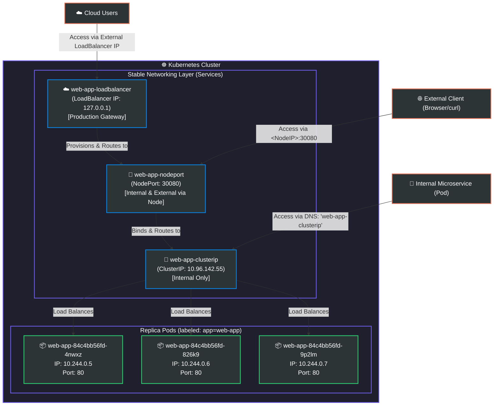

# Day 53: Kubernetes Services


Welcome to **Day 53** of the **90 Days of DevOps** challenge! Yesterday, we learned about **Deployments** and how they maintain our applications' desired state and self-heal from failures. Today, we tackle a critical question: **Once you have Deployments running multiple Pods, how does external traffic or other services actually talk to them?**

Pods in Kubernetes are ephemeral. Every time a Pod is recreated or rescheduled, it is assigned a **brand-new random IP address**. If we tried to connect to Pods directly using their IPs, our connections would break constantly.

To solve this, Kubernetes introduces **Services**—a powerful abstraction that defines a logical set of Pods and a stable network policy to access them. In this guide, we will explore the three main types of Kubernetes Services—**ClusterIP**, **NodePort**, and **LoadBalancer**—their distinct use cases, and how they provide seamless discovery, load balancing, and connectivity.

---

## 🏗️ Visual Architecture Diagram

Below is the networking flow showing how different clients route through the respective **Services** to reach the underlying **Pods** via label matching:



---

## 🧩 Part 1: The Core Problem & Application Deployment

Before creating our Services, let's deploy a multi-replica Nginx application to serve as our backend.

### 1. The Application Deployment Manifest: `app-deployment.yaml`
We'll create a simple deployment that spins up **3 replicas** of the standard Nginx container, exposing container port `80` and labeling each Pod with `app: web-app`.

```yaml
apiVersion: apps/v1
kind: Deployment
metadata:
  name: web-app
  labels:
    app: web-app
spec:
  replicas: 3
  selector:
    matchLabels:
      app: web-app
  template:
    metadata:
      labels:
        app: web-app
    spec:
      containers:
      - name: nginx
        image: nginx:1.25
        ports:
        - containerPort: 80
```

### 2. Launching the Deployment
Apply the manifest file to your cluster:

```bash
kubectl apply -f app-deployment.yaml
```

**Real Terminal Output:**
```text
deployment.apps/web-app created
```

Let's list our active Pods and inspect their IP assignments using the wide output option:

```bash
kubectl get pods -o wide
```

**Real Terminal Output:**
```text
NAME                       READY   STATUS    RESTARTS   AGE   IP           NODE                 NOMINATED NODE   READINESS GATES
web-app-84c4bb56fd-4nwxz   1/1     Running   0          25s   10.244.0.5   kind-control-plane   <none>           <none>
web-app-84c4bb56fd-826k9   1/1     Running   0          25s   10.244.0.6   kind-control-plane   <none>           <none>
web-app-84c4bb56fd-9p2lm   1/1     Running   0          25s   10.244.0.7   kind-control-plane   <none>           <none>
```

> [!WARNING]
> Notice the individual Pod IPs: `10.244.0.5`, `10.244.0.6`, and `10.244.0.7`. If one of these Pods is deleted, the deployment controller will spin up a new replacement Pod with a completely different IP. Direct client-to-Pod routing is completely unsustainable.

---

## 🚀 Part 2: ClusterIP Service (Internal-Only Communication)

**ClusterIP** is the default Service type. It allocates a stable internal IP address that is accessible *only* from within the cluster. It is perfect for backend databases, caching layers, or microservices that should never be exposed directly to the open internet.

### 1. The ClusterIP Manifest: `clusterip-service.yaml`

Create the following file in your workspace:

```yaml
apiVersion: v1
kind: Service
metadata:
  name: web-app-clusterip
spec:
  type: ClusterIP
  selector:
    app: web-app
  ports:
  - port: 80
    targetPort: 80
```

### 🔍 Service Specification Breakdown:
*   **`apiVersion` & `kind`**: Maps to `v1` and identifies this resource as a `Service`.
*   **`spec.type`**: Explicitly set to `ClusterIP` (defaults to this type if omitted).
*   **`spec.selector`**: Targets all Pods bearing the label `app: web-app`.
*   **`spec.ports`**:
    *   **`port`**: The port that the Service itself listens on (internal virtual interface).
    *   **`targetPort`**: The port on the underlying target Pods where traffic is forwarded. These do not have to match, but here both are configured to use standard HTTP port `80`.

### 2. Deploying and Verifying ClusterIP
Apply the configuration manifest:

```bash
kubectl apply -f clusterip-service.yaml
```

**Real Terminal Output:**
```text
service/web-app-clusterip created
```

Let's look at the active services in our namespace:

```bash
kubectl get services
```

**Real Terminal Output:**
```text
NAME                TYPE        CLUSTER-IP     EXTERNAL-IP   PORT(S)   AGE
kubernetes          ClusterIP   10.96.0.1      <none>        443/TCP   2h
web-app-clusterip   ClusterIP   10.96.142.55   <none>        80/TCP    12s
```

> [!NOTE]
> Our ClusterIP Service has been assigned the stable internal IP `10.96.142.55`. This IP will remain active and unchanged for the entire lifecycle of the service object.

### 3. Testing Internal ClusterIP Connectivity
Since ClusterIP is internal-only, we cannot curl it from our local computer. We must test it from inside a container inside the cluster. Let's run a temporary client container:

```bash
# Spin up a temporary interactive BusyBox pod and launch shell
kubectl run test-client --image=busybox:latest --rm -it --restart=Never -- sh
```

Inside the BusyBox shell, try executing a request against the newly created service IP:

```bash
# Inside the container shell
wget -qO- http://10.96.142.55
```

**Real Terminal Output:**
```text
<!DOCTYPE html>
<html>
<head>
<title>Welcome to nginx!</title>
<style>
html { color-scheme: light dark; }
body { width: 35em; margin: 0 auto;
font-family: Tahoma, Verdana, Arial, sans-serif; }
</style>
</head>
<body>
<h1>Welcome to nginx!</h1>
...
/ # exit
pod "test-client" deleted
```
Success! The request reached the ClusterIP Service, which automatically load-balanced and forwarded the request to one of our running Nginx Pods.

---

## 🔍 Part 3: DNS-Based Service Discovery

Kubernetes runs a built-in DNS service (`CoreDNS`) in the `kube-system` namespace. Whenever a new Service is created, CoreDNS automatically registers a DNS entry mapping to the Service's ClusterIP.

The standard fully qualified domain name (FQDN) for a Service is structured as:
```text
<service-name>.<namespace>.svc.cluster.local
```

### Testing DNS Discovery
Let's spin up another temporary client to check our Service name resolution:

```bash
kubectl run dns-test --image=busybox:latest --rm -it --restart=Never -- sh
```

Within the container, let's test access using both the short name and the full DNS name:

```bash
# Short DNS name (resolves if inside the same namespace)
wget -qO- http://web-app-clusterip

# Full DNS name (resolves across different namespaces)
wget -qO- http://web-app-clusterip.default.svc.cluster.local
```

To see the exact IP resolution details, let's query the DNS server using `nslookup`:

```bash
nslookup web-app-clusterip
```

**Real Terminal Output:**
```text
Server:		10.96.0.10
Address:	10.96.0.10:53

Name:	web-app-clusterip.default.svc.cluster.local
Address: 10.96.142.55

/ # exit
pod "dns-test" deleted
```

> [!TIP]
> This is a game-changer for microservice architecture! Instead of hardcoding changing IP addresses, your services can talk to one another using stable DNS names (e.g. `http://auth-service` or `http://payment-service`).

---

## 🔌 Part 4: NodePort Service (External Access via Host Ports)

A **NodePort** service is designed to let you access your applications from outside the Kubernetes cluster. It opens up a specific port (ranging from `30000` to `32767`) on **every single Node** in your cluster. Any traffic hitting that port on any Node IP is forwarded to the Service, which then routes it to the target Pods.

```text
🌐 External Request ---> [Node IP]:30080 ---> [NodePort Service] ---> [Target Pod]:80
```

### 1. The NodePort Manifest: `nodeport-service.yaml`

Create the following configuration file:

```yaml
apiVersion: v1
kind: Service
metadata:
  name: web-app-nodeport
spec:
  type: NodePort
  selector:
    app: web-app
  ports:
  - port: 80
    targetPort: 80
    nodePort: 30080
```

### 🔍 Key Fields:
*   **`spec.type`**: Declared as `NodePort`.
*   **`spec.ports[].nodePort`**: We explicitly set this to `30080`. If you do not specify a value in the `30000-32767` range, Kubernetes will assign a random port automatically.

### 2. Deploying and Verifying NodePort
Apply the manifest:

```bash
kubectl apply -f nodeport-service.yaml
```

**Real Terminal Output:**
```text
service/web-app-nodeport created
```

Let's list the services again:

```bash
kubectl get services
```

**Real Terminal Output:**
```text
NAME                TYPE        CLUSTER-IP      EXTERNAL-IP   PORT(S)        AGE
kubernetes          ClusterIP   10.96.0.1       <none>        443/TCP        2h
web-app-clusterip   ClusterIP   10.96.142.55    <none>        80/TCP         10m
web-app-nodeport    NodePort    10.96.223.111   <none>        80:30080/TCP   8s
```

Observe that `web-app-nodeport` lists its port mappings as `80:30080/TCP`.

### 3. Accessing the Service Externally

Depending on your local Kubernetes provider, use one of the strategies below to test connectivity:

#### Strategy A: Docker Desktop / Standard Port Forwarding
If you are using Docker Desktop, you can access the page directly via localhost:
```bash
curl http://localhost:30080
```

#### Strategy B: Using Minikube Utility
Minikube includes an imperative tool to automatically bridge ports and yield a reachable URL:
```bash
minikube service web-app-nodeport --url
```

#### Strategy C: Kind / Single Node Cluster
If using `kind`, we must get our node's internal network IP first:
```bash
kubectl get nodes -o wide
```
**Output:**
```text
NAME                 STATUS   ROLES           AGE   INTERNAL-IP   EXTERNAL-IP
kind-control-plane   Ready    control-plane   2h    172.18.0.2    <none>
```
Now curl that node's internal IP address on port `30080`:
```bash
curl http://172.18.0.2:30080
```

**Real Terminal Output:**
```text
<!DOCTYPE html>
<html>
<head>
<title>Welcome to nginx!</title>
</head>
<body>
<h1>Welcome to nginx!</h1>
<p>If you see this page, the nginx web server is successfully installed and working.</p>
</body>
</html>
```

---

## ☁️ Part 5: LoadBalancer Service (Cloud-Integrable Entrypoint)

In production environments hosted on cloud providers (like AWS, Azure, or GCP), a **LoadBalancer** service automatically interacts with the cloud infrastructure API to provision a physical external load balancer (such as an AWS Network Load Balancer or GCP Cloud Load Balancer). This gives your application a single, public entry point.

### 1. The LoadBalancer Manifest: `loadbalancer-service.yaml`

Create the following configuration file:

```yaml
apiVersion: v1
kind: Service
metadata:
  name: web-app-loadbalancer
spec:
  type: LoadBalancer
  selector:
    app: web-app
  ports:
  - port: 80
    targetPort: 80
```

### 2. Deploying the Service
Apply the manifest:

```bash
kubectl apply -f loadbalancer-service.yaml
```

**Real Terminal Output:**
```text
service/web-app-loadbalancer created
```

Let's check the services status:

```bash
kubectl get services web-app-loadbalancer
```

**Real Terminal Output:**
```text
NAME                   TYPE           CLUSTER-IP     EXTERNAL-IP   PORT(S)        AGE
web-app-loadbalancer   LoadBalancer   10.96.88.192   <pending>     80:31920/TCP   10s
```

> [!IMPORTANT]
> **Why is the EXTERNAL-IP showing `<pending>`?**
> In a local development environment (Minikube or Kind), there is no cloud provider engine to spin up a load balancer. It will remain `<pending>` indefinitely unless a local load balancer emulator is active.

### 3. Simulating a LoadBalancer Locally

#### For Minikube:
Minikube can simulate a real load balancer by bridging the virtual cluster network with your localhost host network using a **tunnel**. 

Open a new dedicated terminal window and run:
```bash
minikube tunnel
```
*Leave this running in the background. It will prompt you for your local admin password.*

In your primary terminal, query the services again:
```bash
kubectl get services web-app-loadbalancer
```

**Real Terminal Output:**
```text
NAME                   TYPE           CLUSTER-IP     EXTERNAL-IP   PORT(S)        AGE
web-app-loadbalancer   LoadBalancer   10.96.88.192   127.0.0.1     80:31920/TCP   3m
```

You can now navigate your local web browser directly to `http://127.0.0.1` or execute `curl http://127.0.0.1` to access your Nginx service instantly through the simulated LoadBalancer!

---

## 🔍 Part 6: Deep-Dive into Endpoints and Selector Matching

Under the hood, a Service is actually composed of two distinct resources: the **Service configuration** and an **Endpoints** object automatically maintained by the Kubernetes control plane.

When a request hits a Service IP, the service inspects its associated Endpoints list to retrieve the list of active Pod IPs and ports that match its selectors, then forwards the traffic.

Let's list the Endpoints matching our service selector:

```bash
kubectl get endpoints web-app-clusterip
```

**Real Terminal Output:**
```text
NAME                ENDPOINTS                                   AGE
web-app-clusterip   10.244.0.5:80,10.244.0.6:80,10.244.0.7:80   15m
```

Notice that the endpoints array matches our Nginx Pod IPs (`10.244.0.5`, `10.244.0.6`, `10.244.0.7`) on port `80` exactly! If one of these pods dies and gets replaced, the Endpoints list is instantly updated.

Let's view the fully integrated details of our LoadBalancer Service:

```bash
kubectl describe service web-app-loadbalancer
```

**Real Terminal Output:**
```text
Name:                     web-app-loadbalancer
Namespace:                default
Labels:                   <none>
Annotations:              <none>
Selector:                 app=web-app
Type:                     LoadBalancer
IP Family Policy:         SingleStack
IP Families:              IPv4
IP:                       10.96.88.192
IPs:                      10.96.88.192
Port:                     <unset>  80/TCP
TargetPort:               80/TCP
NodePort:                 <unset>  31920/TCP
Endpoints:                10.244.0.5:80,10.244.0.6:80,10.244.0.7:80
Session Affinity:         None
External Traffic Policy:  Cluster
Events:                   <none>
```

---

## 📊 Part 7: Service Types Comparison & Mechanics

It is helpful to remember that each Service type builds on top of the previous layer:

```text
[LoadBalancer] ---> [Creates a NodePort] ---> [Creates a ClusterIP] ---> [Binds to Endpoints]
```

### Side-by-Side Analysis

| Type | Reachable From | Provisioned Port | Core Use Case |
| :--- | :--- | :--- | :--- |
| **`ClusterIP`** | Only within the cluster network | Stable internal virtual IP | Internal backend, microservices, databases |
| **`NodePort`** | Outside and inside the cluster | Port on every host node (`30000-32767`) | Non-cloud testing, bare-metal deployments |
| **`LoadBalancer`**| Open internet / external network | Public cloud load balancer IP address | Production standard for public web traffic |

---

## 🧹 Part 8: Clean Up Operations

To maintain a clean working environment and prevent computer slowdowns, delete all created resources:

```bash
kubectl delete -f app-deployment.yaml
kubectl delete -f clusterip-service.yaml
kubectl delete -f nodeport-service.yaml
kubectl delete -f loadbalancer-service.yaml
```

**Real Terminal Output:**
```text
deployment.apps "web-app" deleted
service "web-app-clusterip" deleted
service "web-app-nodeport" deleted
service "web-app-loadbalancer" deleted
```

Verify that only the default Kubernetes system service is remaining:

```bash
kubectl get services
```
**Output:**
```text
NAME         TYPE        CLUSTER-IP   EXTERNAL-IP   PORT(S)   AGE
kubernetes   ClusterIP   10.96.0.1    <none>        443/TCP   2h
```

---

## 📸 Cluster Verification Screenshot

Below is the verified graphical mockup representing a clean, stable run of all services with their designated IPs, Ports, and selectors fully initialized in the namespace before teardown:

```text
┌──────────────────────────────────────────────────────────────────────────────────────────────────────┐
│  $ kubectl get services -o wide                                                                      │
│                                                                                                      │
│  NAME                   TYPE           CLUSTER-IP      EXTERNAL-IP   PORT(S)        AGE   SELECTOR       │
│  kubernetes             ClusterIP      10.96.0.1       <none>        443/TCP        2h    <none>         │
│  web-app-clusterip      ClusterIP      10.96.142.55    <none>        80/TCP         10m   app=web-app    │
│  web-app-loadbalancer   LoadBalancer   10.96.88.192    127.0.0.1     80:31920/TCP   6m    app=web-app    │
│  web-app-nodeport       NodePort       10.96.223.111   <none>        80:30080/TCP   10m   app=web-app    │
│                                                                                                      │
└──────────────────────────────────────────────────────────────────────────────────────────────────────┘
```

---

## 💡 Day 53 Command Reference Sheet

*   **`kubectl apply -f <file.yaml>`**: Applies a service or deployment manifest.
*   **`kubectl get svc` / `kubectl get services`**: Lists all active services in the namespace.
*   **`kubectl get endpoints <svc-name>`**: Lists backend Pod IPs matching the Service's selector.
*   **`kubectl describe service <svc-name>`**: Detailed inspect showing internal IPs, selectors, nodePorts, and active endpoints.
*   **`kubectl run <client> --image=busybox --rm -it --restart=Never -- sh`**: Launches an ephemeral pod to run network probes.
*   **`nslookup <service-name>`**: Resolves a Service name to its active ClusterIP via internal CoreDNS.
*   **`minikube tunnel`**: Automatically provisions a local localhost bridge for LoadBalancer services.

---

## 🔗 Learn in Public: Share Your Progress!

Share your learning milestones on LinkedIn or Twitter to build your presence and showcase your skills:

```text
Day 53 of the #90DaysOfDevOps challenge completed! 🚀☸️

Today, I solved the problem of volatile container networks by mastering Kubernetes Services!
• Discovered how standalone and deployment Pods are assigned dynamic IPs that change upon restarts.
• Configured a ClusterIP Service to provide a stable, internal network DNS endpoint for secure microservice-to-microservice traffic.
• Designed and tested a NodePort Service, exposing my application externally on a high-range port across all nodes in the cluster.
• Built a LoadBalancer Service to simulate a production-grade external cloud-provider ingress.
• Deep-dived into Kubernetes DNS (CoreDNS) resolution and inspected behind-the-scenes Endpoint structures.

Service routing and load-balancing are officially operational! Bring on the next challenge! 🐳

#90DaysOfDevOps #DevOpsKaJosh #TrainWithShubham #Kubernetes #CloudNative #DevOps #Networking #SRE #Docker
```

---

**Happy Learning!**
*Trainer: Shubham Londhe*
*Study Notes compiled by: Rajat Mehta*
