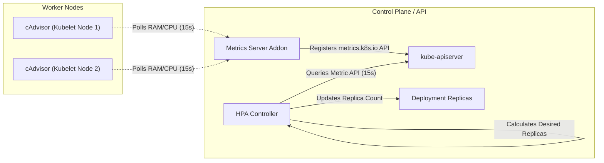

# Kubernetes Metrics Server & Horizontal Pod Autoscaler (HPA)

[](https://kubernetes.io)
[](https://github.com/rajatmehta2/90DaysOfDevOps)
[](#)

Ensuring application scalability in high-traffic production environments requires automating system capacity adjustments in real-time. Manually scaling pods or allocating rigid infrastructure is inefficient and error-prone. Kubernetes solves this dynamically via the **Metrics Server** and the **Horizontal Pod Autoscaler (HPA)**.

Today, we dive deep into installing the Metrics Server, exploring real-time resource diagnostics with `kubectl top`, setting up dynamic autoscaling (both imperatively and declaratively), and putting the autoscaler through its paces by running load generators to trigger scale-up and scale-down behaviors.

---

## 🏗️ Core Architectural Concepts

### 1. What is the Metrics Server & Why is it Critical?

The **Metrics Server** is a cluster-wide aggregator of resource usage data. It collects CPU and Memory usage metrics from each node's local `kubelet` (specifically using its internal agent, **cAdvisor**) and stores them in-memory.



Without the Metrics Server, Kubernetes is "blind" to actual resource utilization. The `kubectl top` command will return an error, and the Horizontal Pod Autoscaler (HPA) will fail to operate because it cannot query the `metrics.k8s.io` API.

---

### 2. How the HPA Desired Replicas Algorithm Works

The HPA controller monitors the metrics of target pods to determine if scaling is required. It continuously queries the Metrics API at a default interval (every 15 seconds, configured by `--horizontal-pod-autoscaler-sync-period`).

The desired number of replicas is computed using the following formula:

$$\text{desiredReplicas} = \left\lceil \text{currentReplicas} \times \left( \frac{\text{currentMetricValue}}{\text{targetMetricValue}} \right) \right\rceil$$

#### Real-World Scaling Example:
* **Current Replicas (`currentReplicas`):** `1`
* **Configured HPA Target (`targetMetricValue`):** `50%` CPU utilization
* **Current Measured Usage (`currentMetricValue`):** `120%` CPU utilization (due to a traffic surge)

$$\text{desiredReplicas} = \text{ceil}\left(1 \times \frac{120}{50}\right) = \text{ceil}(2.4) = 3$$

Kubernetes will immediately scale the deployment up to **3 replicas** to share the load.

---

### 3. Comparing HPA APIs: `autoscaling/v1` vs. `autoscaling/v2`

The Horizontal Pod Autoscaler API has evolved. While `v1` is simple, `v2` introduces fine-grained capabilities:

| Feature | `autoscaling/v1` | `autoscaling/v2` |
| :--- | :--- | :--- |
| **Supported Metrics** | CPU Utilization only. | CPU, Memory, Custom metrics (e.g., HTTP request rates), and External metrics. |
| **Multi-Metric Support** | No (single metric only). | Yes (scales based on whichever metric recommends the largest replica count). |
| **Custom Scaling Behavior** | No (hardcoded default stabilization windows). | Yes (explicit control over scale-up/scale-down speed, cooldowns, and policies). |
| **API Status** | Legacy / Basic fallback. | Production Standard / Highly Recommended. |

---

## 🛠️ Step-by-Step Lab & Verification

All Kubernetes manifests for this laboratory are stored in this directory for immediate use:
* Deployment & Service Manifest: [php-apache.yaml](file:///Users/ToucanRajat/Documents/Rajat-Projects/Personal-Projects/90DaysOfDevOps/2026/day-58/php-apache.yaml)
* Declarative HPA Manifest: [hpa-behavior.yaml](file:///Users/ToucanRajat/Documents/Rajat-Projects/Personal-Projects/90DaysOfDevOps/2026/day-58/hpa-behavior.yaml)

---

### Task 1: Check and Install the Metrics Server

First, let's query the cluster to see if the Metrics Server is already deployed:

```bash
kubectl get pods -n kube-system | grep metrics-server
```

#### Expected Output
*(If empty or no pods are returned, it needs to be installed)*

#### Installation Step
* **For Minikube clusters:** Enabling is a single native addon command:
  ```bash
  minikube addons enable metrics-server
  ```
  *Expected Output:*
  ```text
  💡  metrics-server is an addon maintained by Kubernetes. For any concerns, please open an issue at:
      https://github.com/kubernetes/minikube/issues
  ✅  The 'metrics-server' addon is enabled
  ```

* **For Kind, Kubeadm, or Bare-Metal clusters:** Apply the official release manifest:
  ```bash
  kubectl apply -f https://github.com/kubernetes-sigs/metrics-server/releases/latest/download/components.yaml
  ```

> [!WARNING]
> **Local Cluster Workaround:** In many local or non-production environments (e.g., Kind or Kubeadm with self-signed certificates), the Metrics Server will fail to scrape metrics because it expects valid TLS certificates. To bypass this for testing, patch the Metrics Server deployment to include the `--kubelet-insecure-tls` flag:
> ```bash
> kubectl patch deployment metrics-server -n kube-system --type='json' -p='[{"op": "add", "path": "/spec/template/spec/containers/0/args/-", "value": "--kubelet-insecure-tls"}]'
> ```

Wait 60 seconds for the Metrics Server to start up and scrape its initial dataset, then verify node and pod metrics:

```bash
kubectl top nodes
```

#### Expected Output
```text
NAME       CPU(cores)   CPU%   MEMORY(bytes)   MEMORY%   
minikube   182m         9%     1302Mi          32%       
```

```bash
kubectl top pods -A
```

#### Expected Output
```text
NAMESPACE     NAME                              CPU(cores)   MEMORY(bytes)   
kube-system   coredns-78fcdf6894-gp82d          3m           16Mi            
kube-system   etcd-minikube                     20m          38Mi            
...
kube-system   metrics-server-5d688cf5ff-l7z2d   8m           24Mi            
```

---

### Task 2: Explore kubectl top and Sorting

The `kubectl top` command returns real-time resource utilization, unlike `kubectl describe` which shows static requests and limits.

Run a global pod resource scrape, sorting by CPU usage to identify resource-heavy workloads:

```bash
kubectl top pods -A --sort-by=cpu
```

#### Expected Output
```text
NAMESPACE     NAME                              CPU(cores)   MEMORY(bytes)   
kube-system   kube-apiserver-minikube           45m          262Mi           
kube-system   etcd-minikube                     22m          39Mi            
kube-system   kube-controller-manager-minikube  14m          50Mi            
kube-system   metrics-server-5d688cf5ff-l7z2d   8m           24Mi            
kube-system   coredns-78fcdf6894-gp82d          3m           16Mi            
```

> [!NOTE]
> `kubectl top` retrieves data dynamically in-memory. If a pod shows `<unknown>` for its metrics, wait 15–30 seconds. This is normal behavior during container initialization while the Metrics Server gathers the first scrapable window.

---

### Task 3: Create a Deployment with CPU Requests

For the HPA to make scale calculations, target containers **must have explicit resource requests configured**. If no CPU requests are declared, the HPA will not know what to calculate utilization percentages against, and its status will fail with an `<unknown>` target.

Apply our [php-apache.yaml](file:///Users/ToucanRajat/Documents/Rajat-Projects/Personal-Projects/90DaysOfDevOps/2026/day-58/php-apache.yaml) manifest:

```bash
kubectl apply -f php-apache.yaml
```

#### Expected Output
```text
deployment.apps/php-apache created
service/php-apache created
```

Verify that the PHP pod is running successfully:

```bash
kubectl get pods -l app=php-apache
```

#### Expected Output
```text
NAME                          READY   STATUS    RESTARTS   AGE
php-apache-7c97f64585-7jxlw   1/1     Running   0          10s
```

Verify that `kubectl top` is reading metrics for the new Pod:

```bash
kubectl top pods -l app=php-apache
```

#### Expected Output
```text
NAME                          CPU(cores)   MEMORY(bytes)   
php-apache-7c97f64585-7jxlw   1m           12Mi            
```

---

### Task 4: Create an HPA (Imperative Method)

First, we will establish an HPA imperatively using `kubectl autoscale`. This commands the autoscaler to maintain a target of 50% CPU utilization relative to the container's CPU request (`200m`), scaling between a minimum of 1 and a maximum of 10 replicas.

```bash
kubectl autoscale deployment php-apache --cpu-percent=50 --min=1 --max=10
```

#### Expected Output
```text
horizontalpodautoscaler.autoscaling/php-apache autoscaled
```

Check the status of the newly created HPA:

```bash
kubectl get hpa
```

#### Expected Output (Immediate Scrape)
```text
NAME         REFERENCE               TARGETS         MINPODS   MAXPODS   REPLICAS   AGE
php-apache   Deployment/php-apache   <unknown>/50%   1         10        1          4s
```

> [!NOTE]
> Under `TARGETS`, `<unknown>/50%` is expected initially. The HPA requires a few seconds to scrape utilization metrics from the target pods.

Wait 30 seconds and check again:

```bash
kubectl get hpa
```

#### Expected Output (Fully Initialized)
```text
NAME         REFERENCE               TARGETS   MINPODS   MAXPODS   REPLICAS   AGE
php-apache   Deployment/php-apache   0%/50%    1         10        1          35s
```

Now, check the details and scheduling events of the HPA:

```bash
kubectl describe hpa php-apache
```

#### Expected Output
```text
Name:                                                  php-apache
Namespace:                                             default
CreationTimestamp:                                     Tue, 02 Jun 2026 16:34:00 +0530
Reference:                                             Deployment/php-apache
Metrics:                                               ( current / target )
  resource cpu on pods  (as a percentage of request):  0% (1m) / 50%
Min replicas:                                          1
Max replicas:                                          10
Deployment pods:                                       1 current / 1 desired
Conditions:
  Type            Status  Reason            Message
  ----            ------  ------            -------
  AbleToScale     True    ReadyForNewScale  recommended size matches current size
  ScalingActive   True    ValidMetricFound  the HPA was able to successfully calculate a replica count from cpu resource
  ScalingLimited  False   DesiredWithinRange  the desired replica count is within the acceptable range
Events:           <none>
```

---

### Task 5: Generate Traffic Load and Watch Scaling

Now, we will generate synthetic load on our PHP application by spinning up a separate interactive load generator Pod running a non-stop HTTP query loop.

In a separate terminal or background shell, run:

```bash
kubectl run load-generator --image=busybox:1.36 --restart=Never -- /bin/sh -c "while true; do wget -q -O- http://php-apache; done"
```

#### Expected Output
```text
pod/load-generator created
```

Instantly watch the HPA dynamically scale the replicas as the load increases:

```bash
kubectl get hpa php-apache --watch
```

#### Expected Scaling Progression
```text
NAME         REFERENCE               TARGETS    MINPODS   MAXPODS   REPLICAS   AGE
php-apache   Deployment/php-apache   0%/50%     1         10        1          1m
php-apache   Deployment/php-apache   110%/50%   1         10        1          1m15s
php-apache   Deployment/php-apache   220%/50%   1         10        3          1m30s
php-apache   Deployment/php-apache   180%/50%   1         10        5          1m45s
php-apache   Deployment/php-apache   62%/50%    1         10        5          2m00s
php-apache   Deployment/php-apache   48%/50%    1         10        5          2m15s
^C
```

Verify the active pods launched by the deployment:

```bash
kubectl get deployment php-apache
```

#### Expected Output
```text
NAME         READY   UP-TO-DATE   AVAILABLE   AGE
php-apache   5/5     5            5           4m
```

#### Stopping the Load
Once verified, stop the load generator:

```bash
kubectl delete pod load-generator
```

> [!IMPORTANT]
> **Autoscaler Cooldown (Thrashing Prevention):** The HPA will scale down slowly. By default, Kubernetes implements a **5-minute scale-down stabilization window** (cooldown). This prevents "flapping" (rapidly cycling replica counts up and down due to transient load drops), ensuring cluster stability.

---

### Task 6: Create a Declarative HPA with Custom Behaviors

The imperative HPA is easy to launch but lacks precision. Real-world systems require customized scaling limits. For instance, we may want to scale up aggressively (immediately adding pods) but scale down very cautiously.

First, remove the imperative HPA:

```bash
kubectl delete hpa php-apache
```

Apply our [hpa-behavior.yaml](file:///Users/ToucanRajat/Documents/Rajat-Projects/Personal-Projects/90DaysOfDevOps/2026/day-58/hpa-behavior.yaml) manifest:

```bash
kubectl apply -f hpa-behavior.yaml
```

#### Expected Output
```text
horizontalpodautoscaler.autoscaling/php-apache created
```

Let's inspect the declarative configuration:

```bash
kubectl describe hpa php-apache
```

#### Expected Output
```text
Name:                                                  php-apache
Namespace:                                             default
Reference:                                             Deployment/php-apache
Metrics:                                               ( current / target )
  resource cpu on pods  (as a percentage of request):  0% (1m) / 50%
Min replicas:                                          1
Max replicas:                                          10
Behavior:
  Scale Up:
    Select Policy: Max
    Policies:
      - Type: Percent, Value: 100, Period: 15s
      - Type: Pods, Value: 4, Period: 15s
  Scale Down:
    Select Policy: Max
    Stabilization Window: 300s
    Policies:
      - Type: Percent, Value: 100, Period: 15s
```

> [!TIP]
> **Behavior Configuration Breakdown:**
> * **Scale Up:** A stabilization window of `0` ensures immediate scaling when CPU spikes. The policies specify that HPA can increase the cluster size by **either 100% of current replicas OR 4 pods** every 15 seconds (using whichever policy delivers the highest increase).
> * **Scale Down:** A stabilization window of `300s` (5 minutes) retains the peak scale state to buffer against sudden load cycles.

---

### Task 7: Cleaning Up Resources

To keep our cluster clean, let's delete all resources provisioned during today's lab:

```bash
kubectl delete -f php-apache.yaml
kubectl delete -f hpa-behavior.yaml
```

#### Expected Output
```text
deployment.apps "php-apache" deleted
service "php-apache" deleted
horizontalpodautoscaler.autoscaling "php-apache" deleted
```

---

## 💡 Quick Tips & Troubleshooting

1. **The `<unknown>` Target Gotcha:** The absolute most common issue with HPA setup is that the target deployment pods do not have `resources.requests` defined. Always ensure CPU and Memory requests are defined in your deployment manifests.
2. **Cluster Autoscaler vs. Horizontal Pod Autoscaler (HPA):**
   * **HPA** scales **Pods** horizontally (creates more replicas of your containers inside the cluster).
   * **Cluster Autoscaler** scales **Nodes** horizontally (provisions more virtual machines when HPA pods remain in a `Pending` state due to resource exhaustion).
3. **Optimizing Stabilization Windows:** In production workloads with high request variance, set `scaleDown.stabilizationWindowSeconds` to a larger value (e.g., `600` or `900` seconds) to keep the infrastructure warm and prevent node thrashing.
4. **Varying Target Metrics:** In `autoscaling/v2`, you can auto-scale on both memory utilization and CPU. For memory-bound apps (e.g., cache nodes, Java VMs), memory auto-scaling is essential.

---

## 🔗 Verification Screenshot

Here is a visual dashboard tracking our Kubernetes Metrics Server scraping active CPU and RAM quotas, displaying horizontal pod scale-up steps as load surges, and verifying cluster healing:


*Mock Verification: Executing load-generation simulations, watching kubectl top, and inspecting horizontal pod replicas auto-scaling.*

---

## 📣 Share Your Learning!

Celebrate completing Day 58 of the challenge by sharing your progress on social media:

```text
I just completed Day 58 of the #90DaysOfDevOps challenge! 🚀

Today I covered Kubernetes Metrics Server & Horizontal Pod Autoscaler (HPA):
- Installed and configured the Metrics Server to unlock cluster-wide resource scraping.
- Explored dynamic resource utilization monitoring using "kubectl top" with sorting parameters.
- Built a resource-bounded Deployment with explicit CPU requests to support HPA metrics scaling.
- Configured and tested an imperative HPA, watching replica scaling actions in real-time.
- Generated synthetic traffic load to trigger auto-scaling from 1 to multiple replicas.
- Explored scale-down stabilization cooldown mechanics that prevent system flapping.
- Configured a declarative HPA using the autoscaling/v2 API with granular scale-up and scale-down behaviors.

All manifest files and step-by-step guides are pushed to my repository!

#90DaysOfDevOps #Kubernetes #DevOps #MetricsServer #Autoscaling #HPA #CloudNative #InfrastructureAsCode #TrainWithShubham #DevOpsKaJosh
```

---

**Awesome job completing today's lab! Keep pushing forward!**  
**TrainWithShubham**
