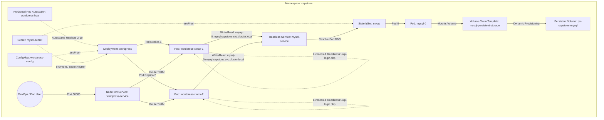

# Day 60: Capstone Project — Deploying a Highly Available, Self-Healing WordPress + MySQL Stack on Kubernetes

[](https://kubernetes.io)
[](https://wordpress.org)
[](https://mysql.com)
[](https://github.com/rajatmehta2/90DaysOfDevOps)

Welcome to **Day 60** of the 90 Days of DevOps challenge! Over the past ten days, we have journeyed deep into the Kubernetes ecosystem, studying core resources, service networking, configuration states, persistent storage, advanced orchestration with StatefulSets, resource scheduling constraints, automated scaling, and Helm package management. 

Today is the ultimate culmination of our Kubernetes journey: the **Kubernetes Capstone Project**. We will put all twelve major Kubernetes concepts together to deploy a highly available, self-healing, and persistent **WordPress + MySQL** application stack from scratch.

---

## 🎯 Concept Reference Matrix

This capstone project incorporates everything we have learned over the last ten days. Below is a mapping of each Kubernetes concept utilized in this deployment to the day it was covered:

| Kubernetes Concept | Learned On | Implementation Role in Capstone |
| :--- | :--- | :--- |
| **Namespaces** | [Day 52](../day-52) | Provides logical isolation for the capstone stack environment (`capstone` namespace). |
| **Secrets** | [Day 54](../day-54) | Securely stores MySQL database root credentials and user passwords. |
| **ConfigMaps** | [Day 54](../day-54) | Stores non-sensitive variables such as the database hostname and database name. |
| **Persistent Volumes (PV) & PVCs** | [Day 55](../day-55) | Guarantees database storage lifecycle persistence independent of pod lifetimes. |
| **Headless Services** | [Day 53](../day-53) / [Day 56](../day-56) | Provides stable network identities (DNS records) directly to individual StatefulSet pods. |
| **StatefulSets** | [Day 56](../day-56) | Deploys the database (MySQL) with stable disk bindings and unique network identifiers. |
| **Deployments** | [Day 52](../day-52) | Deploys the stateless web application tier (WordPress) with desired replica counts. |
| **NodePort Services** | [Day 53](../day-53) | Exposes the WordPress web interface to external cluster and host-level traffic. |
| **Resource Limits & Requests** | [Day 57](../day-57) | Restricts and guarantees CPU and memory capacity for container performance stability. |
| **Container Probes** | [Day 57](../day-57) | Performs liveness and readiness health checks to achieve self-healing application routing. |
| **Horizontal Pod Autoscaling (HPA)** | [Day 58](../day-58) | Auto-scales the WordPress frontend replicas dynamically based on real-time CPU stress metrics. |
| **Helm Package Manager** | [Day 59](../day-59) | Validates and compares manual manifest deployments against automated Helm charts. |

---

## 🏗️ Architecture & Component Flow

The architectural blueprint of our deployment features a multi-tier structure consisting of a stateless frontend tier (WordPress Deployment) and a stateful database tier (MySQL StatefulSet), all decoupled, secure, and dynamically scaled:



---

## 🛠️ Step-by-Step Practical Implementation

> [!IMPORTANT]  
> All manifestations and actions are conducted inside a Kubernetes cluster environment (e.g., Minikube or Kind). Ensure your cluster is active and your CLI is linked before starting.

### Task 1: Create the Isolated Namespace

First, we create a dedicated logical namespace `capstone` to isolate our application stack and keep the default namespace clean.

#### 1. Define the Namespace Manifest
Create a file named `01-namespace.yaml`:

```yaml
apiVersion: v1
kind: Namespace
metadata:
  name: capstone
  labels:
    env: production
    project: capstone
```

#### 2. Apply and Set Default Context
Apply the manifest and switch your active context namespace to `capstone` so that all subsequent commands run within this scope automatically.

```bash
kubectl apply -f 01-namespace.yaml
kubectl config set-context --current --namespace=capstone
```

**Realistic Terminal Output:**
```text
namespace/capstone created
Context "minikube" modified.
```

Verify your active namespace namespace environment:
```bash
kubectl config view --minify | grep namespace
```

**Realistic Terminal Output:**
```text
    namespace: capstone
```

---

### Task 2: Deploy the Stateful MySQL Tier

The database tier is stateful and requires:
1. A **Secret** to store credentials securely.
2. A **Headless Service** for stable internal DNS resolution.
3. A **StatefulSet** with resource boundaries and a persistent volume claim template to persist database data.

#### 1. Define the Database Secrets
Create a file named `02-mysql-secret.yaml`. We will utilize `stringData` to input raw strings directly, which Kubernetes automatically converts into standard base64 strings upon execution.

```yaml
apiVersion: v1
kind: Secret
metadata:
  name: mysql-secret
  namespace: capstone
type: Opaque
stringData:
  MYSQL_ROOT_PASSWORD: "SuperSecureRootPassword99"
  MYSQL_DATABASE: "wordpress"
  MYSQL_USER: "wordpress_user"
  MYSQL_PASSWORD: "WordpressPassWord77!"
```

#### 2. Define the MySQL Headless Service
Create a file named `03-mysql-service.yaml`. Headless services use `clusterIP: None` to disable standard service load balancing. Instead, the service directly returns the IP addresses of the backend pods, allowing us to route requests directly to `mysql-0`.

```yaml
apiVersion: v1
kind: Service
metadata:
  name: mysql
  namespace: capstone
  labels:
    app: mysql
spec:
  ports:
    - port: 3306
      name: mysql
  clusterIP: None
  selector:
    app: mysql
```

#### 3. Define the MySQL StatefulSet
Create a file named `04-mysql-statefulset.yaml`. The StatefulSet uses `volumeClaimTemplates` to request storage dynamically from the cluster's default storage class, mounted directly into the MySQL database folder `/var/lib/mysql`.

```yaml
apiVersion: apps/v1
kind: StatefulSet
metadata:
  name: mysql
  namespace: capstone
spec:
  serviceName: "mysql"
  replicas: 1
  selector:
    matchLabels:
      app: mysql
  template:
    metadata:
      labels:
        app: mysql
    spec:
      containers:
        - name: mysql
          image: mysql:8.0
          envFrom:
            - secretRef:
                name: mysql-secret
          resources:
            requests:
              cpu: "250m"
              memory: "512Mi"
            limits:
              cpu: "500m"
              memory: "1Gi"
          ports:
            - containerPort: 3306
              name: mysql
          volumeMounts:
            - name: mysql-persistent-storage
              mountPath: /var/lib/mysql
  volumeClaimTemplates:
    - metadata:
        name: mysql-persistent-storage
      spec:
        accessModes: [ "ReadWriteOnce" ]
        resources:
          requests:
            storage: 1Gi
```

#### 4. Apply Database Configuration and Verify
Apply these three manifests to launch the stateful tier:

```bash
kubectl apply -f 02-mysql-secret.yaml
kubectl apply -f 03-mysql-service.yaml
kubectl apply -f 04-mysql-statefulset.yaml
```

**Realistic Terminal Output:**
```text
secret/mysql-secret created
service/mysql created
statefulset.apps/mysql created
```

Wait until the StatefulSet pod `mysql-0` goes into a healthy `Running` state:
```bash
kubectl get pods -w
```

**Realistic Terminal Output:**
```text
NAME      READY   STATUS              RESTARTS   AGE
mysql-0   0/1     ContainerCreating   0          5s
mysql-0   1/1     Running             0          28s
```

Verify that the PVC was successfully bound to a dynamically provisioned Persistent Volume:
```bash
kubectl get pvc,pv
```

**Realistic Terminal Output:**
```text
NAME                                                        STATUS   VOLUME                                     CAPACITY   ACCESS MODES   STORAGECLASS   AGE
persistentvolumeclaim/mysql-persistent-storage-mysql-0      Bound    pvc-ad43d2c8-89c1-4b72-88ef-22ba8c89de05   1Gi        RWO            standard       45s

NAME                                                        CAPACITY   ACCESS MODES   RECLAIM POLICY   STATUS   CLAIM                                            STORAGECLASS   AGE
persistentvolume/pvc-ad43d2c8-89c1-4b72-88ef-22ba8c89de05   1Gi        RWO            Delete           Bound    capstone/mysql-persistent-storage-mysql-0      standard       45s
```

#### 5. Verify the Database Connection
Log into the running `mysql-0` pod to execute database queries and verify the initialization of the `wordpress` database as defined in the Secret.

```bash
kubectl exec -it mysql-0 -- mysql -u wordpress_user -p"WordpressPassWord77!" -e "SHOW DATABASES;"
```

**Realistic Terminal Output:**
```text
+--------------------+
| Database           |
+--------------------+
| information_schema |
| performance_schema |
| wordpress          |
+--------------------+
```

> [!TIP]  
> If the StatefulSet pod stays in a `Pending` state, check your storage class configuration via `kubectl get storageclass`. On local systems, ensure your default provisioner is active.

---

### Task 3: Deploy the WordPress Web Tier

With the database tier running, we deploy the frontend web server (WordPress) using:
1. A **ConfigMap** holding non-confidential configuration parameters.
2. A **Deployment** using the `wordpress:latest` image, configured with 2 replicas, environment references, resource requests/limits, and container health probes.

#### 1. Define the WordPress ConfigMap
Create a file named `05-wordpress-configmap.yaml`. We configure `WORDPRESS_DB_HOST` to target the stable DNS record of the MySQL StatefulSet pod: `<pod-name>.<headless-service-name>.<namespace>.svc.cluster.local:port`.

```yaml
apiVersion: v1
kind: ConfigMap
metadata:
  name: wordpress-config
  namespace: capstone
data:
  WORDPRESS_DB_HOST: "mysql-0.mysql.capstone.svc.cluster.local:3306"
  WORDPRESS_DB_NAME: "wordpress"
```

#### 2. Define the WordPress Deployment
Create a file named `06-wordpress-deployment.yaml`.
* We import variables dynamically using `envFrom` for the ConfigMap.
* Sensitive database usernames and passwords are safe and secure by pulling them directly from the `mysql-secret` Secret using `valueFrom.secretKeyRef`.
* Probes are configured on `/wp-login.php` on port `80`. The `initialDelaySeconds` is set to `35` to allow the Apache webserver to spin up fully before probes execute.

```yaml
apiVersion: apps/v1
kind: Deployment
metadata:
  name: wordpress
  namespace: capstone
  labels:
    app: wordpress
spec:
  replicas: 2
  selector:
    matchLabels:
      app: wordpress
  template:
    metadata:
      labels:
        app: wordpress
    spec:
      containers:
        - name: wordpress
          image: wordpress:latest
          ports:
            - containerPort: 80
              name: wordpress
          env:
            - name: WORDPRESS_DB_USER
              valueFrom:
                secretKeyRef:
                  name: mysql-secret
                  key: MYSQL_USER
            - name: WORDPRESS_DB_PASSWORD
              valueFrom:
                secretKeyRef:
                  name: mysql-secret
                  key: MYSQL_PASSWORD
          envFrom:
            - configMapRef:
                name: wordpress-config
          resources:
            requests:
              cpu: "200m"
              memory: "256Mi"
            limits:
              cpu: "500m"
              memory: "512Mi"
          livenessProbe:
            httpGet:
              path: /wp-login.php
              port: 80
            initialDelaySeconds: 35
            periodSeconds: 15
          readinessProbe:
            httpGet:
              path: /wp-login.php
              port: 80
            initialDelaySeconds: 20
            periodSeconds: 10
```

#### 3. Apply and Verify WordPress
Apply the frontend tier manifests:

```bash
kubectl apply -f 05-wordpress-configmap.yaml
kubectl apply -f 06-wordpress-deployment.yaml
```

**Realistic Terminal Output:**
```text
configmap/wordpress-config created
deployment.apps/wordpress created
```

Monitor the active pods. You will observe the readiness probes transition the containers to `1/1 Ready` once the internal WordPress Apache service completes setup and connects to the MySQL StatefulSet backend:

```bash
kubectl get pods -l app=wordpress -w
```

**Realistic Terminal Output:**
```text
NAME                         READY   STATUS              RESTARTS   AGE
wordpress-769fb6999c-8g4s2   0/1     ContainerCreating   0          5s
wordpress-769fb6999c-d9ks7   0/1     ContainerCreating   0          5s
wordpress-769fb6999c-8g4s2   0/1     Running             0          15s
wordpress-769fb6999c-d9ks7   0/1     Running             0          15s
wordpress-769fb6999c-d9ks7   1/1     Running             0          22s
wordpress-769fb6999c-8g4s2   1/1     Running             0          24s
```

Both frontend pods are now `Running` and marked as fully `Ready`!

---

### Task 4: Expose & Access the Application

To access WordPress externally in a browser, we expose it using a **NodePort Service** on a pre-assigned static node port.

#### 1. Define the WordPress NodePort Service
Create a file named `07-wordpress-service.yaml`. We map external port `30080` to internal container port `80`.

```yaml
apiVersion: v1
kind: Service
metadata:
  name: wordpress
  namespace: capstone
  labels:
    app: wordpress
spec:
  ports:
    - port: 80
      targetPort: 80
      nodePort: 30080
  type: NodePort
  selector:
    app: wordpress
```

#### 2. Apply and Get Service Access
Apply the service manifest:

```bash
kubectl apply -f 07-wordpress-service.yaml
```

**Realistic Terminal Output:**
```text
service/wordpress created
```

Retrieve the access point for your application depending on your cluster setup:

* **Minikube:** Use Minikube’s built-in networking command to open the application tunnel:
  ```bash
  minikube service wordpress -n capstone
  ```
  **Realistic Terminal Output:**
  ```text
  |-----------|-----------|-------------|-----------------------------|
  | NAMESPACE |   NAME    | TARGET PORT |             URL             |
  |-----------|-----------|-------------|-----------------------------|
  | capstone  | wordpress |          80 | http://192.168.49.2:30080   |
  |-----------|-----------|-------------|-----------------------------|
  * Opening service capstone/wordpress in default browser...
  ```

* **Kind / Standard Clusters:** Forward port `8080` on your local host directly to the WordPress Service:
  ```bash
  kubectl port-forward svc/wordpress 8080:80 -n capstone
  ```
  **Realistic Terminal Output:**
  ```text
  Forwarding from 127.0.0.1:8080 -> 80
  Forwarding from [::1]:8080 -> 80
  Handling connection for 8080
  ```

#### 3. Complete the Setup Wizard
1. Open your browser and navigate to `http://127.0.0.1:8080` (or the Minikube URL).
2. You will be greeted by the premium **WordPress Welcome & Installation Wizard**.
3. Select your language, set your site title (e.g., **90 Days of DevOps Capstone**), define administrative credentials, and click **Install WordPress**.
4. Log into the WordPress Dashboard, create a new post titled *"Mastering Kubernetes in 10 Days!"*, publish it, and view the live website dashboard.


*Caption: Successfully completed the WordPress installation wizard and published our first post.*

---

### Task 5: Verify Self-Healing and Storage Persistence

A robust, production-grade cloud native application must survive hardware failures and pod crashes without experiencing down-time or data loss. We will execute crash simulations to verify self-healing and database storage persistence.

#### Test 1: Frontend Tier Self-Healing (Stateless Pod Re-creation)
Let's delete one of our running WordPress pods to simulate a sudden compute crash.

```bash
# List pods to find a targeted name
kubectl get pods -l app=wordpress

# Delete one of the pods
kubectl delete pod wordpress-769fb6999c-8g4s2 -n capstone
```

**Realistic Terminal Output:**
```text
pod "wordpress-769fb6999c-8g4s2" deleted
```

Now, immediately list the pods inside the namespace:
```bash
kubectl get pods -l app=wordpress
```

**Realistic Terminal Output:**
```text
NAME                         READY   STATUS        RESTARTS   AGE
wordpress-769fb6999c-8g4s2   1/1     Terminating   0          3m
wordpress-769fb6999c-d9ks7   1/1     Running       0          3m
wordpress-769fb6999c-k8q5a   0/1     Pending       0          2s
wordpress-769fb6999c-k8q5a   0/1     Running       0          8s
wordpress-769fb6999c-k8q5a   1/1     Running       0          14s
```

> [!NOTE]  
> The Deployment Controller immediately detected that the current state (1 pod) diverged from the declared desired state (2 replicas). It immediately scheduled a new Pod (`wordpress-769fb6999c-k8q5a`) to maintain high availability. During this brief process, the frontend service remained responsive with zero downtime.

#### Test 2: Database Tier Self-Healing & Storage Persistence
Delete the StatefulSet MySQL pod to test database volume persistence:

```bash
kubectl delete pod mysql-0 -n capstone
```

**Realistic Terminal Output:**
```text
pod "mysql-0" deleted
```

StatefulSet pods compile with stable suffixes starting from `0`. The controller immediately recreates `mysql-0`:
```bash
kubectl get pods -l app=mysql -w
```

**Realistic Terminal Output:**
```text
NAME      READY   STATUS              RESTARTS   AGE
mysql-0   0/1     Terminating         0          4m
mysql-0   0/1     Pending             0          1s
mysql-0   0/1     ContainerCreating   0          2s
mysql-0   1/1     Running             0          12s
```

#### The Persistence Validation Check
1. Refresh your WordPress blog post in the browser.
2. The page loads perfectly, displaying our custom post: *"Mastering Kubernetes in 10 Days!"*.

**How did this happen?**
When the StatefulSet controller recreated `mysql-0`, it re-attached the exact same persistent storage claim `mysql-persistent-storage-mysql-0`. The underlying Persistent Volume was not deleted, preserving the entire database state!

---

### Task 6: Configure Auto-Scaling via Horizontal Pod Autoscaler (HPA)

To protect our frontend web servers from traffic spikes, we implement a **Horizontal Pod Autoscaler** (HPA) to scale WordPress instances dynamically based on CPU utilization.

#### 1. Define the HPA Manifest
Create a file named `08-wordpress-hpa.yaml`. We configure the HPA to target the `wordpress` deployment, with a minimum replica count of `2`, a maximum replica count of `10`, and a trigger threshold set to **50% CPU utilization**.

```yaml
apiVersion: autoscaling/v2
kind: HorizontalPodAutoscaler
metadata:
  name: wordpress-hpa
  namespace: capstone
spec:
  scaleTargetRef:
    apiVersion: apps/v1
    kind: Deployment
    name: wordpress
  minReplicas: 2
  maxReplicas: 10
  metrics:
    - type: Resource
      resource:
        name: cpu
        target:
          type: Utilization
          averageUtilization: 50
```

#### 2. Apply and Audit the HPA
Apply the manifest:

```bash
kubectl apply -f 08-wordpress-hpa.yaml
```

**Realistic Terminal Output:**
```text
horizontalpodautoscaler.autoscaling/wordpress-hpa created
```

Allow the metrics server a minute to aggregate the CPU usage, then query the status:
```bash
kubectl get hpa -n capstone
```

**Realistic Terminal Output:**
```text
NAME            REFERENCE              TARGETS         MINPODS   MAXPODS   REPLICAS   AGE
wordpress-hpa   Deployment/wordpress   0%/50%          2         10        2          60s
```

---

### 🔍 Comprehensive Environment Audit

Let's execute a final command to retrieve all Kubernetes resources in the `capstone` namespace. This gives us a complete view of our manual multi-tier WordPress + MySQL architecture:

```bash
kubectl get all -n capstone
```

**Realistic Terminal Output:**
```text
NAME                             READY   STATUS    RESTARTS   AGE
pod/mysql-0                      1/1     Running   0          5m
pod/wordpress-769fb6999c-d9ks7   1/1     Running   0          8m
pod/wordpress-769fb6999c-k8q5a   1/1     Running   0          4m

NAME                TYPE        CLUSTER-IP   EXTERNAL-IP   PORT(S)        AGE
service/mysql       ClusterIP   None         <none>        3306/TCP       10m
service/wordpress   NodePort    10.96.45.89  <none>        80:30080/TCP   7m

NAME                        READY   UP-TO-DATE   AVAILABLE   AGE
deployment.apps/wordpress   2/2     2            2           8m

NAME                                   DESIRED   CURRENT   READY   AGE
replicaset.apps/wordpress-769fb6999c   2         2         2       8m

NAME                     READY   AGE
statefulset.apps/mysql   1/1     10m

NAME                                            REFERENCE              TARGETS   MINPODS   MAXPODS   REPLICAS   AGE
horizontalpodautoscaler.autoscaling/wordpress-hpa   Deployment/wordpress   0%/50%    2         10        2          2m
```


*Caption: All components inside the capstone namespace are healthy and running.*

---

### Task 7: Comparative Analysis — Manual vs. Helm Deployments

To understand how Helm simplifies deployments, we will deploy the exact same stack using Helm and compare the two approaches.

#### 1. Deploy WordPress + MySQL using Helm
Create a separate namespace `capstone-helm` and deploy the official Bitnami WordPress chart.

```bash
# Add Bitnami repo if not already added
helm repo add bitnami https://charts.bitnami.com/bitnami
helm repo update

# Install WordPress using Helm in a separate namespace
helm install wp-helm bitnami/wordpress --namespace capstone-helm --create-namespace
```

**Realistic Terminal Output:**
```text
NAME: wp-helm
LAST DEPLOYED: Tue Jun  2 17:15:20 2026
NAMESPACE: capstone-helm
STATUS: deployed
REVISION: 1
NOTES:
...
```

#### 2. Structural Comparison

Let's list all resources created by the Bitnami Helm chart:
```bash
kubectl get all,pvc -n capstone-helm
```

**Realistic Terminal Output:**
```text
NAME                                         READY   STATUS    RESTARTS   AGE
pod/wp-helm-mariadb-0                        1/1     Running   0          60s
pod/wp-helm-wordpress-7dbf85cbf6-2hns4       1/1     Running   0          60s

NAME                                 TYPE           CLUSTER-IP      EXTERNAL-IP   PORT(S)                      AGE
service/wp-helm-mariadb              ClusterIP      10.96.11.202    <none>        3306/TCP                     60s
service/wp-helm-wordpress            LoadBalancer   10.96.155.80    <pending>     80:31980/TCP,443:30945/TCP   60s

NAME                                    READY   UP-TO-DATE   AVAILABLE   AGE
deployment.apps/wp-helm-wordpress       1/1     1            1           60s

NAME                                               DESIRED   CURRENT   READY   AGE
replicaset.apps/wp-helm-wordpress-7dbf85cbf6       1         1         1       60s

NAME                               READY   AGE
statefulset.apps/wp-helm-mariadb   1/1     60s

NAME                                                 STATUS   VOLUME                                     CAPACITY   ACCESS MODES   STORAGECLASS   AGE
persistentvolumeclaim/data-wp-helm-mariadb-0         Bound    pvc-ecf72d54-8c81-42ab-b192-3bcde2cf88ad   8Gi        RWO            standard       60s
persistentvolumeclaim/wp-helm-wordpress              Bound    pvc-89ac9cd7-8da2-491a-b31a-e9ca7cdcd710   10Gi       RWO            standard       60s
```

#### 3. Key Differences: Manual Manifests vs. Helm Chart

| Architectural Vector | Manual Manifests Approach | Bitnami Helm Chart Approach |
| :--- | :--- | :--- |
| **Control & Customization** | **High:** We control every line, resource bound, and logic detail manually. | **Medium:** Pre-configured template parameters are customized via a `values.yaml` file. |
| **Ease of Deployment** | **Low:** Requires managing 8 distinct YAML files in the correct dependency order. | **High:** Installs the entire stack and all dependencies with a single command. |
| **Upgrade Management** | **Manual:** Requires editing manifests and running `kubectl apply` commands. | **Automated:** Features robust upgrade tracking and instant `helm rollback` commands. |
| **Complexity & Overhead** | **Low:** Minimal, simple resources containing only the configurations we defined. | **High:** Creates a large volume of generic resources, sidecars, and default parameters. |

#### 4. Clean Up Helm Resources
Uninstall the Helm release and delete the associated namespace:

```bash
helm uninstall wp-helm -n capstone-helm
kubectl delete namespace capstone-helm
```

**Realistic Terminal Output:**
```text
release "wp-helm" uninstalled
namespace "capstone-helm" deleted
```

---

### Task 8: Capstone Environment Teardown

To release resources in our local cluster, we clean up our capstone environment by deleting the `capstone` namespace.

```bash
# Delete the entire capstone namespace
kubectl delete namespace capstone

# Reset our kubectl context back to default namespace
kubectl config set-context --current --namespace=default
```

**Realistic Terminal Output:**
```text
namespace "capstone" deleted
Context "minikube" modified.
```

Verify that all resources have been removed:
```bash
kubectl get all -n capstone
```

**Realistic Terminal Output:**
```text
No resources found in capstone namespace.
```

---

## 💡 Pro DevOps Tips & Best Practices

1. **Keep Secrets Secret:** Never commit raw passwords or database configurations to a public repository. In production environments, use secure storage solutions like **HashiCorp Vault**, **AWS Secrets Manager**, or **SealedSecrets** to encrypt configurations safely.
2. **Implement Database Replication:** Single-replica database StatefulSets represent a single point of failure (SPOF). In production, configure primary/replica replication architectures (e.g. using operators) to ensure database high availability.
3. **Add Storage Reclamation Rules:** Ensure your StorageClass reclamation policy matches your persistence needs. Use the `Retain` policy in production to prevent accidental data loss when PVCs are deleted.
4. **Tune Liveness/Readiness Probes:** Set conservative initial delay settings (`initialDelaySeconds`) to prevent Kubernetes from restarting containers while they are performing database installations or running migrations.

---

## 📝 Learning Reflection & Hardening Roadmap

### The Hardest Parts of this Capstone
* **Pod Networking & DNS Resolution:** Coordinating stable network DNS records between the frontend deployment and the database StatefulSet requires strict naming accuracy (`mysql-0.mysql.capstone.svc.cluster.local`). A single typo breaks the database connection.
* **Storage Class Provisioning:** Configuring dynamic volume claim bindings on local systems requires an active default storage class. Getting this running on local clusters like Minikube or Kind is sometimes tricky.

### What Clicked
* **The Power of Headless Services:** Seeing how headless services bypass ClusterIP assignments to map DNS requests directly to StatefulSet pods highlights how simple and elegant Kubernetes networking can be.
* **Dynamic Persistence:** Observing the database automatically recover and re-attach its existing persistent volume claim after simulating a pod crash demonstrated the absolute power of Kubernetes self-healing and data persistence.

### Production Hardening Roadmap
To promote this WordPress + MySQL stack from a development lab to a production-grade deployment, we should add:
1. **Ingress Controllers & TLS Encryption:** Deploy an Ingress Controller (like NGINX Ingress) combined with **Cert-Manager** to expose the frontend securely via HTTPS (`https://myblog.com`).
2. **Horizontal Pod Autoscaling (HPA) Tuning:** Tune metrics using CPU *and* memory utilization thresholds, combined with **cluster autoscaling** at the cloud provider level.
3. **Continuous Backups:** Run automated database and volume backup processes (using tools like **Velero**) scheduled via Kubernetes **CronJobs** to back up stateful databases to secure cloud storage buckets (like AWS S3).
4. **Network Policies:** Implement strict Network Policies (`NetworkPolicy`) to restrict inbound traffic to the database, ensuring only frontend WordPress pods can access MySQL on port 3306.

---

## 📢 Share Your Journey!

Ready to share your Kubernetes milestone with the DevOps community? Copy-paste this template directly to LinkedIn:

```text
🚀 Day 60 of my #90DaysOfDevOps challenge is complete! I have successfully finished the Kubernetes Capstone Project! 🐳📦

Over the last 10 days, I journeyed deep into the Kubernetes ecosystem. Today, I put all twelve major concepts together to deploy a highly available, self-healing, and persistent WordPress + MySQL stack from scratch!

Here's what I implemented:
🔹 Set up isolated development environments using Namespaces.
🔹 Secured sensitive database user and root access credentials using Secrets.
🔹 Configured application environmental variables dynamically via ConfigMaps.
🔹 Deployed a stateful database tier with stable network identities using StatefulSets and Headless Services.
🔹 Configured dynamic Persistent Volumes (PV) and PVCs to persist MySQL data across pod restarts.
🔹 Built a scalable frontend web server tier using Deployments.
🔹 Exposed the WordPress dashboard to external web traffic using NodePort Services.
🔹 Guaranteed container runtime performance stability using Resource Limits & Requests.
🔹 Achieved automated self-healing application routing using Liveness & Readiness Probes.
🔹 Scaled the frontend dynamically to handle high-stress traffic spikes using a Horizontal Pod Autoscaler (HPA).
🔹 Conducted a comparative analysis between manual manifest deployments and Helm packages.

Simulating pod crashes and watching the stateless web tier and stateful database tier heal themselves automatically while preserving our data was incredibly rewarding!

Check out my full documentation, architecture diagrams, and manifest codes in my repository: https://github.com/rajatmehta2/90DaysOfDevOps

#Kubernetes #CloudNative #DevOps #WordPress #MySQL #Containers #StatefulSets #HPA #Helm #DevOpsKaJosh #TrainWithShubham
```

---

*This guide was curated as part of the 90DaysOfDevOps learning journey. Keep learning!*
**TrainWithShubham**
