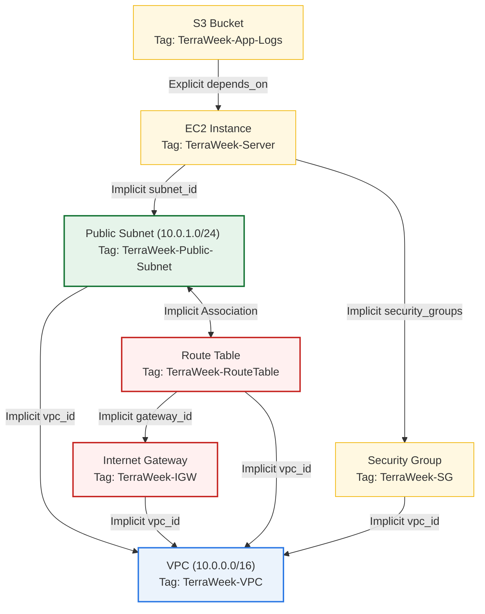

# Day 62: Connecting the Dots -- Terraform Providers, Resources & Dependencies

[](https://terraform.io)
[](https://aws.amazon.com)
[](https://github.com/rajatmehta2/90DaysOfDevOps)

Welcome to **Day 62** of the 90 Days of DevOps challenge! Today, we are taking our infrastructure automation skills to the next level. While yesterday was about basic standalone resources, real-world infrastructure is deeply connected and highly interdependent. A virtual machine cannot exist in a vacuum—it must reside in a subnet, which is linked to a route table, which routes traffic through an internet gateway inside a Virtual Private Cloud (VPC), all while being protected by firewalls (security groups).

Today, we will build a complete, production-grade networking stack in AWS using Terraform and explore the internal mechanics of how Terraform analyzes, constructs, and orders resource provisioning via **Implicit and Explicit Dependencies**, **Lifecycle Rules**, and **Dependency Graph Visualizations**.

---

## 🏗️ Architecture Design & Dependency Flow

Understanding how resources connect is the key to mastering Terraform. Below is the visual architectural layout of the AWS networking and compute stack we are deploying today. 



---

## 🧠 Challenge Tasks & Deep Dive Solutions

### Task 1: Explore the AWS Provider & Version Control

To ensure a clean workspace, create a dedicated directory for our AWS infrastructure:
```bash
mkdir terraform-aws-infra && cd terraform-aws-infra
```

#### 1. Define the Provider Configuration (`providers.tf`)
Create `providers.tf` to initialize the HashiCorp AWS provider with strict version pinning:

```hcl
terraform {
  required_version = ">= 1.0.0"
  required_providers {
    aws = {
      source  = "hashicorp/aws"
      version = "~> 5.0"
    }
  }
}

provider "aws" {
  region = "ap-south-1" # Mumbai Region
}
```

#### 2. Run Initialization (`terraform init`)
Initialize the project directory to read the provider and download the required AWS plugin.
```bash
terraform init
```

**Realistic Terminal Output:**
```text
Initializing the backend...

Initializing provider plugins...
- Finding hashicorp/aws versions matching "~> 5.0"...
- Installing hashicorp/aws v5.51.0...
- Installed hashicorp/aws v5.51.0 (signed by HashiCorp)

Terraform has created a lock file .terraform.lock.hcl to record the provider
selections it made above. Include this file in your version control repository
so that Terraform can guarantee to make the same selections by default.

Terraform has been successfully initialized!

You may now begin working with Terraform. Try running "terraform plan" to see
any changes that are required for your infrastructure. All Terraform commands
should now work.
```

#### 3. Deep Dive: Provider Version Pinning Syntax
In professional settings, pinning provider versions prevents accidental upstream breaking updates from corrupting pipelines.

| Syntax | Example | What it Means | Impact on Upgrades |
| :--- | :--- | :--- | :--- |
| `~>` **(Pessimistic Constraint)** | `~> 5.0` | Allows upgrading to minor and patch releases within the major version (e.g., `5.1.0`, `5.51.0`), but **restricts** upgrading to next major version (`6.0.0`). | **Recommended** - Balances safety (prevents breaking syntax changes) and utility (gets bug fixes/features). |
| `>=` **(Greater-than or Equal)** | `>= 5.0` | Allows downloading **any** version equal to or greater than the defined version, including major upgrades (e.g., `6.0.0`, `7.0.0`). | **Risky** - A new major release could introduce breaking changes that crash your infrastructure code. |
| `=` **(Exact Match)** | `= 5.51.0` | Locks the installation to **exactly** this single release. No upgrades are allowed. | **Ultra-Conservative** - Ensures 100% execution parity across environments, but requires manual code updates for bug/security fixes. |

#### 4. Understanding the Dependency Lock File (`.terraform.lock.hcl`)
When you run `terraform init`, Terraform generates a `.terraform.lock.hcl` file.
* **What it does:** It records the precise provider version selected and a series of cryptographic checksums (hashes) for the provider binaries compiled across different operating systems (macOS, Linux, Windows).
* **Why it matters:** Committing this file to Git ensures that every developer on the team and every CI/CD runner downloads the **exact same provider binary**, eliminating the risk of "works on my machine" bugs.

---

### Task 2: Build an AWS VPC Network Stack from Scratch

Now, we will define the core networking resources. Create `main.tf` and declare the VPC, Subnet, Internet Gateway, Route Table, and Route Table Association.

```hcl
# ==============================================================================
# DAY 62: CORE AWS NETWORKING STACK
# ==============================================================================

# 1. Virtual Private Cloud (VPC)
resource "aws_vpc" "main" {
  cidr_block       = "10.0.0.0/16"
  instance_tenancy = "default"

  tags = {
    Name        = "TerraWeek-VPC"
    Environment = "Dev"
    Project     = "90DaysOfDevOps"
  }
}

# 2. Public Subnet
resource "aws_subnet" "public" {
  vpc_id                  = aws_vpc.main.id # Implicit dependency on VPC
  cidr_block              = "10.0.1.0/24"
  map_public_ip_on_launch = true # Automatically assign public IPs to instances in this subnet

  tags = {
    Name        = "TerraWeek-Public-Subnet"
    Environment = "Dev"
  }
}

# 3. Internet Gateway (IGW) for Outbound Internet Access
resource "aws_internet_gateway" "igw" {
  vpc_id = aws_vpc.main.id # Implicit dependency on VPC

  tags = {
    Name        = "TerraWeek-IGW"
    Environment = "Dev"
  }
}

# 4. Custom Route Table
resource "aws_route_table" "public_rt" {
  vpc_id = aws_vpc.main.id # Implicit dependency on VPC

  # Define route sending all outbound traffic (0.0.0.0/0) through the IGW
  route {
    cidr_block = "0.0.0.0/0"
    gateway_id = aws_internet_gateway.igw.id # Implicit dependency on IGW
  }

  tags = {
    Name        = "TerraWeek-RouteTable"
    Environment = "Dev"
  }
}

# 5. Route Table Association to bind our Subnet to the Custom Route Table
resource "aws_route_table_association" "public_assoc" {
  subnet_id      = aws_subnet.public.id      # Implicit dependency on Subnet
  route_table_id = aws_route_table.public_rt.id # Implicit dependency on Route Table
}
```

#### Run Plan Preview (`terraform plan`)
Verify that Terraform successfully structures the plan to provision exactly 5 resources.
```bash
terraform plan
```

**Realistic Terminal Output:**
```text
Terraform used the selected providers to generate the following execution plan. Resource actions are indicated with the following symbols:
  + create

Terraform will perform the following actions:

  # aws_internet_gateway.igw will be created
  + resource "aws_internet_gateway" "igw" {
      + arn      = (known after apply)
      + id       = (known after apply)
      + owner_id = (known after apply)
      + tags     = {
          + "Environment" = "Dev"
          + "Name"        = "TerraWeek-IGW"
        }
      + tags_all = {
          + "Environment" = "Dev"
          + "Name"        = "TerraWeek-IGW"
        }
      + vpc_id   = (known after apply)
    }

  # aws_route_table.public_rt will be created
  + resource "aws_route_table" "public_rt" {
      + arn              = (known after apply)
      + id               = (known after apply)
      + owner_id         = (known after apply)
      + propagating_vgws = (known after apply)
      + route            = [
          + {
              + carrier_gateway_id         = ""
              + cidr_block                 = "0.0.0.0/0"
              + core_network_arn           = ""
              + destination_prefix_list_id = ""
              + egress_only_gateway_id     = ""
              + gateway_id                 = (known after apply)
              + ipv6_cidr_block            = ""
              + local_gateway_id           = ""
              + nat_gateway_id             = ""
              + network_interface_id       = ""
              + transit_gateway_id         = ""
              + vpc_endpoint_id            = ""
              + vpc_peer_connection_id     = ""
            },
        ]
      + tags             = {
          + "Environment" = "Dev"
          + "Name"        = "TerraWeek-RouteTable"
        }
      + tags_all         = {
          + "Environment" = "Dev"
          + "Name"        = "TerraWeek-RouteTable"
        }
      + vpc_id           = (known after apply)
    }

  # aws_route_table_association.public_assoc will be created
  + resource "aws_route_table_association" "public_assoc" {
      + id             = (known after apply)
      + route_table_id = (known after apply)
      + subnet_id      = (known after apply)
    }

  # aws_subnet.public will be created
  + resource "aws_subnet" "public" {
      + arn                             = (known after apply)
      + assign_ipv6_address_on_creation = false
      + availability_zone               = (known after apply)
      + availability_zone_id            = (known after apply)
      + cidr_block                      = "10.0.1.0/24"
      + enable_dns64                    = false
      + id                              = (known after apply)
      + map_public_ip_on_launch         = true
      + owner_id                        = (known after apply)
      + tags                            = {
          + "Environment" = "Dev"
          + "Name"        = "TerraWeek-Public-Subnet"
        }
      + tags_all                        = {
          + "Environment" = "Dev"
          + "Name"        = "TerraWeek-Public-Subnet"
        }
      + vpc_id                          = (known after apply)
    }

  # aws_vpc.main will be created
  + resource "aws_vpc" "main" {
      + arn                                  = (known after apply)
      + cidr_block                           = "10.0.0.0/16"
      + default_network_acl_id               = (known after apply)
      + default_route_table_id               = (known after apply)
      + default_security_group_id            = (known after apply)
      + dhcp_options_id                      = (known after apply)
      + enable_dns_hostnames                 = (known after apply)
      + enable_dns_support                   = true
      + id                                   = (known after apply)
      + instance_tenancy                     = "default"
      + ipv6_association_id                  = (known after apply)
      + ipv6_cidr_block                      = (known after apply)
      + main_route_table_id                  = (known after apply)
      + owner_id                             = (known after apply)
      + tags                                 = {
          + "Environment" = "Dev"
          + "Name"        = "TerraWeek-VPC"
          + "Project"     = "90DaysOfDevOps"
        }
      + tags_all                             = {
          + "Environment" = "Dev"
          + "Name"        = "TerraWeek-VPC"
          + "Project"     = "90DaysOfDevOps"
        }
    }

Plan: 5 to add, 0 to change, 0 to destroy.
```

---

### Task 3: Understand Implicit Dependencies

#### Q1. How does Terraform know to create the VPC before the subnet?
**Answer:** Terraform reads the HCL code and builds an in-memory **Directed Acyclic Graph (DAG)** of all resources before executing any action. Inside `aws_subnet.public`, we have the line:
```hcl
vpc_id = aws_vpc.main.id
```
By referencing the exported ID attribute (`.id`) of the `aws_vpc.main` resource block, we establish an **implicit dependency**. Terraform parses this reference, realizes the subnet cannot determine its `vpc_id` until the VPC is provisioned, and automatically positions `aws_vpc.main` higher in the deployment hierarchy.

#### Q2. What would happen if you tried to create the subnet before the VPC existed?
**Answer:** If Terraform did not build a dependency tree and executed creation calls in parallel or random order, AWS would reject the Subnet creation request. The AWS API requires a valid, pre-existing `VpcId` as a mandatory parameter to provision a subnet. Attempting to create the subnet first would yield an immediate `InvalidVpcID.NotFound` API exception, causing your deployment to fail.

#### Q3. All Implicit Dependencies in Our Configuration:
1. **`aws_subnet.public` ➔ `aws_vpc.main`:** Relies on `aws_vpc.main.id` to map the subnet to the VPC.
2. **`aws_internet_gateway.igw` ➔ `aws_vpc.main`:** Relies on `aws_vpc.main.id` to attach the gateway.
3. **`aws_route_table.public_rt` ➔ `aws_vpc.main`:** Relies on `aws_vpc.main.id` to create the route table inside the VPC boundary.
4. **`aws_route_table.public_rt` ➔ `aws_internet_gateway.igw`:** Relies on `aws_internet_gateway.igw.id` inside the `route { ... }` block to route outbound traffic.
5. **`aws_route_table_association.public_assoc` ➔ `aws_subnet.public` & `aws_route_table.public_rt`:** Relies on both `aws_subnet.public.id` and `aws_route_table.public_rt.id` to bind them together.

---

### Task 4: Add a Security Group and EC2 Instance

Let's expand our infrastructure by introducing a secure firewall (Security Group) and a virtual server (EC2 instance) running Amazon Linux 2.

#### Append these definitions to `main.tf`:

```hcl
# 6. Security Group to control inbound and outbound traffic
resource "aws_security_group" "web_sg" {
  name        = "terraweek-sg"
  description = "Allow SSH and HTTP traffic"
  vpc_id      = aws_vpc.main.id # Implicit dependency on VPC

  # Inbound Rules (Ingress)
  ingress {
    description = "Allow SSH from anywhere"
    from_port   = 22
    to_port     = 22
    protocol    = "tcp"
    cidr_blocks = ["0.0.0.0/0"]
  }

  ingress {
    description = "Allow HTTP from anywhere"
    from_port   = 80
    to_port     = 80
    protocol    = "tcp"
    cidr_blocks = ["0.0.0.0/0"]
  }

  # Outbound Rules (Egress)
  egress {
    description = "Allow all outbound traffic"
    from_port   = 0
    to_port     = 0
    protocol    = "-1" # -1 matches all protocols
    cidr_blocks = ["0.0.0.0/0"]
  }

  tags = {
    Name        = "TerraWeek-SG"
    Environment = "Dev"
  }
}

# 7. EC2 Compute Instance
resource "aws_instance" "web_server" {
  ami                         = "ami-0f5ee92e2d63afc18" # Amazon Linux 2 in ap-south-1
  instance_type               = "t2.micro"
  subnet_id                   = aws_subnet.public.id          # Implicit dependency on Subnet
  vpc_security_group_ids      = [aws_security_group.web_sg.id] # Implicit dependency on Security Group
  associate_public_ip_address = true

  tags = {
    Name        = "TerraWeek-Server"
    Environment = "Dev"
  }

  # Lifecycle rules (Task 6)
  lifecycle {
    create_before_destroy = true
  }
}
```

---

### Task 5: Explicit Dependencies with `depends_on`

Sometimes, resources require specific creation order even when they don't directly reference each other's data attributes. This is where **Explicit Dependencies** via the `depends_on` meta-argument come into play.

Let's configure a scenario where we deploy an S3 bucket to store application logs, but we require the EC2 instance to be fully created and operational *before* the S3 bucket is provisioned.

#### Add the S3 Bucket resource to `main.tf`:

```hcl
# 8. S3 Bucket for Application Logs with Explicit Dependency
resource "aws_s3_bucket" "app_logs" {
  bucket = "terraweek-rajat-app-logs-bucket" # Keep this globally unique

  tags = {
    Name        = "TerraWeek-App-Logs"
    Environment = "Dev"
  }

  # Explicit Dependency: Forces S3 bucket creation ONLY after the EC2 Instance is active
  depends_on = [
    aws_instance.web_server
  ]
}
```

#### Run Deployment Preview (`terraform plan`)
Analyze the plan to verify the complete resource tree structure.
```bash
terraform plan
```

**Realistic Terminal Output:**
```text
Plan: 8 to add, 0 to change, 0 to destroy.
```

#### Apply the Plan (`terraform apply --auto-approve`)
Deploy the entire network, compute, firewall, and storage stack to AWS.
```bash
terraform apply --auto-approve
```

**Realistic Terminal Output:**
```text
aws_vpc.main: Creating...
aws_vpc.main: Creation complete after 3s [id=vpc-0123456789abcdef0]
aws_internet_gateway.igw: Creating...
aws_subnet.public: Creating...
aws_security_group.web_sg: Creating...
aws_internet_gateway.igw: Creation complete after 2s [id=igw-0987654321fedcba0]
aws_subnet.public: Creation complete after 2s [id=subnet-0a1b2c3d4e5f67890]
aws_route_table.public_rt: Creating...
aws_security_group.web_sg: Creation complete after 3s [id=sg-0c1d2e3f4a5b6c7d8]
aws_route_table.public_rt: Creation complete after 1s [id=rtb-0z1y2x3w4v5u6t7s8]
aws_route_table_association.public_assoc: Creating...
aws_instance.web_server: Creating...
aws_route_table_association.public_assoc: Creation complete after 1s
aws_instance.web_server: Still creating... [10s elapsed]
aws_instance.web_server: Still creating... [20s elapsed]
aws_instance.web_server: Creation complete after 26s [id=i-0a1b2c3d4e5f67890]
aws_s3_bucket.app_logs: Creating...
aws_s3_bucket.app_logs: Creation complete after 4s [id=terraweek-rajat-app-logs-bucket]

Apply complete! Resources: 8 added, 0 changed, 0 destroyed.
```

#### 📊 Generating the Dependency Graph
To see the internal representation of how Terraform maps these dependencies, generate a DOT representation:
```bash
terraform graph
```

**DOT Format Output:**
```text
digraph G {
  rankdir = "RL";
  node [shape = "rect", fontname = "sans-serif"];
  "aws_instance.web_server" -> "aws_security_group.web_sg";
  "aws_instance.web_server" -> "aws_subnet.public";
  "aws_internet_gateway.igw" -> "aws_vpc.main";
  "aws_route_table.public_rt" -> "aws_internet_gateway.igw";
  "aws_route_table.public_rt" -> "aws_vpc.main";
  "aws_route_table_association.public_assoc" -> "aws_route_table.public_rt";
  "aws_route_table_association.public_assoc" -> "aws_subnet.public";
  "aws_s3_bucket.app_logs" -> "aws_instance.web_server";
  "aws_security_group.web_sg" -> "aws_vpc.main";
  "aws_subnet.public" -> "aws_vpc.main";
}
```

> **Pro-Tip:** If you do not have Graphviz `dot` utility installed locally, copy the text block above and paste it into [WebGraphviz](http://www.webgraphviz.com/) to visualize the interactive DAG.

#### 💡 When should you use `depends_on` in production?
Explicit dependencies should be used sparingly, as Terraform is exceptionally good at finding implicit relationships. However, two common real-world production use cases include:

1. **IAM Policy Attachments for EC2 Instance Profiles:**  
   If an EC2 Instance is configured with an IAM Instance Profile that grants S3 write permissions, the Instance Profile relies on an IAM Role and an IAM Policy Attachment. While the instance block implicitly references the instance profile name, it does *not* explicitly reference the Policy Attachment. Without `depends_on = [aws_iam_role_policy_attachment.s3_access]`, Terraform might spin up the EC2 instance before AWS registers the IAM Policy Attachment. Applications starting up on boot would fail to write to S3 due to access-denied errors.
2. **EKS Cluster Resources & Ingress Controllers:**  
   When using Helm to deploy an Ingress controller inside an Elastic Kubernetes Service (EKS) cluster, the Helm release requires EKS node groups to be fully operational to schedule pods. Because the Helm release code might reference the cluster endpoint (implicit), but not the physical node groups (which host the pods), you must add `depends_on = [aws_eks_node_group.primary]` to ensure pods can actually be scheduled during resource creation.

---

### Task 6: Lifecycle Rules and Destroy

Terraform offers advanced control mechanisms over how resources are created, updated, and destroyed using lifecycle configuration blocks.

#### 1. The three primary lifecycle arguments:

| Lifecycle Argument | What It Does | Common Production Use Case |
| :--- | :--- | :--- |
| `create_before_destroy` | Changes the default update behavior. When a resource needs to be replaced (e.g. changing an immutable attribute), Terraform normally destroys the resource first, causing downtime, and then creates the replacement. Setting this to `true` **provisions the new resource first**, associates it, and then destroys the deprecated resource. | **Zero-Downtime Deployments:** Updating base AMIs for Auto Scaling Groups, updating launching templates, or replacing core proxy servers. |
| `prevent_destroy` | Acts as an ultimate safety lock. If a developer accidentally runs a command that triggers a replacement or deletion of this resource (e.g. `terraform destroy`), Terraform immediately throws an error and **halts execution**, refusing to modify the resource. | **Critical Storage & State Databases:** Production RDS databases, KMS encryption keys, primary domain DNS zones, or state S3 buckets. |
| `ignore_changes` | Instructs Terraform to ignore specific resource attribute modifications made outside of Terraform (e.g., changes made manually via the AWS Console or updated by an automated script). | **Dynamic Scaling & External Tagging:** Auto-scaling capacity attributes (such as EC2 instance count or ECS tasks counts) or compliance tools that automatically attach dynamic scanning tags. |

#### 2. Let's Test: Destroy the Infrastructure
Because we are done with our lab, we will safely delete all active cloud components to prevent any AWS billing surprises.
```bash
terraform destroy
```

**Realistic Terminal Output:**
```text
aws_s3_bucket.app_logs: Refreshing state... [id=terraweek-rajat-app-logs-bucket]
aws_vpc.main: Refreshing state... [id=vpc-0123456789abcdef0]
aws_subnet.public: Refreshing state... [id=subnet-0a1b2c3d4e5f67890]
aws_security_group.web_sg: Refreshing state... [id=sg-0c1d2e3f4a5b6c7d8]
aws_instance.web_server: Refreshing state... [id=i-0a1b2c3d4e5f67890]
...

Terraform will perform the following actions:

  # aws_instance.web_server will be destroyed
  - resource "aws_instance" "web_server" { ... }
  
  # aws_s3_bucket.app_logs will be destroyed
  - resource "aws_s3_bucket" "app_logs" { ... }

  # aws_security_group.web_sg will be destroyed
  - resource "aws_security_group" "web_sg" { ... }

  # aws_subnet.public will be destroyed
  - resource "aws_subnet" "public" { ... }

  # aws_vpc.main will be destroyed
  - resource "aws_vpc" "main" { ... }
  
  # [Other networking components removed for brevity]

Plan: 0 to add, 0 to change, 8 to destroy.

Do you want to perform these actions?
  Only 'yes' will be accepted to approve.

  Enter a value: yes

aws_s3_bucket.app_logs: Destroying... [id=terraweek-rajat-app-logs-bucket]
aws_s3_bucket.app_logs: Destruction complete after 3s
aws_instance.web_server: Destroying... [id=i-0a1b2c3d4e5f67890]
aws_instance.web_server: Still destroying... [10s elapsed]
aws_instance.web_server: Still destroying... [20s elapsed]
aws_instance.web_server: Destruction complete after 28s
aws_route_table_association.public_assoc: Destroying...
aws_security_group.web_sg: Destroying... [id=sg-0c1d2e3f4a5b6c7d8]
aws_route_table_association.public_assoc: Destruction complete after 1s
aws_route_table.public_rt: Destroying... [id=rtb-0z1y2x3w4v5u6t7s8]
aws_route_table.public_rt: Destruction complete after 1s
aws_internet_gateway.igw: Destroying... [id=igw-0987654321fedcba0]
aws_security_group.web_sg: Destruction complete after 2s
aws_internet_gateway.igw: Destruction complete after 1s
aws_subnet.public: Destroying... [id=subnet-0a1b2c3d4e5f67890]
aws_subnet.public: Destruction complete after 1s
aws_vpc.main: Destroying... [id=vpc-0123456789abcdef0]
aws_vpc.main: Destruction complete after 3s

Destroy complete! Resources: 8 destroyed.
```

> **Observation:** Notice the destruction sequence. It is the **exact reverse** of the installation hierarchy! The S3 bucket depends on the EC2 instance, so S3 is torn down first. The EC2 instance is terminated next, releasing its lock on the Security Group and Subnet. Finally, the subnets and route tables are cleared, allowing the VPC to be safely deleted.

---

## 📸 Lab Visual Validations

To verify your configuration in GitHub, drop your screenshot captures into the `day-62/` directory and map them to the placeholders below:

### 1. Provider Initialization Output (`terraform init`)
Displays successful plugin acquisition and the cryptographic lock generation.


### 2. Networking Plan Generation (`terraform plan`)
Shows that the resource logic compiles perfectly into a 5-resource networking execution plan.


### 3. Complete Resource Provisioning Apply Success (`terraform apply`)
Displays the successfully executed 8-resource build.


### 4. AWS Console VPC Network Topology
Displays all 5 custom networking components connected inside the Amazon VPC console.


### 5. AWS Console Provisioned Compute and Storage Instances
Shows our `t2.micro` EC2 Server and our S3 logging bucket live in `ap-south-1`.


### 6. Dependency Graph Representation (`terraform graph`)
The visualized DOT layout showing the Directed Acyclic Graph relationships.


### 7. Clean Destructive Resource Tear-Down (`terraform destroy`)
Shows the successful reverse-order deletion of the entire infrastructure.


---

## 💡 Pro DevOps Tips & Best Practices

1. **Keep Your Configurations Modular:** Avoid building monolithic `main.tf` files containing hundreds of resources. Partition your structure logically:
   * `providers.tf` - Version lockings and provider parameters.
   * `variables.tf` - Dynamic configurations and structural parameters.
   * `vpc.tf` - Pure networking layers (subnets, route tables, IGWs, NAT gateways).
   * `security.tf` - Firewalls, network access lists, and IAM specifications.
   * `compute.tf` - EC2 instances, load balancers, auto-scaling setups.
   * `outputs.tf` - Key metadata parameters to output upon compilation.
2. **Execute Formatting and Validation Checks:** Run `terraform fmt` to keep your code indentation standard and clean, followed by `terraform validate` to verify logic structures before running plans.
3. **Commit the Dependency Lock:** Keep `.terraform.lock.hcl` committed to Git. This prevents subtle provider version updates from breaking your pipeline deployments.

---

## 📝 Reflection & Key Lessons

* **The Power of DAGs:** Declarative IaC is incredibly robust. Seeing Terraform automatically parse deep relationships, deduce dependencies, and construct resources in perfect sequence is extremely satisfying compared to writing complex sequential bash scripts.
* **Explicit Dependency Control:** While implicit dependencies handle 95% of use cases, understanding `depends_on` prevents critical execution-order bugs in professional production environments (especially when working with IAM policies or EKS controllers).
* **Safe State Teardowns:** The reverse-dependency execution model of `terraform destroy` ensures that all resources are deleted safely without leaving orphaned elements.

---

## 📢 Share Your Journey!

Copy and paste this message to LinkedIn to showcase your milestone:

```text
🚀 Day 62 of my #90DaysOfDevOps challenge complete! Deployed a complete AWS networking and compute stack using Terraform! 🛠️☁️

Today I leveled up on Infrastructure as Code by focusing on dependencies, providers, and lifecycle states:
🔹 Explored AWS provider version pinning syntax (~> 5.0 vs >= 5.0 vs = 5.0.0).
🔹 Built a complete VPC networking stack (VPC, public subnet, route tables, internet gateway, and route associations).
🔹 Deep-dived into Implicit vs. Explicit dependencies (using depends_on) to coordinate bucket storage and compute timing.
🔹 Mastered Terraform lifecycle configurations (create_before_destroy, prevent_destroy, ignore_changes) for resilient production state control.
🔹 Analyzed the Directed Acyclic Graph (DAG) by visualizing the infrastructure architecture via terraform graph.

Understanding how Terraform connecting the dots across cloud networks in reverse dependency order is a game changer for zero-downtime rollouts!

#90DaysOfDevOps #TerraWeek #IaC #HashiCorp #Terraform #AWS #VPC #DevOps #CloudComputing #InfrastructureAsCode
```

---

*Awesome job on completing Day 62! Let's continue building on Day 63!*
**TrainWithShubham**
