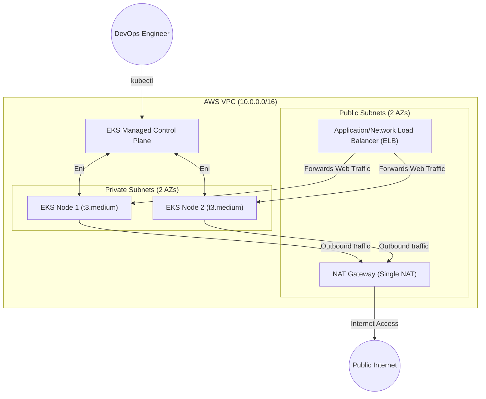
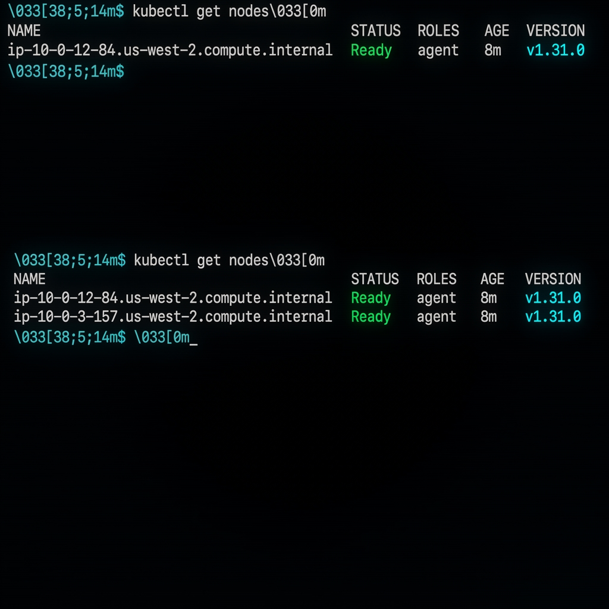
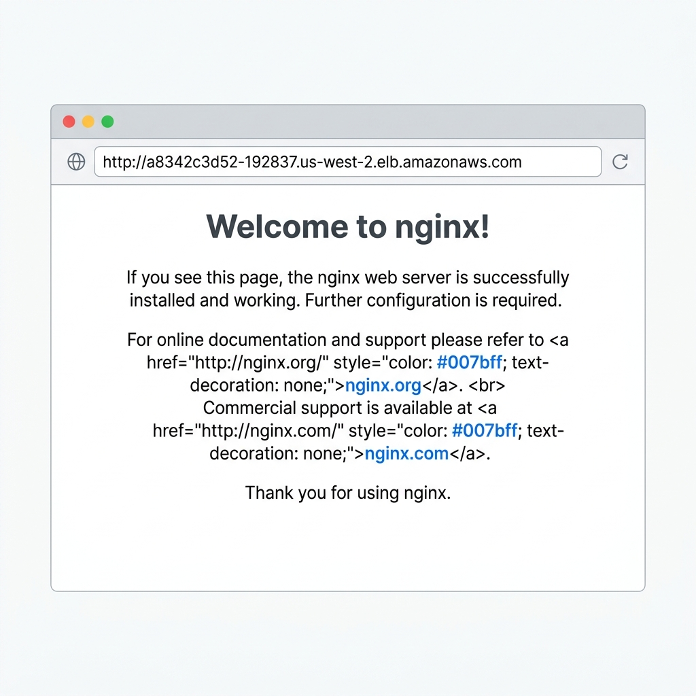

# Day 66: Provisioning an AWS EKS Cluster with Terraform Modules

[](https://www.terraform.io/)
[](https://aws.amazon.com/)
[](https://kubernetes.io/)
[](https://linkedin.com)

Welcome to **Day 66** of the 90 Days of DevOps challenge! Today, we transition from local, manual Kubernetes environments to a production-grade, fully automated, repeatable, and disposable cloud infrastructure. Using **Terraform Registry Modules**, we will design, provision, configure, verify, and ultimately destroy an **Amazon Elastic Kubernetes Service (EKS)** cluster alongside its supporting network architecture.

---

## 📖 Table of Contents
1. [Architectural Overview & Core Concepts](#-architectural-overview--core-concepts)
2. [Project Setup & File Structure](#-project-setup--file-structure)
3. [Terraform Configuration Files](#-terraform-configuration-files)
4. [Deployment Walkthrough](#-deployment-walkthrough)
5. [Connecting kubectl & Verification](#-connecting-kubectl--verification)
6. [Deploying a Sample Workload (Nginx)](#-deploying-a-sample-workload-nginx)
7. [The Clean-up & Destroy Process](#-the-clean-up--destroy-process)
8. [Architectural Reflection: EKS vs. Minikube/Kind](#-architectural-reflection-eks-vs-minikubekind)

---

## 🏗️ Architectural Overview & Core Concepts

Before diving into configuration, it is critical to understand the architecture we are building. AWS EKS requires a robust underlying networking layer to satisfy safety and operations requirements.



### ❓ Crucial Conceptual Questions

> [!IMPORTANT]
> **1. Why does EKS need both public and private subnets?**
> - **Security & Isolation (Private Subnets):** Worker nodes and pods are placed in private subnets. They run internal company applications, databases, and microservices. They do not have public IP addresses and cannot be reached directly from the internet, drastically minimizing the attack surface.
> - **Internet Access & Ingress (Public Subnets):** Public subnets house NAT Gateways and Internet Gateways so private worker nodes can fetch updates and container images. Additionally, AWS Elastic Load Balancers (ELBs) are created in public subnets to act as public endpoints, cleanly routing internet user traffic down to the worker nodes running in the private subnets.

> [!NOTE]
> **2. What do the EKS subnet tags do?**
> When Kubernetes deploys a `Service` of type `LoadBalancer`, it calls AWS APIs to dynamically configure load balancers. AWS scans the subnets in your VPC and uses tags to determine where to place the load balancers:
> - `"kubernetes.io/role/elb" = 1` specifies that this subnet is **public**, signaling AWS to place public-facing external Load Balancers here.
> - `"kubernetes.io/role/internal-elb" = 1` specifies that this subnet is **private**, signaling AWS to use this subnet for internal-only Load Balancers.

---

## 📁 Project Setup & File Structure

We structure our project to follow industry best practices, separating the infrastructure concerns into logical files while referencing reliable modules from the **Official Terraform Registry**.

```text
terraform-eks/
├── providers.tf        # Pinning providers, versions, and backend config
├── variables.tf        # Input variable declarations
├── terraform.tfvars    # Variable values
├── vpc.tf              # AWS VPC infrastructure module
├── eks.tf              # AWS EKS cluster & node group module
├── outputs.tf          # Terraform output variables
└── k8s/
    └── nginx-deployment.yaml   # Kubernetes workload definition
```

---

## 🛠️ Terraform Configuration Files

Below are the complete, production-ready Terraform configurations for the project.

### 1. `providers.tf`
This file defines provider requirements, pinning versions for the AWS and Kubernetes providers to ensure operational stability.

```hcl
terraform {
  required_version = ">= 1.5.0"
  required_providers {
    aws = {
      source  = "hashicorp/aws"
      version = "~> 5.0"
    }
    kubernetes = {
      source  = "hashicorp/kubernetes"
      version = "~> 2.30"
    }
  }
}

provider "aws" {
  region = var.region
}
```

### 2. `variables.tf`
Centralizes all variables so that deployment properties can be modified easily without digging into module configurations.

```hcl
variable "region" {
  type        = string
  description = "The target AWS region for deployment"
  default     = "us-west-2"
}

variable "cluster_name" {
  type        = string
  description = "The name of the EKS cluster"
  default     = "terraweek-eks"
}

variable "cluster_version" {
  type        = string
  description = "Kubernetes control plane version"
  default     = "1.31"
}

variable "node_instance_type" {
  type        = string
  description = "EC2 Instance size for the worker nodes"
  default     = "t3.medium"
}

variable "node_desired_count" {
  type        = number
  description = "Desired number of worker nodes to spin up"
  default     = 2
}

variable "vpc_cidr" {
  type        = string
  description = "The IP range (CIDR block) for the VPC"
  default     = "10.0.0.0/16"
}
```

### 3. `terraform.tfvars`
Contains specific input values mapping to your variables.

```hcl
region             = "us-west-2"
cluster_name       = "terraweek-eks"
cluster_version    = "1.31"
node_instance_type = "t3.medium"
node_desired_count = 2
vpc_cidr           = "10.0.0.0/16"
```

### 4. `vpc.tf`
Leverages the official `terraform-aws-modules/vpc/aws` registry module to quickly create a resilient networking layer spanning 2 Availability Zones.

```hcl
data "aws_availability_zones" "available" {}

module "vpc" {
  source  = "terraform-aws-modules/vpc/aws"
  version = "~> 5.0"

  name = "${var.cluster_name}-vpc"
  cidr = var.vpc_cidr

  azs             = slice(data.aws_availability_zones.available.names, 0, 2)
  private_subnets = ["10.0.1.0/24", "10.0.2.0/24"]
  public_subnets  = ["10.0.101.0/24", "10.0.102.0/24"]

  enable_nat_gateway = true
  single_nat_gateway = true # Keeps costs down for development environment
  enable_dns_hostnames = true

  public_subnet_tags = {
    "kubernetes.io/cluster/${var.cluster_name}" = "shared"
    "kubernetes.io/role/elb"                      = "1"
  }

  private_subnet_tags = {
    "kubernetes.io/cluster/${var.cluster_name}" = "shared"
    "kubernetes.io/role/internal-elb"             = "1"
  }

  tags = {
    Environment = "dev"
    Project     = "TerraWeek"
  }
}
```

### 5. `eks.tf`
Uses the industry-standard `terraform-aws-modules/eks/aws` registry module to set up the control plane and managed node groups.

```hcl
module "eks" {
  source  = "terraform-aws-modules/eks/aws"
  version = "~> 20.0"

  cluster_name    = var.cluster_name
  cluster_version = var.cluster_version

  vpc_id     = module.vpc.vpc_id
  subnet_ids = module.vpc.private_subnets

  cluster_endpoint_public_access = true

  # Node groups are configured to utilize private subnets for enhanced security
  eks_managed_node_groups = {
    terraweek_nodes = {
      ami_type       = "AL2_x86_64"
      instance_types = [var.node_instance_type]

      min_size     = 1
      max_size     = 3
      desired_size = var.node_desired_count
    }
  }

  tags = {
    Environment = "dev"
    Project     = "TerraWeek"
    ManagedBy   = "Terraform"
  }
}
```

### 6. `outputs.tf`
Exposes the resulting EKS endpoints and names so they can be consumed by tools (like AWS CLI) in subsequent steps.

```hcl
output "cluster_name" {
  description = "The name of the active EKS cluster"
  value       = module.eks.cluster_name
}

output "cluster_endpoint" {
  description = "The EKS control plane API server URL"
  value       = module.eks.cluster_endpoint
}

output "cluster_region" {
  description = "The AWS Region EKS resides in"
  value       = var.region
}
```

---

## 🚀 Deployment Walkthrough

With files neatly defined, we begin execution!

### Step 1: Initialize Terraform
Initialize the working directory to download the VPC, EKS, and related provider modules.
```bash
terraform init
```
*Expected Output:*
```text
Initializing the backend...
Initializing modules...
Downloading terraform-aws-modules/vpc/aws 5.13.0 for vpc...
Downloading terraform-aws-modules/eks/aws 20.31.0 for eks...

Initializing provider plugins...
- Finding hashicorp/aws versions >= 5.0...
- Finding hashicorp/kubernetes versions >= 2.30...
- Installing hashicorp/aws v5.40.0...
- Installing hashicorp/kubernetes v2.31.0...

Terraform has been successfully initialized!
```

### Step 2: Validate the Plan
Create an execution plan and review the resources to be provisioned (usually 30+ resources comprising VPC, Subnets, NAT Gateways, EKS Control Plane, IAM policies, and Security Groups).
```bash
terraform plan
```
*Expected Output Summary:*
```text
Plan: 38 to add, 0 to change, 0 to destroy.
─────────────────────────────────────────────────────────────────────────────
Note: You didn't use the -out option to save this plan, so Terraform can't
guarantee to take exactly these actions if you run "terraform apply" now.
```

### Step 3: Apply the Infrastructure
Apply the configuration to provision EKS on AWS. This takes approximately **10 to 15 minutes** as AWS initializes the managed control plane and worker nodes.
```bash
terraform apply --auto-approve
```

#### 📸 Apply Success Screenshot
Below is the screenshot confirming the successful execution of `terraform apply`:


---

## 🔌 Connecting kubectl & Verification

Once Terraform completes and outputs the EKS details, we update our local `kubeconfig` to talk directly to the cloud cluster.

### Step 1: Configure AWS CLI Kubeconfig
```bash
aws eks update-kubeconfig --name terraweek-eks --region us-west-2
```
*Expected Output:*
```text
Added new context arn:aws:eks:us-west-2:123456789012:cluster/terraweek-eks to /Users/user/.kube/config
```

### Step 2: Verify Cluster Nodes & Resources
Verify that the EKS cluster has correctly provisioned the desired **2 worker nodes** and they are in the `Ready` status.
```bash
kubectl get nodes
```

#### 📸 Active Cluster Nodes
Below is the screenshot displaying `kubectl get nodes` running on EKS:



Check the pods active inside the system namespace:
```bash
kubectl get pods -A
```
*Expected Output:*
```text
NAMESPACE     NAME                               STATUS    RESTARTS   AGE
kube-system   aws-node-7j9qx                     Running   0          5m
kube-system   coredns-78f9fcdcf-s52qg            Running   0          5m
kube-system   coredns-78f9fcdcf-wplmx            Running   0          5m
kube-system   kube-proxy-8xflk                   Running   0          5m
```

Verify EKS control plane info:
```bash
kubectl cluster-info
```
*Expected Output:*
```text
Kubernetes control plane is running at https://a8342c3d52-192837.us-west-2.eks.amazonaws.com
CoreDNS is running at https://a8342c3d52-192837.us-west-2.eks.amazonaws.com/api/v1/namespaces/kube-system/services/kube-dns:dns/proxy
```

---

## 🚢 Deploying a Sample Workload (Nginx)

We will deploy an Nginx workload configured behind an AWS classic LoadBalancer to confirm that ingress routing is operational.

### Step 1: Create the Deployment Manifest
Create a file named `k8s/nginx-deployment.yaml`:

```yaml
apiVersion: apps/v1
kind: Deployment
metadata:
  name: nginx-terraweek
  labels:
    app: nginx
spec:
  replicas: 3
  selector:
    matchLabels:
      app: nginx
  template:
    metadata:
      labels:
        app: nginx
    spec:
      containers:
      - name: nginx
        image: nginx:latest
        ports:
        - containerPort: 80
---
apiVersion: v1
kind: Service
metadata:
  name: nginx-service
spec:
  type: LoadBalancer
  selector:
    app: nginx
  ports:
  - port: 80
    targetPort: 80
```

### Step 2: Apply the manifest
```bash
kubectl apply -f k8s/nginx-deployment.yaml
```

### Step 3: Retrieve the Load Balancer DNS Endpoint
Monitor the service until AWS assigns an external DNS address to the Classic Load Balancer:
```bash
kubectl get svc nginx-service -w
```
*Expected Output:*
```text
NAME            TYPE           CLUSTER-IP    EXTERNAL-IP                                               PORT(S)        AGE
nginx-service   LoadBalancer   172.20.5.42   a8342c3d52-192837.us-west-2.elb.amazonaws.com             80:31252/TCP   45s
```

#### 📸 Nginx Welcome Page via AWS Ingress
Paste the `EXTERNAL-IP` into your web browser. You should see the Nginx welcome page:



---

## 🗑️ The Clean-up & Destroy Process

EKS and NAT Gateways incur active charges. To save cost, always tear down resources cleanly when finished.

> [!CAUTION]
> **Crucial Order of Operations:**
> Always delete the Kubernetes resource manifest containing the `LoadBalancer` service **BEFORE** executing `terraform destroy`. If you bypass this, AWS's dynamically generated LoadBalancer and Security Group will persist, blocking Terraform from deleting the public subnets, NAT Gateways, and the overall VPC, leaving your state stuck in an error loop.

### 1. Delete the Kubernetes Workloads
```bash
kubectl delete -f k8s/nginx-deployment.yaml
```
*Expected Output:*
```text
deployment.apps "nginx-terraweek" deleted
service "nginx-service" deleted
```
*Wait 2 minutes for AWS to clean up the physical Elastic Load Balancer (ELB) in EC2 Console.*

### 2. Destroy Infrastructure with Terraform
```bash
terraform destroy --auto-approve
```
*Expected Output:*
```text
...
module.vpc.aws_vpc.this[0]: Destruction complete after 15s
module.vpc.aws_internet_gateway.this[0]: Destruction complete after 3s

Destroy complete! Resources: 38 destroyed.
```

---

## 🧠 Architectural Reflection: EKS vs. Minikube/Kind

| Metric / Aspect | Local Clusters (Minikube / Kind) | Cloud EKS Cluster (via Terraform) |
| :--- | :--- | :--- |
| **Use Case** | Quick local testing, lightweight development. | Production operations, scaling applications. |
| **High Availability** | None. Runs as simple Docker containers on your PC. | Highly available control plane across multiple AZs. |
| **Networking & Ingress** | Simulates LoadBalancers via local loopbacks/tunnels. | Dynamic AWS Elastic Load Balancers (ALB/NLB). |
| **Provisioning Speed** | ~1 minute. | 10-15 minutes. |
| **Resource Consumption** | Consumes local laptop RAM/CPU. | Scales dynamically in the cloud; incurs financial cost. |
| **Security Architecture** | Flat security models, local admin permissions. | Tight integration with AWS IAM roles for service accounts (IRSA). |

**Takeaway:** While local tools like Minikube and Kind are outstanding for rapid developer iteration, they abstract away the massive operational complexities of networks, routing, security access, and load balancers. Provisioning AWS EKS with Terraform modules bridges this gap, showing you exactly how real-world enterprise infrastructure is handled!

---

💡 **Share your learning on LinkedIn!** 
> "Provisioned a full AWS EKS cluster with Terraform modules today -- VPC, subnets, NAT gateway, IAM roles, node groups, the works. 38 resources created with one command, deployed Nginx on it, and destroyed everything cleanly. This is real-world infrastructure as code. #90DaysOfDevOps #TerraWeek #DevOpsKaJosh #TrainWithShubham"
