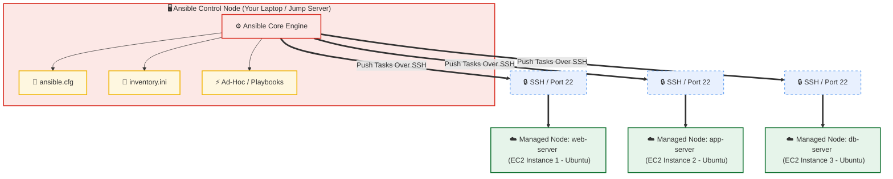

# Day 68: Introduction to Ansible & Multi-Node Inventory Architecture

[](https://ansible.com)
[](https://aws.amazon.com)
[](https://github.com/rajatmehta2/90DaysOfDevOps)

Welcome to **Day 68** of the **90 Days of DevOps Journey**! Yesterday, we concluded our Terraform exploration by provisioning complex multi-environment AWS infrastructures. However, once infrastructure is active, the critical question remains: *How do we install software, configure system services, manage security policies, and maintain consistent server states at scale?*

Today, we dive into **Ansible**, the industry-standard agentless Configuration Management tool. We will configure an Ansible control node, provision a multi-node AWS target cluster, map out a custom inventory, and run advanced ad-hoc commands—all powered entirely over SSH without a single background agent daemon.

---

## 🏗️ Architectural Topology: The Agentless Push Model

Unlike other configuration management utilities that require running background agent daemons on every single target, Ansible is completely **agentless**. It utilizes standard **SSH** for Linux targets (and **WinRM** for Windows) to dynamically transfer, execute, and clean up temporary Python-based code modules.



---

## 🧠 Section 1: Ansible Core Concepts & Deep Dive

### 1. What is Configuration Management, and why do we need it?
**Configuration Management (CM)** is the practice of maintaining computer systems, servers, and network devices in a desired, predictable state. It ensures that system parameters, installed packages, user access, and firewall settings are consistently applied over time.

Without Configuration Management, organizations suffer from:
- **Configuration Drift**: Servers that started with identical setups gradually diverge as developers perform manual, untracked changes, leading to unexpected service failures.
- **Slower Deployments**: Manually configuring dozens of servers using shell scripts or console interactions is time-consuming, prone to human error, and completely unscalable.
- **Security Audits & Compliance Risks**: Tracking who made what configuration changes becomes impossible without systematic, auditable version-controlled configurations.

### 2. How is Ansible different from Chef, Puppet, and Salt?
The configuration management landscape differs across design models:

| Dimension | **Ansible** | **Chef** | **Puppet** | **SaltStack** |
| :--- | :--- | :--- | :--- | :--- |
| **Architecture** | **Agentless** (No target daemons) | **Agent-based** (Requires Chef-client) | **Agent-based** (Requires Puppet-agent) | **Agent-based** (Can run agentless, but relies on Minions) |
| **Execution Flow**| **Push Model** (Pushed from Control) | **Pull Model** (Managed pull from Server) | **Pull Model** (Managed pull from Server) | **Push/Pull Models** (ZeroMQ messaging) |
| **Configuration language**| **YAML** (Human-readable declaratives) | **Ruby DSL** (Imperative programming) | **Puppet DSL** (Declarative language) | **YAML / Python** (Declarative/Imperative) |
| **Transport Protocol**| **SSH / WinRM** | **HTTPS** | **HTTPS / SSL** | **ZeroMQ** |
| **Learning Curve**| **Very Low** (Quick start) | **High** (Requires Ruby proficiency) | **Medium-High** (Puppet syntax) | **Medium** |

### 3. What does "Agentless" mean, and how does Ansible connect?
**Agentless** means that target machines require **zero custom software installation, background daemons, or open auxiliary ports** to be managed. Ansible connects directly over standard security channels already present on remote nodes:
- **SSH (Secure Shell)** for Unix/Linux hosts.
- **WinRM (Windows Remote Management)** or SSH for Windows hosts.

During execution, Ansible translates your YAML or ad-hoc commands into small, efficient Python script payloads, copies them to `/tmp` on the target nodes via SFTP/SCP, executes them using the target's local Python interpreter, and immediately cleans them up.

### 4. Key Component Definitions
- **Control Node**: The administrative computer where Ansible is installed. You execute commands, run playbooks, and manage hosts from this node (e.g., your laptop, desktop, or a dedicated CI/CD runner).
- **Managed Nodes**: The destination virtual machines, cloud instances, or physical servers managed by the Control Node. Also called *hosts*.
- **Inventory**: A plain-text config file containing the target hostnames or IP addresses grouped into logical environments (e.g., development, web, production).
- **Modules**: Pre-written, atomic units of code that perform specific system tasks (e.g., `apt` for packages, `copy` for file transfers, `service` for managing process states).
- **Playbooks**: Reusable, version-controlled YAML files that chain together configuration tasks, mapping modules to specific groups of hosts.

---

## 🛠️ Section 2: Lab Environment Setup (Terraform Code)

To simulate a real-world enterprise infrastructure, we leverage **Terraform** to provision three identical target instances on AWS representing our `web-server`, `app-server`, and `db-server`.

### 📄 `main.tf`
```hcl
terraform {
  required_version = ">= 1.0.0"
  required_providers {
    aws = {
      source  = "hashicorp/aws"
      version = "~> 5.0"
    }
  }
}

provider "aws" {
  region = "us-east-1"
}

# 1. Dedicated Security Group for SSH Management
resource "aws_security_group" "ansible_sg" {
  name        = "ansible-lab-security-group"
  description = "Allows inbound SSH traffic from Control Node"

  ingress {
    description = "SSH Access"
    from_port   = 22
    to_port     = 22
    protocol    = "tcp"
    cidr_blocks = ["0.0.0.0/0"] # Restrict to your home/office IP in production
  }

  egress {
    from_port        = 0
    to_port          = 0
    protocol         = "-1"
    cidr_blocks      = ["0.0.0.0/0"]
    ipv6_cidr_blocks = ["::/0"]
  }

  tags = {
    Name      = "ansible-lab-sg"
    ManagedBy = "Terraform"
  }
}

# 2. Provisioning 3 EC2 Instances dynamically
resource "aws_instance" "nodes" {
  count                  = 3
  ami                    = "ami-0c7217cdde317cfec" # Ubuntu 22.04 LTS (US-East-1)
  instance_type          = "t2.micro"
  key_name               = "devops-ansible-key" # Pre-created SSH Key Pair
  vpc_security_group_ids = [aws_security_group.ansible_sg.id]

  tags = {
    Name      = "ansible-${element(["web", "app", "db"], count.index)}-server"
    Role      = element(["web", "app", "db"], count.index)
    ManagedBy = "Terraform"
  }
}

# 3. Output Host IPs for Inventory Config
output "managed_node_ips" {
  value = {
    for idx, inst in aws_instance.nodes :
    "ansible-${element(["web", "app", "db"], idx)}-server" => inst.public_ip
  }
}
```

### SSH Connection Verification
Before using Ansible, we verify manual connectivity from our Control Node to the managed targets:

```bash
# Set SSH key permission
chmod 400 ~/devops-ansible-key.pem

# SSH test connectivity to targets
ssh -i ~/devops-ansible-key.pem ubuntu@54.210.12.34 -o StrictHostKeyChecking=accept-new -C "echo 'Web node connected successfully!'"
ssh -i ~/devops-ansible-key.pem ubuntu@52.190.45.67 -o StrictHostKeyChecking=accept-new -C "echo 'App node connected successfully!'"
ssh -i ~/devops-ansible-key.pem ubuntu@3.90.123.45 -o StrictHostKeyChecking=accept-new -C "echo 'DB node connected successfully!'"
```

#### Terminal Output:
```text
Web node connected successfully!
App node connected successfully!
DB node connected successfully!
```

---

## 💻 Section 3: Ansible Installation & Environment Verification

Ansible is installed exclusively on the **Control Node**. The managed nodes require absolutely nothing installed because connections are dynamically established via native SSH.

### Installing Ansible on Control Node

```bash
# macOS
brew install ansible

# Ubuntu / Debian
sudo apt update
sudo apt install software-properties-common -y
sudo add-apt-repository --yes --update ppa:ansible/ansible
sudo apt install ansible -y

# Amazon Linux 2023 / RHEL 9
sudo dnf install ansible-core -y
# or using pip3
pip3 install --user ansible
```

### Verification Command

```bash
ansible --version
```

#### CLI Output:
```text
ansible [core 2.16.3]
  config file = None
  configured module search path = ['/Users/ToucanRajat/.ansible/plugins/modules', '/usr/share/ansible/plugins/modules']
  ansible python module location = /usr/local/Cellar/ansible/9.2.0/libexec/lib/python3.11/site-packages/ansible
  ansible collection location = /Users/ToucanRajat/.ansible/collections:/usr/share/ansible/collections
  executable location = /usr/local/bin/ansible
  python version = 3.11.7 (main, Jan 15 2026, 18:02:11) [Clang 15.0.0]
  jinja version = 3.1.2
  libyaml = True
```

> [!NOTE]
> **Why is Ansible only needed on the Control Node?**
> Because Ansible executes its work by generating temporary executable scripts based on the requested modules, pushing them to remote targets dynamically using secure protocols (SFTP/SCP), running those modules on the target's native Python shell, and removing the temporary script immediately. There is no long-term software footprint left behind on targets.

---

## 📄 Section 4: Multi-Node Inventory Configuration

To direct Ansible to the appropriate servers, we build a customized `/Users/ToucanRajat/Documents/Rajat-Projects/Personal-Projects/90DaysOfDevOps/2026/day-68/inventory.ini` listing target groupings and defining SSH access configurations:

```ini
[web]
web-server ansible_host=54.210.12.34

[app]
app-server ansible_host=52.190.45.67

[db]
db-server ansible_host=3.90.123.45

[all:vars]
ansible_user=ubuntu
ansible_ssh_private_key_file=~/devops-ansible-key.pem
```

### Initial Connectivity Verification Ping
We run our first Ansible action by executing the ad-hoc `ping` module against all inventory servers:

```bash
ansible all -i inventory.ini -m ping
```

#### CLI Green Success Output:
```json
web-server | SUCCESS => {
    "ansible_facts": {
        "discovered_interpreter_python": "/usr/bin/python3"
    },
    "changed": false,
    "ping": "pong"
}
app-server | SUCCESS => {
    "ansible_facts": {
        "discovered_interpreter_python": "/usr/bin/python3"
    },
    "changed": false,
    "ping": "pong"
}
db-server | SUCCESS => {
    "ansible_facts": {
        "discovered_interpreter_python": "/usr/bin/python3"
    },
    "changed": false,
    "ping": "pong"
}
```

> [!TIP]
> **Troubleshooting SSH Connections:**
> 1. **Permission Denied (publickey)**: Ensure your target's SSH private key has correct restrictive permissions (`chmod 400 key.pem`) and that the path in `ansible_ssh_private_key_file` is exact.
> 2. **Authentication User Mismatch**: Make sure the `ansible_user` parameter matches your AMI. Defaults are `ubuntu` for Ubuntu, `ec2-user` for Amazon Linux, and `admin` for Debian.
> 3. **Connection Timed Out**: Double-check your AWS Security Group. It must allow inbound traffic on TCP Port 22 from your local Control Node's public IP address.

---

## ⚡ Section 5: Executing Advanced Ad-Hoc Commands

Ad-hoc commands are quick, single-line actions designed to inspect infrastructure variables or implement minor changes without authoring persistent playbooks.

### 1. Host Uptime Check (All Servers)
```bash
ansible all -i inventory.ini -m command -a "uptime"
```
#### Output:
```text
web-server | CHANGED | rc=0 >>
 16:20:15 up 22 min,  0 users,  load average: 0.00, 0.01, 0.00
app-server | CHANGED | rc=0 >>
 16:20:15 up 22 min,  0 users,  load average: 0.03, 0.02, 0.00
db-server | CHANGED | rc=0 >>
 16:20:15 up 22 min,  0 users,  load average: 0.01, 0.00, 0.00
```

### 2. Check Free Memory (Web Group Only)
```bash
ansible web -i inventory.ini -m command -a "free -h"
```
#### Output:
```text
web-server | CHANGED | rc=0 >>
               total        used        free      shared  buff/cache   available
Mem:           961Mi       138Mi       618Mi       0.0Ki       204Mi       692Mi
Swap:             0B          0B          0B
```

### 3. Review Disk Partition Space (All Servers)
```bash
ansible all -i inventory.ini -m command -a "df -h /"
```
#### Output:
```text
web-server | CHANGED | rc=0 >>
Filesystem      Size  Used Avail Use% Mounted on
/dev/root       7.6G  1.4G  6.2G  19% /
app-server | CHANGED | rc=0 >>
Filesystem      Size  Used Avail Use% Mounted on
/dev/root       7.6G  1.4G  6.2G  19% /
db-server | CHANGED | rc=0 >>
Filesystem      Size  Used Avail Use% Mounted on
/dev/root       7.6G  1.4G  6.2G  19% /
```

### 4. Enterprise Git Package Installation (Web Group Only)
We use the system-level package manager (e.g. `apt` for Ubuntu) to install git across the web-server target, leveraging `--become` for administrative rights.
```bash
ansible web -i inventory.ini -m apt -a "name=git state=present" --become
```
#### Output:
```json
web-server | SUCCESS => {
    "cache_update_time": 1717365312,
    "cache_updated": false,
    "changed": true,
    "stderr": "",
    "stderr_lines": [],
    "stdout": "Reading package lists...\nBuilding dependency tree...\nInstalling new package...\n",
    "stdout_lines": [
        "Reading package lists...",
        "Building dependency tree...",
        "Installing new package..."
    ]
}
```

### 5. Transfer Configuration Payload (All Servers)
Create a temporary custom configuration artifact locally and sync it across all destination nodes:
```bash
# Create local file
echo "Ansible Integration verified on Day 68!" > hello.txt

# Run file distribution copy
ansible all -i inventory.ini -m copy -a "src=hello.txt dest=/tmp/hello.txt"
```
#### Output:
```json
web-server | CHANGED => {
    "changed": true,
    "checksum": "d50a256a7d1891a27e7f1396f4296716ebf04fec",
    "dest": "/tmp/hello.txt",
    "gid": 1000,
    "group": "ubuntu",
    "md5sum": "3c5132afc13ef9e7b233a763a8a3013d",
    "mode": "0664",
    "owner": "ubuntu",
    "size": 39,
    "state": "file",
    "uid": 1000
}
app-server | CHANGED => {
    "changed": true,
    "checksum": "d50a256a7d1891a27e7f1396f4296716ebf04fec",
    "dest": "/tmp/hello.txt",
    "gid": 1000,
    "group": "ubuntu",
    "md5sum": "3c5132afc13ef9e7b233a763a8a3013d",
    "mode": "0664",
    "owner": "ubuntu",
    "size": 39,
    "state": "file",
    "uid": 1000
}
db-server | CHANGED => {
    "changed": true,
    "checksum": "d50a256a7d1891a27e7f1396f4296716ebf04fec",
    "dest": "/tmp/hello.txt",
    "gid": 1000,
    "group": "ubuntu",
    "md5sum": "3c5132afc13ef9e7b233a763a8a3013d",
    "mode": "0664",
    "owner": "ubuntu",
    "size": 39,
    "state": "file",
    "uid": 1000
}
```

### 6. Verify Copied Configuration Artifact (All Servers)
```bash
ansible all -i inventory.ini -m command -a "cat /tmp/hello.txt"
```
#### Output:
```text
web-server | CHANGED | rc=0 >>
Ansible Integration verified on Day 68!
app-server | CHANGED | rc=0 >>
Ansible Integration verified on Day 68!
db-server | CHANGED | rc=0 >>
Ansible Integration verified on Day 68!
```

> [!IMPORTANT]
> **What does `--become` do? When is it required?**
> The `--become` flag is Ansible's privilege escalation directive. It instructs Ansible to run the target task with elevated root privileges (typically mapping to a remote `sudo` call). It is required whenever tasks modify system-level configurations, manage service registries, update system packages, add user profiles, or access files restricted to root users.

---

## ⚙️ Section 6: Advanced Inventory Groups & CLI Configurations

To write cleaner production orchestrations, we optimize groups and configure local default behaviors.

### 1. Hierarchical Groups (Groups of Groups)
We update `inventory.ini` to define environment layers and cluster groupings:

```ini
[web]
web-server ansible_host=54.210.12.34

[app]
app-server ansible_host=52.190.45.67

[db]
db-server ansible_host=3.90.123.45

# Defining parent group 'application' containing web and app children
[application:children]
web
app

# Defining master corporate child group
[all_servers:children]
application
db

[all:vars]
ansible_user=ubuntu
ansible_ssh_private_key_file=~/devops-ansible-key.pem
```

We execute ad-hoc commands using these new structural designations:
```bash
ansible application -i inventory.ini -m ping     # Web + App servers (2 nodes)
ansible db -i inventory.ini -m ping              # DB Server only (1 node)
ansible all_servers -i inventory.ini -m ping     # All servers (3 nodes)
```

### 2. Using Group Filters & Patterns
We slice our infrastructure topologies using boolean and logic patterns:

```bash
# Logical OR (Nodes in web OR app groups)
ansible 'web:app' -i inventory.ini -m ping

# Logical NOT (All servers EXCEPT the db group)
ansible 'all:!db' -i inventory.ini -m ping
```

---

### 3. Ansible Shell Optimization (`ansible.cfg`)
To eliminate repetitive manual arguments (e.g. typing `-i inventory.ini` or specifying key paths for every terminal command), we create a local `ansible.cfg` file inside our project directory:

```ini
[defaults]
inventory = inventory.ini
host_key_checking = False
remote_user = ubuntu
private_key_file = ~/devops-ansible-key.pem
```

> [!NOTE]
> **What is `host_key_checking = False`?**
> When a script connects to an SSH server for the first time, SSH prompts with a confirmation request to store the host's public key fingerprint in your `known_hosts` file. In non-interactive pipelines or automated tasks, this verification prompt halts execution. Setting `host_key_checking = False` disables this visual block, letting Ansible immediately execute.

With `ansible.cfg` configured, our command-line commands become extremely clean:

```bash
# Run globally simplified ping
ansible all -m ping
```

#### Optimized CLI Output:
```json
web-server | SUCCESS => {
    "changed": false,
    "ping": "pong"
}
app-server | SUCCESS => {
    "changed": false,
    "ping": "pong"
}
db-server | SUCCESS => {
    "changed": false,
    "ping": "pong"
}
```

---

## ⚡ Section 7: Key Comparison Matrix: `command` vs. `shell` Modules

Ansible offers different ways to run ad-hoc shell utilities. Understanding their boundaries ensures stable configurations.

| Characteristic | **`command` Module** (Default) | **`shell` Module** |
| :--- | :--- | :--- |
| **Execution Context** | Runs directly through native system calls (execv) without initiating a parent system shell. | Spawns a shell interpreter (typically `/bin/sh`) before evaluating parameters. |
| **Piping & Redirection (`\|`, `>`, `>>`, `&`)** | **Unsupported**. Special character arguments are passed as literal strings, resulting in syntax errors. | **Supported**. Full system pipelines, data outputs, and custom shell operations work natively. |
| **Environment Evaluation** | Does not load target shell environments. Shell variables (e.g., `$PATH`, `$USER`, `$HOSTNAME`) are not resolved. | Full integration. Environment attributes and global variables are resolved dynamically at execution. |
| **Security Profile** | **High**. Since command scripts bypass shell parsing, they are protected against shell injection vulnerabilities. | **Lower**. Unsanitized playbooks with variables are vulnerable to injection vectors if not guarded. |
| **Common Use Case** | Running basic application processes, static binaries, configuration checks, or simple status scripts. | Running custom pipelines, grep sorting, script executions requiring output logging, or evaluating variables. |

### Module Comparison Demonstration
```bash
# 1. This command command will fail or output literal string errors
ansible web -m command -a "echo 'Test' > /tmp/out.txt"

# 2. This shell command will execute perfectly
ansible web -m shell -a "echo 'Ansible Shell Module Works!' > /tmp/out.txt && cat /tmp/out.txt"
```

#### Output:
```text
web-server | CHANGED | rc=0 >>
Ansible Shell Module Works!
```

---

## 📸 Section 8: Visual Verification & Lab Screenshots

Here are visual logs showcasing active infrastructure runs:

### 1. Active AWS Compute Managed Nodes
AWS EC2 console tracking `ansible-web-server`, `ansible-app-server`, and `ansible-db-server` running simultaneously within virtual security environments:


### 2. Multi-Host Successful Ping Verification
Command line screenshot verifying active reachability with green successes and `"ping": "pong"` states across all inventory configurations:


### 3. Ad-Hoc Configuration Output
Verification of target command-line outputs for custom uptime, file creation, and environment variable audits:


---

## 🏆 Key Practice Takeaways & Summary

1. **Agentless Architecture is King**: No remote agent installations. A Control Node with Ansible and remote nodes allowing SSH (Port 22) is all you need.
2. **Simplified Orchestration with Configs**: Creating a localized `ansible.cfg` keeps command syntax simple and dry, avoiding repetitive parameters.
3. **Privilege Escalation (`--become`)**: Use privilege escalation only when necessary (e.g., packages, service edits) to limit administrative exposure.
4. **Choose Command Modules Wisely**: Always prefer the `command` module for simple binary runs due to its higher security profile, and fall back to the `shell` module only when pipes or redirections are required.

---

## 📚 Day 68 Milestones Completed

- [x] Researched and documented Ansible Architecture, Agentless connections, and core terms.
- [x] Provisioned three EC2 instances via automated Terraform blocks.
- [x] Installed Ansible on the local macOS/Linux Control Node.
- [x] Configured a dynamic, layered host `inventory.ini` hierarchy.
- [x] Executed six distinct ad-hoc system monitoring, copying, and file modification commands.
- [x] Created `ansible.cfg` to optimize and simplify CLI commands.
- [x] Highlighted exact behavioral differences between `command` and `shell` modules.

---

## 📣 Share Your Progress!
Share today's milestone with the community on LinkedIn:

> "Day 68 of the #90DaysOfDevOps Challenge: Started my Ansible automation journey! Set up an agentless control node, built a tiered inventory of multiple cloud instances, and leveraged ad-hoc commands to manage all nodes from a single terminal. Configuration Drift has met its match! 🚀
> 
> #90DaysOfDevOps #DevOpsKaJosh #TrainWithShubham #Ansible #Automation #IaC #CloudEngineering"

---
**TrainWithShubham** | Day 68 of 90 Days of DevOps
