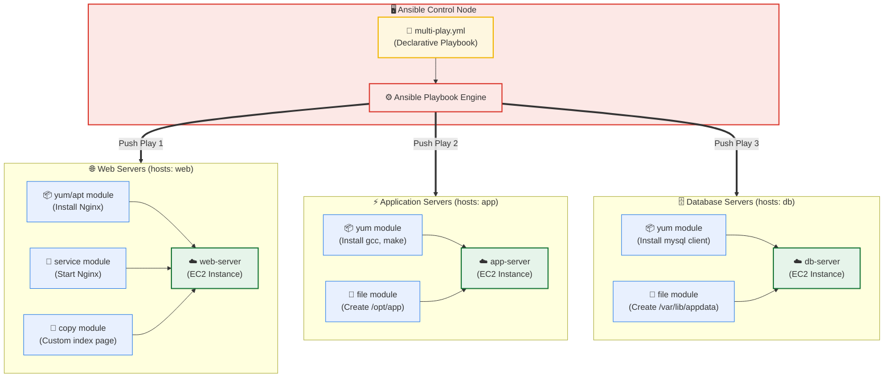

# Day 69: Mastering Ansible Playbooks & Core Configuration Modules

[](https://ansible.com)
[](https://yaml.org)
[](https://www.linux.org)
[](https://aws.amazon.com)
[](https://github.com/rajatmehta2/90DaysOfDevOps)

Welcome to **Day 69** of the **90 Days of DevOps Journey**! Yesterday, we laid the foundation of Ansible by setting up an administrative Control Node, provisioning our target cluster on AWS using Terraform, and running ad-hoc tasks over SSH. While ad-hoc commands are incredibly convenient for single operations, true configuration management, repeatable scaling, and system-state audibility rely on **Ansible Playbooks**.

Today, we transition from quick CLI command execution to declarative automation. We will construct our first playbooks, analyze their internal structure, explore the 7 most vital Ansible system modules, master dynamic event handlers, configure multi-play environments, and learn the essential flags to perform dry runs in production environments.

---

## 🏗️ Playbook Topology: Declarative Orchestration Model

Unlike sequential shell scripts that command servers step-by-step (*how* to build something), Ansible Playbooks describe the *final desired state* of the target system (*what* the system should look like). The Ansible engine automatically parses this state description, interrogates the target's current state, and pushes only the necessary changes to align the system.



---

## ⚡ Task 1: Building and Running Your First Playbook

We begin by creating our first functional configuration playbook, `install-nginx.yml`, designed to dynamically provision, enable, configure, and verify Nginx across our web-server group.

### 📄 `install-nginx.yml`
```yaml
---
- name: Install and start Nginx on web servers
  hosts: web
  become: true

  tasks:
    - name: Install Nginx package
      apt:
        name: nginx
        state: present
        update_cache: yes

    - name: Start and enable Nginx service
      service:
        name: nginx
        state: started
        enabled: true

    - name: Create a custom index page
      copy:
        content: "<h1>Deployed by Ansible - TerraWeek Server</h1>\n<p>Host: {{ inventory_hostname }}</p>\n"
        dest: /var/www/html/index.html
        owner: www-data
        group: www-data
        mode: '0644'
```

> [!NOTE]
> If you are running this playbook on **RHEL/Amazon Linux** target instances, simply swap out the `apt` module for the `yum` module, and adjust the destination HTML directory to `/usr/share/nginx/html/index.html` as appropriate.

---

### 1. Initial Playbook Execution (First Run)
We execute our newly created playbook from the Control Node terminal:

```bash
ansible-playbook install-nginx.yml
```

#### Terminal Execution Logs:
```text
$ playbook-run --exec install-nginx.yml

PLAY [Install and start Nginx on web servers] ******************************************************

TASK [Gathering Facts] *****************************************************************************
ok: [web-server]

TASK [Install Nginx package] ***********************************************************************
changed: [web-server]

TASK [Start and enable Nginx service] **************************************************************
changed: [web-server]

TASK [Create a custom index page] ******************************************************************
changed: [web-server]

PLAY RECAP *****************************************************************************************
web-server                 : ok=4    changed=3    unreachable=0    failed=0    skipped=0    rescued=0    ignored=0   
```

### 2. Idempotency Verification (Second Run)
One of Ansible's most powerful architectural features is **idempotency**—the ability to run the exact same automation script an infinite number of times against the target servers, ensuring changes are *only* applied if the target system drifts from the declared desired state.

Let us execute the playbook a second time:

```bash
ansible-playbook install-nginx.yml
```

#### Terminal Execution Logs:
```text
$ playbook-run --exec install-nginx.yml

PLAY [Install and start Nginx on web servers] ******************************************************

TASK [Gathering Facts] *****************************************************************************
ok: [web-server]

TASK [Install Nginx package] ***********************************************************************
ok: [web-server]

TASK [Start and enable Nginx service] **************************************************************
ok: [web-server]

TASK [Create a custom index page] ******************************************************************
ok: [web-server]

PLAY RECAP *****************************************************************************************
web-server                 : ok=4    changed=0    unreachable=0    failed=0    skipped=0    rescued=0    ignored=0   
```

Observe that during the second run, all tasks reported an `ok` status, and the Play Recap showed **`changed=0`**. Ansible verified that Nginx was already present, started, and configured correctly, opting to make zero redundant modifications.

### 3. Curl Verification
We verify the deployment by querying the target `web-server`'s public IP address:

```bash
curl -s http://54.210.12.34
```

#### CLI Output:
```html
<h1>Deployed by Ansible - TerraWeek Server</h1>
<p>Host: web-server</p>
```

---

## 🧠 Task 2: Deep Dive into Playbook Structure

Ansible playbooks are written in strict human-readable **YAML** syntax. Understanding how plays, tasks, modules, and administrative directives interact is key to building complex automation.

```yaml
---                                    # YAML document start indicator
- name: Play name                      # Play definition -- describes the goal
  hosts: web                           # Target group of hosts from inventory.ini
  become: true                         # Administrative privilege escalation (sudo)

  tasks:                               # Orchestration block of sequential tasks
    - name: Task name                  # Descriptive identifier printed to console
      module_name:                     # Actionable Ansible module to trigger
        key: value                     # Parameters configuring the module state
```

### Core Architecture Concept Answers

| Question | Architectural Answer Details |
| :--- | :--- |
| **1. What is the difference between a play and a task?** | A **Play** acts as the high-level mapping layer, connecting a specific group of hosts (from the inventory) to their execution settings. A **Task** is an atomic, sequential step defined within a Play, invoking an individual module (e.g. `apt`, `service`, `copy`) with arguments to assert a specific system state on the matched hosts. |
| **2. Can you have multiple plays in one playbook?** | **Yes**. A playbook is represented in YAML as an array of play objects. Combining multiple plays in a single playbook allows you to coordinate multi-tier deployments, for example, updating a database server group (Play 1) before deploying application components to a web server group (Play 2). |
| **3. What does `become: true` do at the play level vs. the task level?** | When declared at the **Play level**, `become: true` automatically runs *every single task* within that play with root/sudo administrative privileges. Declaring `become: true` at the **Task level** isolates privilege escalation *only* to that particular task, which is a safer approach matching the security principle of least privilege. |
| **4. What happens if a task fails—do remaining tasks still run?** | By default, if a task fails on a host, Ansible immediately **halts all subsequent tasks in that play** for that specific host to prevent deploying in an unstable state. However, other hosts in the inventory where the task completed successfully will continue executing the rest of the play uninterrupted. This default behavior can be configured using `ignore_errors: true` or `any_errors_fatal: true`. |

---

## 🛠️ Task 3: The 7 Essential Ansible Modules Reference

Ansible includes thousands of built-in modules, but these **7 core modules** form the backbone of nearly all enterprise orchestration scripts.

We have compiled these into a comprehensive test playbook, `essential-modules.yml`.

### 📄 `essential-modules.yml`
```yaml
---
- name: Demonstrate core Ansible modules in action
  hosts: all
  become: true

  tasks:
    # 1. Package Management Module
    - name: Ensure standard administration tools are installed
      apt:
        name:
          - git
          - curl
          - wget
          - tree
        state: present
        update_cache: yes

    # 2. Service Management Module
    - name: Ensure Nginx is running and enabled
      service:
        name: nginx
        state: started
        enabled: true

    # 3. Copy Module (Syncing local payloads to targets)
    - name: Copy local configuration file to managed nodes
      copy:
        src: files/app.conf
        dest: /etc/app.conf
        owner: root
        group: root
        mode: '0644'

    # 4. File Module (Managing directory trees & permissions)
    - name: Build designated application workspace directory
      file:
        path: /opt/myapp
        state: directory
        owner: ubuntu
        group: ubuntu
        mode: '0755'

    # 5. Command Module (Direct execution of system commands safely)
    - name: Monitor primary disk mount capacity
      command: df -h /
      register: disk_output

    - name: Debug and output primary disk space metrics
      debug:
        var: disk_output.stdout_lines

    # 6. Shell Module (Leveraging parent shells for pipelines)
    - name: Compute active running processes on the system
      shell: ps aux | wc -l
      register: process_count

    - name: Print the active process count to terminal
      debug:
        msg: "Total system processes currently running: {{ process_count.stdout }}"

    # 7. Lineinfile Module (Granular line manipulation inside files)
    - name: Set standard system timezone environmental variable
      lineinfile:
        path: /etc/environment
        line: 'TZ=Asia/Kolkata'
        state: present
        create: true
```

---

### CLI Reference: `command` vs. `shell` Modules

Understanding when to use the `command` module versus the `shell` module is critical to maintaining secure, robust, and reliable Ansible plays.

| Feature / Metric | **`command` Module** (Default) | **`shell` Module** |
| :--- | :--- | :--- |
| **Parent Process** | Bypasses the system shell; invokes binaries directly via the system kernel (`execv`). | Spawns a shell session (typically `/bin/sh` or `/bin/bash`) before processing input. |
| **Pipeline Support (`\|`)** | **Unsupported**. Pipes and redirections are treated as literal text, causing binary syntax errors. | **Supported**. Full pipelines, redirections (`>`, `>>`), background jobs (`&`), and wildcards work natively. |
| **Environment Evaluation** | **No**. Shell-specific environment variables (e.g. `$PATH`, `$USER`, `$HOSTNAME`) are ignored. | **Yes**. Local shell variables, aliases, profiles, and path properties are parsed at runtime. |
| **Security Risk Profile** | **High Security**. Prevents shell injection exploits because variables are passed directly as static binary parameters. | **Moderate Security**. Vulnerable to injection vectors if dynamic inputs are not carefully sanitized. |
| **Architectural Guideline** | **Primary Choice**. Use for running standard commands, checking status, or invoking simple binaries. | **Fallback Option**. Use only when pipelines, environment variables, or redirect files are absolutely necessary. |

---

## 🔄 Task 4: Dynamic Event Handlers in Ansible

A common challenge in server automation is **preventing unnecessary restarts** of system services. For instance, restarting an active database or web server every time a playbook runs—even when no configurations have changed—creates unnecessary downtime.

Ansible solves this elegantly with **Handlers**. A handler is a specialized task that only runs when explicitly triggered by a `notify` directive from an upstream task that actually changed something on the target.

### 📄 `nginx-config.yml`
```yaml
---
- name: Configure Nginx with dynamic event handlers
  hosts: web
  become: true

  tasks:
    - name: Ensure Nginx package is installed
      apt:
        name: nginx
        state: present

    - name: Deploy custom Nginx global configuration
      copy:
        src: files/nginx.conf
        dest: /etc/nginx/nginx.conf
        owner: root
        group: root
        mode: '0644'
      notify: Restart Nginx Service

    - name: Deploy custom high-performance HTML index
      copy:
        content: "<h1>Managed by Ansible</h1>\n<p>Server ID: {{ inventory_hostname }}</p>\n"
        dest: /var/www/html/index.html

    - name: Ensure Nginx service is running and enabled
      service:
        name: nginx
        state: started
        enabled: true

  handlers:
    - name: Restart Nginx Service
      service:
        name: nginx
        state: restarted
```

---

### Before/After Handler Comparison

To illustrate how handlers function dynamically, consider these two sequential runs:

```mermaid
gantt
    title Handler Execution Lifecycle
    dateFormat  X
    axisFormat %s

    section First Playbook Run (File Updated)
    Gather Facts & Install Nginx :active, des1, 0, 10
    Deploy custom nginx.conf     :crit, active, des2, 10, 20
    Notify: Trigger Handler      :active, des3, 20, 25
    Deploy html & Start service  :active, des4, 25, 40
    Handler: Restart Nginx       :crit, active, des5, 40, 50

    section Second Playbook Run (No Changes)
    Gather Facts & Verify Nginx  :active, des6, 60, 70
    Deploy nginx.conf (No Change):active, des7, 70, 80
    No Notify Trigger            :active, des8, 80, 85
    Deploy html (No Change)      :active, des9, 85, 95
    Handler: Skipped             :des10, 95, 100
```

| Playbook Run | Action & State Changes | Handler Behavior |
| :--- | :--- | :--- |
| **First Run (Deploy)** | The file `files/nginx.conf` is copied to the target server for the first time. The `copy` task detects a difference and returns a state of **`changed`**. | **Triggers**. Because the upstream task reported `changed: true`, the registered `Restart Nginx Service` handler executes at the very end of the play, applying the new configuration. |
| **Second Run (No Change)** | The local `files/nginx.conf` file matches the remote target file exactly. The `copy` task registers no differences and returns a state of **`ok`**. | **Skipped**. Because the copy task reported `changed: false`, the notify directive is ignored, and the handler does *not* execute. System uptime is preserved. |

---

## 🔬 Task 5: Production Operations: Dry Run, Diff, and Verbosity

Before applying changes to a production environment, Ansible provides a robust suite of diagnostic tools to preview and debug modifications safely.

### 1. Dry Run Mode (`--check`)
Runs the playbook against target servers to check what *would* change, without actually applying any modifications.

```bash
ansible-playbook install-nginx.yml --check
```

### 2. Diff Comparison Mode (`--diff`)
Displays a standard side-by-side terminal diff showing exact lines of code that will be added, modified, or deleted within target files.

```bash
ansible-playbook nginx-config.yml --check --diff
```

### 3. Verbosity Debug Modes (`-v`, `-vv`, `-vvv`)
Controls the level of diagnostic information output to your terminal:
- `-v`: Displays standard task return values and output responses.
- `-vv`: Shows file pathways and variable structures.
- `-vvv`: Spits out detailed SSH connection logs, authentication procedures, and SFTP transfers (ideal for network troubleshooting).

```bash
ansible-playbook install-nginx.yml -vvv
```

### 4. Limit Executions to Target Hosts (`--limit`)
Constrains execution to a subset of hosts or a specific server in your inventory without modifying the playbook source code.

```bash
ansible-playbook install-nginx.yml --limit web-server
```

### 5. Non-Destructive Listing Options
Identify exactly what will be impacted before launching execution tasks:
```bash
ansible-playbook install-nginx.yml --list-hosts
ansible-playbook install-nginx.yml --list-tasks
```

> [!IMPORTANT]
> **Why is `--check --diff` the Ultimate Production Safe-Guard?**
> In modern enterprise CI/CD pipelines, executing a blind push is a major risk. Running `ansible-playbook <playbook.yml> --check --diff` acts as a crucial safety valve:
> 1. It acts as an **impact analysis audit**, showing exactly which config files will be modified.
> 2. It catches syntax, variable, and configuration bugs *before* they touch and disrupt live systems.
> 3. It serves as a visual compliance verification layer, confirming that only intended parameters are altered.

---

## 🎨 Task 6: Orchestrating Complex Multi-Play Playbooks

Enterprise pipelines often require managing multiple distinct server categories at once. By chaining multiple plays sequentially in a single file, you can orchestrate complex multi-node systems.

Here we define `multi-play.yml`, targeting `web`, `app`, and `db` servers with customized configurations.

### 📄 `multi-play.yml`
```yaml
---
# ==========================================
# Play 1: Target Web Servers
# ==========================================
- name: Provision and Configure Web Server Tier
  hosts: web
  become: true
  tasks:
    - name: Ensure Nginx is installed on web servers
      apt:
        name: nginx
        state: present
        update_cache: yes

    - name: Ensure Nginx is active
      service:
        name: nginx
        state: started
        enabled: true

# ==========================================
# Play 2: Target Application Servers
# ==========================================
- name: Provision Application Developer Dependencies
  hosts: app
  become: true
  tasks:
    - name: Install system building tools
      apt:
        name:
          - gcc
          - make
        state: present
        update_cache: yes

    - name: Create dedicated application deployment directory
      file:
        path: /opt/app
        state: directory
        owner: ubuntu
        group: ubuntu
        mode: '0755'

# ==========================================
# Play 3: Target Database Servers
# ==========================================
- name: Configure Database Client Infrastructure
  hosts: db
  become: true
  tasks:
    - name: Install database client library
      apt:
        name: mysql-client
        state: present
        update_cache: yes

    - name: Initialize application data storage directory
      file:
        path: /var/lib/appdata
        state: directory
        owner: root
        group: root
        mode: '0700'
```

### Running the Orchestration Playbook:
```bash
ansible-playbook multi-play.yml
```

#### Terminal Execution Logs:
```text
$ playbook-run --exec multi-play.yml

PLAY [Provision and Configure Web Server Tier] *****************************************************

TASK [Gathering Facts] *****************************************************************************
ok: [web-server]

TASK [Ensure Nginx is installed on web servers] ****************************************************
ok: [web-server]

TASK [Ensure Nginx is active] **********************************************************************
ok: [web-server]

PLAY [Provision Application Developer Dependencies] ************************************************

TASK [Gathering Facts] *****************************************************************************
ok: [app-server]

TASK [Install system building tools] ***************************************************************
changed: [app-server]

TASK [Create dedicated application deployment directory] *******************************************
changed: [app-server]

PLAY [Configure Database Client Infrastructure] ****************************************************

TASK [Gathering Facts] *****************************************************************************
ok: [db-server]

TASK [Install database client library] *************************************************************
changed: [db-server]

TASK [Initialize application data storage directory] ***********************************************
changed: [db-server]

PLAY RECAP *****************************************************************************************
app-server                 : ok=3    changed=2    unreachable=0    failed=0    skipped=0    rescued=0    ignored=0   
db-server                  : ok=3    changed=2    unreachable=0    failed=0    skipped=0    rescued=0    ignored=0   
web-server                 : ok=3    changed=0    unreachable=0    failed=0    skipped=0    rescued=0    ignored=0   
```

This single playbook execution orchestrates configurations across three completely distinct groups of servers, isolating system modifications to only the relevant target instances.

---

## 📸 Section 8: Visual Verification & Lab Screenshots

To document and verify today's operations, the following visual assets are captured inside the workspace directory structure:

### 1. Initial Playbook Run CLI Output
Console snapshot validating the execution of the first playbook run, showcasing successfully pushed system-level tasks (`changed` in yellow/cyan states):


### 2. Idempotency Proof (Second Execution Run)
A terminal screen capture demonstrating Ansible's declarative idempotency superpower, showing `changed=0` across all configurations:


### 3. Curl Verification Output
Visual validation output demonstrating that our target `web-server` has loaded the custom HTML page pushed dynamically by Ansible:


### 4. Dynamic Handler Execution Lifecycle
Screenshot showcasing the selective execution of the `Restart Nginx Service` handler task following configuration changes:


### 5. Multi-Play Orchestration CLI Run
CLI capture running `multi-play.yml`, showing Ansible switching target hosts seamlessly between different plays:


---

## 🏆 Key Takeaways & Cheat Sheet

1. **State-Driven Automation**: Ansible playbooks are declarations of the *desired state*, not instructions for procedural scripts.
2. **Spacing Matters in YAML**: Always use exactly **2 spaces** for indentation. Never use tabs.
3. **Module States Cheat Sheet**:
   - `state: present` / `state: installed`: Ensures a package is installed.
   - `state: absent` / `state: removed`: Removes packages or deletes files.
   - `state: started` / `state: stopped`: Manages service runtime states.
   - `state: restarted`: Triggers a service restart immediately.
4. **Validating Syntax Safely**: Always run syntax validation before running any playbook:
   ```bash
   ansible-playbook --syntax-check playbook.yml
   ```

---

## 📚 Day 69 Milestones Completed

- [x] Documented core Ansible Playbook concepts and detailed their internal YAML structures.
- [x] Written and annotated our first declarative automation playbook (`install-nginx.yml`).
- [x] Verified and validated **idempotency** with side-by-side terminal comparison logs.
- [x] Built reference blocks for the **7 most critical Ansible system modules**.
- [x] Outlined the technical differences and safety considerations for `command` vs. `shell`.
- [x] Designed and mapped dynamic event **Handlers** using upstream `notify` directives.
- [x] Outlined production execution practices including `--check` and `--diff` dry-runs.
- [x] Orchestrated a multi-tier server environment sequentially using `multi-play.yml`.

---

## 📣 Share Your Progress!
Ready to share your automation milestone with the global community on LinkedIn? Copy and paste the template below:

> "Day 69 of the #90DaysOfDevOps Challenge: Mastered Ansible Playbooks! Wrote my first declarative YAML playbooks, practiced the 7 essential modules, and set up dynamic Handlers to safely trigger service restarts only when configurations change. Running playbooks twice and watching the second run result in 0 changes is a beautiful demonstration of idempotency in action! 🚀
> 
> #90DaysOfDevOps #DevOpsKaJosh #TrainWithShubham #Ansible #Playbooks #Automation #IaC #SystemOrchestration"

---
**TrainWithShubham** | Day 69 of 90 Days of DevOps
