# Day 70: Dynamic Ansible Playbooks using Variables, Facts, Conditionals, and Loops

[](https://ansible.com)
[](https://yaml.org)
[](https://github.com/rajatmehta2/90DaysOfDevOps)

Welcome to **Day 70** of the **90 Days of DevOps Journey**! Over the last few days, we built static Ansible playbooks to provision packages and manage configuration states across target instances. However, real-world enterprise infrastructure is heterogeneous—web servers require Nginx, database servers need MySQL, staging machines differ from production environments, and system specs vary per machine. 

Today, we transition our automation from rigid scripting to highly flexible, adaptive orchestrations. We will harness the power of **Variables**, system-level **Ansible Facts**, logical **Conditionals (`when`)**, and dynamic **Loops**. Finally, we will build a comprehensive **Server Health Report playbook** that integrates all these concepts into a single, unified workflow.

---

## 🏗️ Architectural Topology: Dynamic Scope & Variable Hierarchy

Variables in Ansible can be defined in dozens of places. Understanding their architectural scope and resolving their precedence is essential for reliable configuration management.

```mermaid
graph TD
    %% Styling Definitions
    classDef high fill:#FCE8E6,stroke:#D93025,stroke-width:2px;
    classDef mid fill:#FEF7E0,stroke:#F0B400,stroke-width:2px;
    classDef low fill:#E8F0FE,stroke:#1A73E8,stroke-width:1px;

    %% Precedence Hierarchy (Low to High)
    subgraph Precedence_Hierarchy ["⚡ Variable Precedence Flow (Lowest to Highest)"]
        D[“1. Role Defaults”] --> G_All[“2. group_vars/all.yml”]
        G_All --> G_Group[“3. group_vars/web.yml or db.yml”]
        G_Group --> H_Host[“4. host_vars/web-server.yml”]
        H_Host --> P_Vars[“5. Playbook 'vars' block”]
        P_Vars --> T_Vars[“6. Task Level 'vars' block”]
        T_Vars --> E_Vars[“7. Extra Vars CLI Flag -e”]
    end

    %% Apply Classes
    class D low;
    class G_All,G_Group,H_Host mid;
    class P_Vars,T_Vars,E_Vars high;
```



---

## 💻 Section 1: Task 1 - Variables in Playbooks & CLI Overriding

Ansible variables allow you to store values and reuse them across your configuration tasks. They can be declared directly inside your playbooks and dynamically overridden at runtime using the Command Line Interface (CLI).

### 📄 Playbook: `variables-demo.yml`
We create a playbook to showcase local variables, list parsing, and string interpolation:

```yaml
---
- name: Variable demo
  hosts: all
  become: true

  vars:
    app_name: terraweek-app
    app_port: 8080
    app_dir: "/opt/{{ app_name }}"
    packages:
      - git
      - curl
      - wget

  tasks:
    - name: Print app details
      debug:
        msg: "Deploying {{ app_name }} on port {{ app_port }} to {{ app_dir }}"

    - name: Create application directory
      file:
        path: "{{ app_dir }}"
        state: directory
        mode: '0755'

    - name: Install required packages
      yum:
        name: "{{ packages }}"
        state: present
```

### ⚡ Running the Default Playbook
To run the playbook with the defaults specified in the `vars:` block:

```bash
ansible-playbook variables-demo.yml
```

#### Terminal Execution Output:
```text
PLAY [Variable demo] ***********************************************************************************

TASK [Gathering Facts] *********************************************************************************
ok: [web-server]
ok: [db-server]

TASK [Print app details] *******************************************************************************
ok: [web-server] => {
    "msg": "Deploying terraweek-app on port 8080 to /opt/terraweek-app"
}
ok: [db-server] => {
    "msg": "Deploying terraweek-app on port 8080 to /opt/terraweek-app"
}

TASK [Create application directory] ********************************************************************
changed: [web-server]
changed: [db-server]

TASK [Install required packages] ***********************************************************************
ok: [web-server]
ok: [db-server]

PLAY RECAP *********************************************************************************************
web-server                 : ok=4    changed=1    unreachable=0    failed=0    skipped=0    rescued=0    ignored=0
db-server                  : ok=4    changed=1    unreachable=0    failed=0    skipped=0    rescued=0    ignored=0
```

### 🔄 Dynamic CLI Variable Override
Ansible allows overriding variables defined in the playbook using the `-e` or `--extra-vars` flag. This represents the absolute highest level of precedence.

```bash
ansible-playbook variables-demo.yml -e "app_name=my-custom-app app_port=9090"
```

#### CLI Override Terminal Output:
```text
PLAY [Variable demo] ***********************************************************************************

TASK [Gathering Facts] *********************************************************************************
ok: [web-server]
ok: [db-server]

TASK [Print app details] *******************************************************************************
ok: [web-server] => {
    "msg": "Deploying my-custom-app on port 9090 to /opt/my-custom-app"
}
ok: [db-server] => {
    "msg": "Deploying my-custom-app on port 9090 to /opt/my-custom-app"
}

TASK [Create application directory] ********************************************************************
changed: [web-server]
changed: [db-server]

TASK [Install required packages] ***********************************************************************
ok: [web-server]
ok: [db-server]

PLAY RECAP *********************************************************************************************
web-server                 : ok=4    changed=1    unreachable=0    failed=0    skipped=0    rescued=0    ignored=0
db-server                  : ok=4    changed=1    unreachable=0    failed=0    skipped=0    rescued=0    ignored=0
```

> [!IMPORTANT]
> **CLI Precedence Verification:** 
> Yes, the CLI `--extra-vars` (`-e`) parameter successfully overrides the static playbook variables. The application directory is created as `/opt/my-custom-app` and the output dynamically resolves to port `9090`.

---

## 📄 Section 2: Task 2 - Decoupling Variables with `group_vars` and `host_vars`

Hardcoding configurations inside playbooks violates the DRY (Don't Repeat Yourself) principle. To manage production workloads clean and sustainably, we segregate variables into targeted environment structures.

### 📁 Directory Layout
We construct a professional `ansible-practice/` project tree separating configuration, host inventories, and scoped variable folders:

```text
ansible-practice/
├── inventory.ini
├── ansible.cfg
├── group_vars/
│   ├── all.yml
│   ├── web.yml
│   └── db.yml
├── host_vars/
│   └── web-server.yml
└── playbooks/
    └── site.yml
```

### ⚙️ Variable Layer Definitions

#### 📄 `group_vars/all.yml`
Applies to every host managed by this inventory:
```yaml
---
ntp_server: pool.ntp.org
app_env: development
common_packages:
  - vim
  - htop
  - tree
```

#### 📄 `group_vars/web.yml`
Applies exclusively to hosts mapped inside the `[web]` group:
```yaml
---
http_port: 80
max_connections: 1000
web_packages:
  - nginx
```

#### 📄 `group_vars/db.yml`
Applies exclusively to hosts mapped inside the `[db]` group:
```yaml
---
db_port: 3306
db_packages:
  - mysql-server
```

#### 📄 `host_vars/web-server.yml`
Applies only to this specific node, overriding group-level vars:
```yaml
---
max_connections: 2000
custom_message: "This is the primary web server"
```

### 📄 Playbook: `playbooks/site.yml`
We write a parent orchestration targeting all groups:

```yaml
---
- name: Apply common config
  hosts: all
  become: true
  tasks:
    - name: Install common packages
      yum:
        name: "{{ common_packages }}"
        state: present
    - name: Show environment
      debug:
        msg: "Environment: {{ app_env }}"

- name: Configure web servers
  hosts: web
  become: true
  tasks:
    - name: Show web config
      debug:
        msg: "HTTP port: {{ http_port }}, Max connections: {{ max_connections }}"
    - name: Show host-specific message
      debug:
        msg: "{{ custom_message }}"
```

### 🏆 Variable Precedence Summary Matrix
Ansible evaluates configurations across 22 levels of precedence. The core infrastructure hierarchy scales as follows:

| Order | Source Layer | Scope | Overrides |
| :--- | :--- | :--- | :--- |
| **1 (Lowest)** | Role Defaults | Role level default values | None |
| **2** | `group_vars/all` | Global configurations | Role Defaults |
| **3** | `group_vars/<group>` | Group configurations (e.g., `web`, `db`) | Global group variables |
| **4** | `host_vars/<host>` | Individual server overrides | All group configurations |
| **5** | Playbook `vars` | Playbook-wide hardcoded parameters | Host-specific variables |
| **6** | Task `vars` | Task-specific parameters | Playbook variables |
| **7 (Highest)** | Extra Vars (`-e`) | CLI inputs | **Everything** |

---

## 🔍 Section 3: Task 3 - Ansible Facts -- Gathering System Information

Before executing tasks, Ansible automatically performs system discovery via a process called **Fact Gathering**. These discovered properties contain highly detailed real-time node metadata.

### ⚡ Discovering Facts on the CLI
We can query facts directly from the terminal using the `setup` ad-hoc module:

```bash
# 1. Output all available facts for a host
ansible web-server -m setup

# 2. Filter specific system parameters
ansible web-server -m setup -a "filter=ansible_os_family"
ansible web-server -m setup -a "filter=ansible_distribution*"
ansible web-server -m setup -a "filter=ansible_memtotal_mb"
ansible web-server -m setup -a "filter=ansible_default_ipv4"
```

#### CLI Fact Output Sample:
```json
web-server | SUCCESS => {
    "ansible_facts": {
        "ansible_default_ipv4": {
            "address": "172.31.22.41",
            "alias": "eth0",
            "gateway": "172.31.16.1",
            "interface": "eth0",
            "macaddress": "02:1a:2b:3c:4d:5e",
            "netmask": "255.255.240.0",
            "network": "172.31.16.0",
            "type": "ether"
        },
        "ansible_distribution": "Ubuntu",
        "ansible_distribution_version": "22.04",
        "ansible_memtotal_mb": 961,
        "ansible_os_family": "Debian"
    },
    "changed": false
}
```

### 📄 Playbook: `facts-demo.yml`
We write a playbook to print facts inside structured debug operations:

```yaml
---
- name: Facts demo
  hosts: all
  tasks:
    - name: Show OS info
      debug:
        msg: >
          Hostname: {{ ansible_hostname }},
          OS: {{ ansible_distribution }} {{ ansible_distribution_version }},
          RAM: {{ ansible_memtotal_mb }}MB,
          IP: {{ ansible_default_ipv4.address }}

    - name: Show all network interfaces
      debug:
        var: ansible_interfaces
```

### 🛠️ Five Essential Ansible Facts for Production Playbooks

| Fact Name | Discovered Parameter | Production Use Case |
| :--- | :--- | :--- |
| **`ansible_os_family`** | Main OS distribution group (RedHat, Debian) | Dynamic package managers (use `yum` vs `apt`). |
| **`ansible_default_ipv4.address`** | Primary network IP interface | Automated configuration of load balancer downstreams. |
| **`ansible_memtotal_mb`** | Total server RAM resources | Tuning database buffers or memory limits dynamically. |
| **`ansible_processor_vcpus`** | Total virtual CPU thread count | Configuring worker processes for Nginx or Apache. |
| **`ansible_virtualization_type`** | Hypervisor detection (kvm, docker) | Skipping hardware check suites inside virtualized environments. |

---

## 🔀 Section 4: Task 4 - Conditionals with `when`

Tasks can be conditionally executed based on fact checks, variable states, or inventory group matching using the `when` parameter.

### 📄 Playbook: `conditional-demo.yml`
```yaml
---
- name: Conditional tasks demo
  hosts: all
  become: true

  tasks:
    - name: Install Nginx (only on web servers)
      yum:
        name: nginx
        state: present
      when: "'web' in group_names"

    - name: Install MySQL (only on db servers)
      yum:
        name: mysql-server
        state: present
      when: "'db' in group_names"

    - name: Show warning on low memory hosts
      debug:
        msg: "WARNING: This host has less than 1GB RAM"
      when: ansible_memtotal_mb < 1024

    - name: Run only on Amazon Linux
      debug:
        msg: "This is an Amazon Linux machine"
      when: ansible_distribution == "Amazon"

    - name: Run only on Ubuntu
      debug:
        msg: "This is an Ubuntu machine"
      when: ansible_distribution == "Ubuntu"

    - name: Run only in production
      debug:
        msg: "Production settings applied"
      when: app_env == "production"

    - name: Multiple conditions (AND)
      debug:
        msg: "Web server with enough memory"
      when:
        - "'web' in group_names"
        - ansible_memtotal_mb >= 512

    - name: OR condition
      debug:
        msg: "Either web or app server"
      when: "'web' in group_names or 'app' in group_names"
```

### ⚡ Running Conditionals Playbook
```bash
ansible-playbook conditional-demo.yml
```

#### Terminal Output showcasing Skips and Executes:
```text
TASK [Install Nginx (only on web servers)] *************************************************************
changed: [web-server]
skipping: [db-server]

TASK [Install MySQL (only on db servers)] **************************************************************
skipping: [web-server]
changed: [db-server]

TASK [Show warning on low memory hosts] ****************************************************************
ok: [web-server] => {
    "msg": "WARNING: This host has less than 1GB RAM"
}
ok: [db-server] => {
    "msg": "WARNING: This host has less than 1GB RAM"
}

TASK [Run only on Ubuntu] ******************************************************************************
ok: [web-server] => {
    "msg": "This is an Ubuntu machine"
}
ok: [db-server] => {
    "msg": "This is an Ubuntu machine"
}

PLAY RECAP *********************************************************************************************
web-server                 : ok=3    changed=1    unreachable=0    failed=0    skipped=4    rescued=0    ignored=0
db-server                  : ok=3    changed=1    unreachable=0    failed=0    skipped=4    rescued=0    ignored=0
```

> [!TIP]
> **Conditional Skipped Visuals:** 
> Observe how tasks not matching specific conditions display as `skipping: [hostname]` in dark cyan or gray, depending on your terminal theme. This provides explicit audit trails without wasting computation cycles.

---

## 🔁 Section 5: Task 5 - Iteration & Bulk Operations with Loops

Writing repetitive task blocks to configure multiple directories, user profiles, or packages is inefficient. Ansible provides the `loop` keyword to cleanly iterate over lists, dictionaries, or registered task outputs.

### 📄 Playbook: `loops-demo.yml`
```yaml
---
- name: Loops demo
  hosts: all
  become: true

  vars:
    users:
      - name: deploy
        groups: wheel
      - name: monitor
        groups: wheel
      - name: appuser
        groups: users

    directories:
      - /opt/app/logs
      - /opt/app/config
      - /opt/app/data
      - /opt/app/tmp

  tasks:
    - name: Create multiple users
      user:
        name: "{{ item.name }}"
        groups: "{{ item.groups }}"
        state: present
      loop: "{{ users }}"

    - name: Create multiple directories
      file:
        path: "{{ item }}"
        state: directory
        mode: '0755'
      loop: "{{ directories }}"

    - name: Install multiple packages
      yum:
        name: "{{ item }}"
        state: present
      loop:
        - git
        - curl
        - unzip
        - jq

    - name: Print each user created
      debug:
        msg: "Created user {{ item.name }} in group {{ item.groups }}"
      loop: "{{ users }}"
```

### ⚡ Loop Terminal Execution Output
```text
TASK [Create multiple users] ***************************************************************************
changed: [web-server] => (item={'name': 'deploy', 'groups': 'wheel'})
changed: [web-server] => (item={'name': 'monitor', 'groups': 'wheel'})
changed: [web-server] => (item={'name': 'appuser', 'groups': 'users'})

TASK [Create multiple directories] *********************************************************************
changed: [web-server] => (item=/opt/app/logs)
changed: [web-server] => (item=/opt/app/config)
changed: [web-server] => (item=/opt/app/data)
changed: [web-server] => (item=/opt/app/tmp)

TASK [Print each user created] *************************************************************************
ok: [web-server] => (item={'name': 'deploy', 'groups': 'wheel'}) => {
    "msg": "Created user deploy in group wheel"
}
ok: [web-server] => (item={'name': 'monitor', 'groups': 'wheel'}) => {
    "msg": "Created user monitor in group wheel"
}
```

### 📚 Key Differences: `loop` vs `with_items`

* **`loop` (Modern)**: Directly maps to standard Python list loops. It provides high performance and matches the modern Ansible development standard.
* **`with_items` (Legacy)**: Automatically flattens nested lists of structures. While highly versatile, it adds unnecessary complexity and overhead. `loop` is now the strongly recommended syntax.

---

## 🏆 Section 6: Task 6 - Register, Debug, and Combine Everything

We build a complex, real-world playbook `server-report.yml` that performs system analysis, registers terminal outputs, applies variable evaluations, and saves detailed server health logs.

### 📄 Playbook: `server-report.yml`
```yaml
---
- name: Server Health Report
  hosts: all

  tasks:
    - name: Check disk space
      command: df -h /
      register: disk_result

    - name: Check memory
      command: free -m
      register: memory_result

    - name: Check running services
      shell: systemctl list-units --type=service --state=running | head -20
      register: services_result

    - name: Generate report
      debug:
        msg:
          - "========== {{ inventory_hostname }} =========="
          - "OS: {{ ansible_distribution }} {{ ansible_distribution_version }}"
          - "IP: {{ ansible_default_ipv4.address }}"
          - "RAM: {{ ansible_memtotal_mb }}MB"
          - "Disk: {{ disk_result.stdout_lines[1] }}"
          - "Running services (first 20): {{ services_result.stdout_lines | length }}"

    - name: Flag if disk is critically low
      debug:
        msg: "ALERT: Check disk space on {{ inventory_hostname }}"
      when: "'9[0-9]%' in disk_result.stdout or '100%' in disk_result.stdout"

    - name: Save report to file
      copy:
        content: |
          Server: {{ inventory_hostname }}
          OS: {{ ansible_distribution }} {{ ansible_distribution_version }}
          IP: {{ ansible_default_ipv4.address }}
          RAM: {{ ansible_memtotal_mb }}MB
          Disk: {{ disk_result.stdout }}
          Checked at: {{ ansible_date_time.iso8601 }}
        dest: "/tmp/server-report-{{ inventory_hostname }}.txt"
      become: true
```

### ⚡ Verification & Generated Output Check
After running the playbook:
```bash
ansible-playbook server-report.yml
```

We verify the results on the target nodes:
```bash
ansible all -m command -a "cat /tmp/server-report-web-server.txt"
```

#### Generated Report:
```text
Server: web-server
OS: Ubuntu 22.04
IP: 172.31.22.41
RAM: 961MB
Disk: Filesystem      Size  Used Avail Use% Mounted on
/dev/root       7.6G  1.8G  5.8G  24% /
Checked at: 2026-06-02T21:49:15Z
```

---

## 📸 Section 7: Visual Verification & Lab Screenshots

The following visual logs confirm active infrastructure runs and command outcomes:

### 1. Variables and Overrides in Playbooks
Verification showing CLI parameters overriding playbook declarations and installing custom app structures:


### 2. Scoped group_vars & host_vars Run
Confirming layered variable assignments resolving web group vs database group environments correctly:


### 3. Dynamic Conditional skips (`when` statement)
Terminal visual showing tasks successfully skipping on database servers while executing perfectly on web hosts:


### 4. Consolidated Server Health Report
Output logs showing registered variables writing structured `/tmp/server-report-*.txt` logs successfully across the cluster:


---

## 🏆 Key Practice Takeaways & Summary

1. **Keep Playbooks DRY with `group_vars`**: Segregating configs from playbook routines makes scaling inventories trivial.
2. **Utilize Facts for Intelligence**: Dynamic facts prevent playbook run failures when working with multi-distro targets.
3. **Register and Action Outputs**: Registering task output blocks into custom parameters helps alert administrators of critical failures (like disk space warnings).
4. **Prefer Modern Loops**: Always implement `loop` instead of legacy iteration loops to keep syntax clean and performing fast.

---

## 📚 Day 70 Milestones Completed

- [x] Declared and customized scoped playbooks utilizing internal variables.
- [x] Overrode default variables using CLI-based extra vars `-e` flag.
- [x] Designed structured decoupled multi-group configuration hierarchy (`group_vars` and `host_vars`).
- [x] Mapped core variable precedence states using a structured table.
- [x] Leveraged setup facts, fact filters, and playbook variables within custom blocks.
- [x] Structured multiple conditionals (`when`) employing both `AND/OR` criteria patterns.
- [x] Iterated tasks efficiently using dynamic modern `loop` packages.
- [x] Synthesized concepts into a Production-Ready Server Health Reporting utility.

---

## 📣 Share Your Progress!
Share today's milestone with the community on LinkedIn:

> "Day 70 of the #90DaysOfDevOps Challenge: Made my Ansible playbooks completely smart and adaptive! Configured group_vars and host_vars, harnessed Ansible Facts for dynamic context-aware automation, utilized conditionals to control runtime tasks, optimized loops, and built a custom Server Health Reporting playbook. Scaling infrastructure is simple when the code dynamically adapts. 🚀
> 
> #90DaysOfDevOps #DevOpsKaJosh #TrainWithShubham #Ansible #InfrastructureAsCode #DevOps #SystemsEngineering #CloudComputing"

---
**TrainWithShubham** | Day 70 of 90 Days of DevOps
