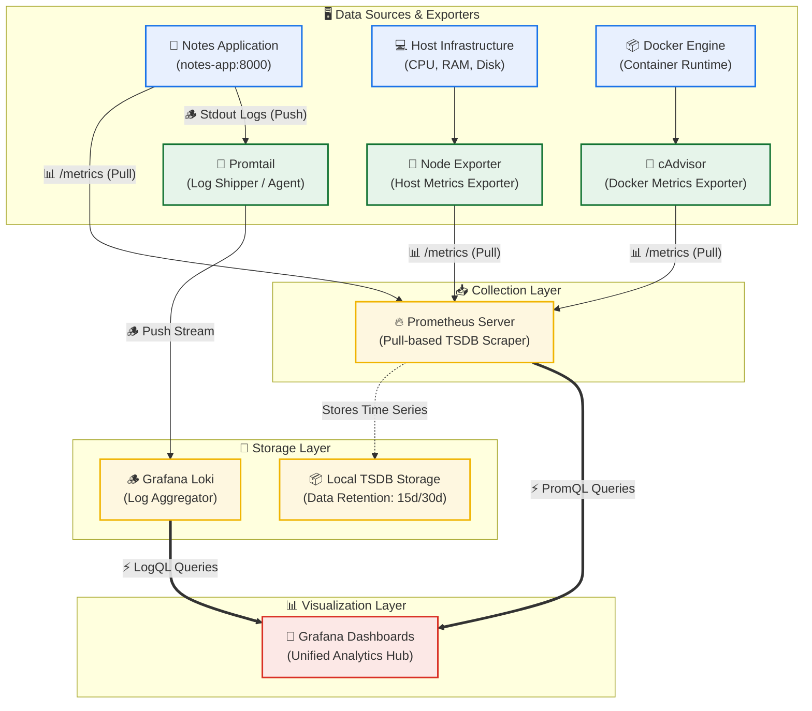

# Day 73: Introduction to Observability and Prometheus -- Metric Collection, PromQL, & Docker Deployment

[](https://prometheus.io)
[](https://docker.com)
[](https://github.com/rajatmehta2/90DaysOfDevOps)
[](https://github.com/rajatmehta2/90DaysOfDevOps)

Welcome to **Day 73** of the **90 Days of DevOps Journey**! 🚀 

Until now, you have successfully automated infrastructure provisioning with Terraform, configured remote servers with Ansible, and packaged applications into Docker containers. However, once your applications are up and running in a live production environment, a critical question arises: **How do you know they are healthy?** What do you do when a microservice breaks down silently at 3 AM?

This is where **observability** comes in. Observability transforms our infrastructure from an opaque "black box" into a transparent, queryable system. Today, we will explore the foundational theories of observability—defining its Three Pillars—and bootstrap **Prometheus**, the industry-standard, pull-based metrics collection and querying system, running entirely in Docker containers.

---

## 📋 Section 1: The Three Pillars of Observability

A common misconception is treating traditional monitoring and modern observability as the same. Let's delineate the two:

*   **Monitoring** tells you **when** something is wrong. It is static and threshold-based (e.g., *Is CPU usage > 90%?* or *Is the server pingable?*). It is designed to alert you about *known failure modes*.
*   **Observability** tells you **why** something is wrong. It is highly dynamic, allowing you to ask questions about your system from the outside based on its telemetry outputs. It is designed to help you debug *unknown failure modes*.

Observability is built upon three essential telemetry types, widely known as the **Three Pillars**:

| Pillar | Data Type Description | Storage Cost | Query Speed | Primary Purpose | Standard Tools |
| :--- | :--- | :--- | :--- | :--- | :--- |
| **Metrics** | Numerical measurements recorded over time. Highly aggregated. | 🟢 Low | ⚡ Extremely Fast | Real-time dashboards, alerting, detecting performance anomalies. | **Prometheus**, Datadog, AWS CloudWatch |
| **Logs** | Timestamped text records of discrete, raw application events. | 🟡 Medium | 🐢 Slow to Medium | Root-cause analysis, stack trace auditing, examining specific failures. | **Grafana Loki**, ELK Stack, Fluentd |
| **Traces** | End-to-end paths of single requests passing through microservices. | 🔴 High | 🟡 Medium | Pinpointing network bottlenecks and inter-service latency. | **OpenTelemetry**, Jaeger, Zipkin |

### Why Do DevOps Engineers Need All Three?
A robust DevOps workflow relies on the synergy of all three telemetry types:
1. **Metrics** act as the *smoke detector*: They tell you **what** is broken (e.g., "*Alert! HTTP 5xx error rate has spiked to 12% on the `/api/payment` endpoint*").
2. **Traces** act as the *map*: They tell you **where** the failure occurred along the request journey (e.g., "*The request failed during the downstream database query inside the Payment service*").
3. **Logs** act as the *magnifying glass*: They tell you **why** it broke (e.g., "*Database Timeout Exception: Failed to connect to MySQL database at ip-10-0-2-4*").

---

## 🏗️ Section 2: Observability Stack Architecture (Days 73-77)

Below is the architectural diagram of the complete observability pipeline we will build over the next 5 days. It illustrates the telemetry streams flowing from hosts, containers, and applications into specialized aggregators, unified under a single visualization plane.



---

## 🛠️ Section 3: Setting Up Prometheus with Docker

We will build an organized stack structure under the project directory `observability-stack`.

```text
observability-stack/
├── docker-compose.yml     # Docker services orchestrator
└── prometheus.yml         # Prometheus scrape configuration
```

### Step 1: Create the Project Directory
Initialize a dedicated directory to house our observability configurations:
```bash
mkdir -p observability-stack && cd observability-stack
```

### Step 2: Write the Prometheus Scrape Configuration: `prometheus.yml`
Prometheus relies on a configuration file to define scraping intervals and targets. Create `prometheus.yml`:
```yaml
global:
  scrape_interval: 15s      # Interval at which metrics are scraped (Default: 1m)
  evaluation_interval: 15s  # Interval to evaluate alerting and recording rules

scrape_configs:
  - job_name: "prometheus"
    static_configs:
      - targets: ["localhost:9090"]  # Scraping its own monitoring endpoint
```

### Step 3: Write the Orchestration File: `docker-compose.yml`
We run Prometheus as a containerized service, mounting our configuration file and a persistent volume for metrics storage. Create `docker-compose.yml`:
```yaml
services:
  prometheus:
    image: prom/prometheus:latest
    container_name: prometheus
    ports:
      - "9090:9090"
    volumes:
      - ./prometheus.yml:/etc/prometheus/prometheus.yml
      - prometheus_data:/prometheus
    command:
      - '--config.file=/etc/prometheus/prometheus.yml'
    restart: unless-stopped

volumes:
  prometheus_data:
```

### Step 4: Spin Up the Containerized Prometheus Server
Execute the compose command to pull and launch Prometheus in detached mode:
```bash
docker compose up -d
```

#### Terminal Execution Log:
```text
[+] Running 3/3
 ✔ Network observability-stack_default         Created                                                             0.0s
 ✔ Volume observability-stack_prometheus_data  Created                                                             0.0s
 ✔ Container prometheus                        Started                                                             0.4s
```

### Step 5: Verify targets
1. Open your browser and navigate to `http://localhost:9090`.
2. In the top navigation bar, go to **Status** > **Targets**.
3. You will see the default `prometheus` target reporting status **UP**.

---

## 📊 Section 4: Core Prometheus Metric Types & Concepts

Prometheus operates on a **Pull-Based Model**—it regularly scrapes HTTP endpoints exposing text-based metrics rather than waiting for servers to push metrics to it. Before querying, we must understand the core concepts and the four native metric types:

*   **Scrape Target**: An HTTP endpoint that exposes formatted metrics (usually via `/metrics`).
*   **Labels**: Key-value pairs representing multi-dimensional metadata (e.g., `status="200"`, `method="POST"`).
*   **Time Series**: A stream of timestamped values belonging to the exact same metric and label configuration.

### The Four Metric Types

| Metric Type | Characteristics | Key Architectural Details | Real-World Example |
| :--- | :--- | :--- | :--- |
| **Counter** | A cumulative metric that **only goes up** or resets to zero on restart. | Always use `rate()` or `increase()` functions to interpret values over time. | `prometheus_http_requests_total` (total requests served) |
| **Gauge** | A variable metric that **goes up and down** arbitrarily. | Shows instantaneous current values. Never use `rate()` on Gauges. | `process_resident_memory_bytes` (active RAM usage) |
| **Histogram** | Measures observations in configurable **data buckets** and sums them up. | Automatically creates `<metric_name>_bucket`, `<metric_name>_sum`, and `<metric_name>_count`. | `prometheus_http_request_duration_seconds_bucket` (latency) |
| **Summary** | Similar to Histogram, but calculates **quantiles** on the client side. | Highly accurate for specific clients, but cannot be aggregated across hosts. | `go_gc_duration_seconds` (Garbage collection timing) |

---

## ⚡ Section 5: PromQL Basics & Practical Queries

**PromQL (Prometheus Query Language)** is a domain-specific language designed to extract, aggregate, and calculate metrics.

### Vector Types in PromQL
*   **Instant Vector**: Returns a single value per time series representing the most recent data point (e.g., `up`).
*   **Range Vector**: Returns an array of values over a specified time duration (e.g., `prometheus_http_requests_total[5m]`).

---

### Five PromQL Queries Run in the UI

Below are five standard diagnostics queries executed in the Prometheus UI (`http://localhost:9090/graph`):

#### 1. Count of Total Active Metrics
Counts how many distinct metric endpoints are currently registered on this Prometheus instance.
```promql
count({__name__=~".+"})
```
*   **Returned Output Value**: `982` *(Number representing active time-series targets)*

#### 2. Resident Memory Consumption (Gauge Example)
Checks the actual physical memory (RAM) the Prometheus server container is utilizing, converted to Megabytes.
```promql
process_resident_memory_bytes / 1024 / 1024
```
*   **Returned Output Value**: `58.42` *(Value in MB)*

#### 3. Total Received HTTP Requests (Counter Example)
Tracks the total count of incoming HTTP requests processed by the Prometheus web interface.
```promql
prometheus_http_requests_total
```
*   **Returned Tabular Output**:
    ```text
    Element                                                                             Value
    prometheus_http_requests_total{code="200", handler="/api/v1/query"}                 42
    prometheus_http_requests_total{code="200", handler="/static/*filepath"}             18
    prometheus_http_requests_total{code="302", handler="/"}                             2
    ```

#### 4. Filter HTTP Requests by Query Handler
Filters request counters down to the specific Prometheus search query executor API handler endpoint.
```promql
prometheus_http_requests_total{handler="/api/v1/query"}
```
*   **Returned Tabular Output**:
    ```text
    Element                                                                             Value
    prometheus_http_requests_total{code="200", handler="/api/v1/query"}                 42
    ```

#### 5. Verify Target Scrape Health Status
Evaluates the connection state of the configured scrape endpoints (returns `1` for active/UP, and `0` for unreachable/DOWN).
```promql
up
```
*   **Returned Tabular Output**:
    ```text
    Element                                                                             Value
    up{instance="localhost:9090", job="prometheus"}                                     1
    ```

---

### 💡 Practice Exercise Solution
**Requirement**: *Write a PromQL query that shows the per-second rate of non-200 HTTP requests to Prometheus over the last 5 minutes.*

#### PromQL Query:
```promql
sum(rate(prometheus_http_requests_total{code!="200"}[5m]))
```

#### Detailed Breakdown of the Query:
1.  `{code!="200"}`: A label filter that filters out all successful (`200 OK`) HTTP requests, leaving only redirect (`3xx`) or error (`4xx`/`5xx`) statuses.
2.  `[5m]`: Specifies a **Range Vector** that collects all historical data points matching this criteria over the past 5 minutes.
3.  `rate(...)`: Calculates the per-second average rate of increase of the counter metric over the 5-minute time window.
4.  `sum(...)`: Aggregates the computed rate values across all matching label combinations (like differing handlers or instances) into a single, unified scalar value.

---

## 🚢 Section 6: Adding a Sample Application (`notes-app`) as a Scrape Target

Prometheus shines when monitoring active applications. We will deploy a sample web app (`notes-app`) and configure Prometheus to scrape its metrics.

### Step 1: Update the Orchestration File `docker-compose.yml`
Add the `notes-app` service to our Compose stack.
```yaml
services:
  prometheus:
    image: prom/prometheus:latest
    container_name: prometheus
    ports:
      - "9090:9090"
    volumes:
      - ./prometheus.yml:/etc/prometheus/prometheus.yml
      - prometheus_data:/prometheus
    command:
      - '--config.file=/etc/prometheus/prometheus.yml'
    restart: unless-stopped

  notes-app:
    image: trainwithshubham/notes-app:latest
    container_name: notes-app
    ports:
      - "8000:8000"
    restart: unless-stopped

volumes:
  prometheus_data:
```

### Step 2: Update the Scrape Config File `prometheus.yml`
Configure Prometheus to scrap metrics from the new container, referencing it via its Docker internal DNS name `notes-app` on port `8000`:
```yaml
global:
  scrape_interval: 15s
  evaluation_interval: 15s

scrape_configs:
  - job_name: "prometheus"
    static_configs:
      - targets: ["localhost:9090"]

  - job_name: "notes-app"
    static_configs:
      - targets: ["notes-app:8000"]
```

### Step 3: Restart the Docker Compose Stack
Apply configurations and start the application container:
```bash
docker compose up -d
```

#### Terminal Execution Log:
```text
[+] Running 2/2
 ✔ Container prometheus  Running                                                                           0.0s
 ✔ Container notes-app   Started                                                                           0.4s
```

### Step 4: Generate Mock Web Traffic
Let's query the application endpoint a few times using `curl` to generate baseline request metrics:
```bash
curl http://localhost:8000
curl http://localhost:8000
curl http://localhost:8000
```

#### Terminal Output:
```text
*   Trying 127.0.0.1:8000...
* Connected to localhost (127.0.0.1) port 8000 (#0)
HTTP/1.1 200 OK
...
Note-taking app home screen!
```

Now, navigate to **Status** > **Targets** in the Prometheus UI. You will see both **prometheus** and **notes-app** targets in the **UP** state!

---

## 💾 Section 7: Data Retention and TSDB Engine Management

Prometheus relies on an optimized, append-only **Time Series Database (TSDB)** to write metrics in block segments of 2 hours.

### Step 1: Check Current TSDB Local Disk Space
Execute a command inside the container to see how much storage space is currently consumed by the `/prometheus` directory:
```bash
docker exec prometheus du -sh /prometheus
```
*   **Simulated Terminal Output**:
    ```text
    14.2M   /prometheus
    ```

### Step 2: Configure Custom Storage Retention Policies
By default, Prometheus retains metrics for 15 days. We can tune this behavior to prevent storage exhaustion by adjusting command-line arguments in `docker-compose.yml`.

Update the `command` block in your `docker-compose.yml`:
```yaml
    command:
      - '--config.file=/etc/prometheus/prometheus.yml'
      - '--storage.tsdb.retention.time=30d'
      - '--storage.tsdb.retention.size=1GB'
```
*   `--storage.tsdb.retention.time=30d`: Extends metric history retention from 15 days to 30 days.
*   `--storage.tsdb.retention.size=1GB`: Places a cap on the maximum disk space used by TSDB blocks. If exceeded, the oldest metrics are purged first.

---

### 💡 Observability Architecture Questions
#### Q1: What happens when retention limits are exceeded?
When either the configured time limit (`30d`) or the size limit (`1GB`) is reached, Prometheus's internal TSDB compaction engine immediately deletes the oldest time-series data blocks from disk to free up space.

#### Q2: Why is a volume mount critical for Prometheus container storage?
Docker containers are completely **ephemeral**. Any files generated or updated inside the container are lost if the container stops, restarts, or is updated to a newer image. Volume mounting (`prometheus_data:/prometheus`) maps the TSDB data path inside the container to a persistent storage directory on the host machine. This ensures that historical monitoring data is preserved across container lifecycles.

---

## 📸 Section 8: Visual Verification & Screenshots

Below are the designated verification steps showing our Prometheus observability setup in action.

### 1. Multi-Target Verification
The Prometheus Web UI **Status > Targets** page proving both the Prometheus engine self-target and the sample `notes-app` container are in the active **UP** state:


### 2. Live PromQL Query Execution
Running diagnostic queries on the **Graph** panel to analyze memory and HTTP requests:


### 3. Docker Containers Running
System terminal output of `docker ps` confirming active, running containers:


### 4. Storage Engine Disk Check
Executing storage validation metrics on the TSDB database directory:


---

## 🏆 Key Practice Takeaways & Summary

1.  **Monitoring vs Observability**: Monitoring alerts you to failures (*what*); observability gives you the data you need to figure out the cause (*why*).
2.  **Pull-Based Scrape Model**: Prometheus pulls metrics from target endpoints at regular intervals. This simplifies client architectures and prevents metric overloads.
3.  **PromQL Power**: Using simple query filters, functions like `rate()`, and aggregations like `sum()`, you can quickly calculate complex system metrics.
4.  **Container Portability**: Wrapping Prometheus and target apps in Docker Compose makes deploying and scaling your monitoring stack highly portable and consistent.

### 📚 Day 73 Milestones Completed
- [x] Defined the three pillars of observability in detail.
- [x] Constructed a multi-day observability stack architecture diagram (Mermaid).
- [x] Launched Prometheus in a containerized Docker Compose environment.
- [x] Explored and categorized core Prometheus metrics (Counter, Gauge, Histogram, Summary).
- [x] Executed core diagnostic PromQL queries on the Prometheus Graph console.
- [x] Successfully solved the non-200 HTTP request rate query exercise.
- [x] Deployed `notes-app` and configured multi-target scraping.
- [x] Configured TSDB retention flags (`time` and `size`) to control local storage.

---

## 📣 Share Your Progress!
Share your accomplishments with the community on LinkedIn:

> "Day 73 of the #90DaysOfDevOps Challenge: Dived into the core concepts of Observability! 🚀
> 
> Today, I explored the differences between traditional monitoring and modern observability, and studied the three pillars: Metrics, Logs, and Traces. I set up a Prometheus server in a Docker environment, configured it to scrape its own metrics, and learned how to query data using PromQL. I also expanded the stack by deploying a sample notes application and configuring multi-target scraping. 
> 
> The journey into metrics collection and performance diagnostics has begun! 📈
> 
> #90DaysOfDevOps #DevOpsKaJosh #TrainWithShubham #Prometheus #Docker #Observability #PromQL #SRE"

---
**TrainWithShubham** | Day 73 of 90 Days of DevOps
