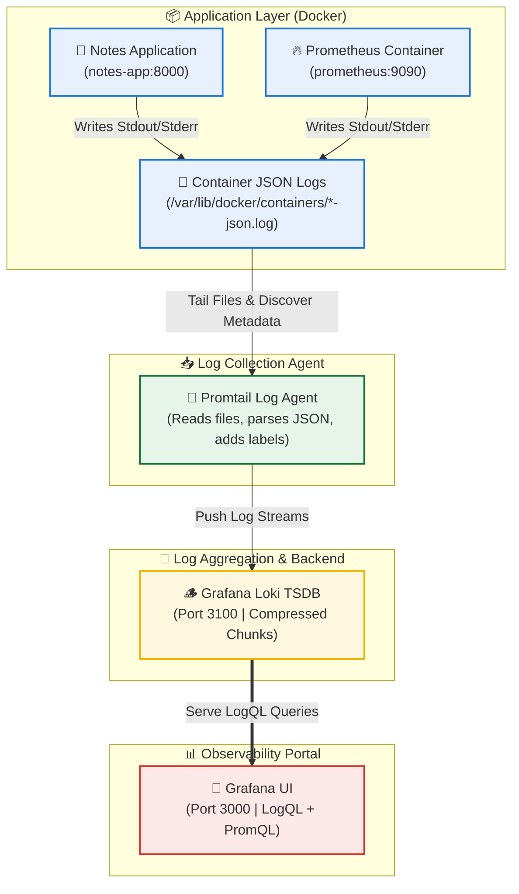

# Day 75: Unified Log Management with Grafana Loki and Promtail -- LogQL, Pipelines, and Metrics-Logs Correlation

[](https://grafana.com/oss/loki/)
[](https://grafana.com/oss/promtail/)
[](https://docker.com)
[](https://github.com/rajatmehta2/90DaysOfDevOps)
[](https://github.com/rajatmehta2/90DaysOfDevOps)

Welcome to **Day 75** of the **90 Days of DevOps Journey**! 🚀 

On [Day 74](../day-74/day-74-exporters-grafana.md), we constructed a multi-layered metrics collection pipeline using **Prometheus**, **Node Exporter**, **cAdvisor**, and **Grafana**. While metrics are exceptional for detecting anomalies and answering **what** is broken (e.g., CPU spikes, high memory footprints, or surges in HTTP 5xx errors), they fall short of telling you **why** a failure occurred. To pinpoint the root cause of an application error, you need the second pillar of observability: **Logs**.

Today, we will expand our containerized observability stack by implementing **Grafana Loki** (a lightweight, highly-efficient log aggregation engine) and **Promtail** (the log collection agent). By the end of this guide, your Grafana dashboard will unify both metrics and logs, allowing you to correlate system performance spikes directly with container logs at that exact microsecond.

---

## 📋 Section 1: Observability Theory -- Loki vs. ELK Stack

Before deploying, we must understand the core architectural philosophy of Grafana Loki. Traditionally, the **ELK Stack (Elasticsearch, Logstash, Kibana)** has been the go-to solution for log aggregation. However, Elasticsearch works by creating a resource-intensive full-text index of all log contents, which demands significant RAM and storage.

### Why Loki Indexing is Different
Loki is designed with a "labels-first" approach, inspired by Prometheus. Instead of parsing and indexing the full text of every single log line, Loki **only indexes metadata labels** (e.g., `container_name="notes-app"`, `job="docker"`, `environment="production"`). 

The raw log messages themselves are compressed into discrete chunks and stored cheaply in object storage (like AWS S3) or local filesystems.

### The Architectural Trade-off
*   **Storage & Run Costs (Win for Loki):** Loki requires a fraction of the RAM and storage of Elasticsearch. It runs beautifully on small Kubernetes clusters or single instances, making it highly cost-effective.
*   **Search Flexibility (Win for ELK):** Because ELK indexes full text, it is extremely fast for unstructured, arbitrary ad-hoc text search across billions of lines. Loki must scan through log chunks matching a label selector to search for specific text, which can be slower for massive, un-labeled data volumes. However, when scoped with precise labels, Loki scans are lightning fast.

### Comparison Matrix

| Feature / capability | Grafana Loki (PLG Stack) | Elasticsearch (ELK Stack) |
| :--- | :--- | :--- |
| **Indexing Approach** | Metadata labels only; compresses raw text. | Full-text indexing of all log fields and contents. |
| **Storage Requirements** | 🟢 Extremely Low (Highly compressed chunks, object storage friendly). | 🔴 High (Large indexes, inverted index tables). |
| **Memory Footprint** | 🟢 Minimal (Highly lightweight, runs easily on low-spec VMs). | 🔴 Heavy (Java Virtual Machine based, highly RAM-hungry). |
| **Query Language** | **LogQL** (PromQL-like, easy correlation with metrics). | KQL (Kibana Query Language) / Lucene / DSL. |
| **Ecosystem Synergy** | Native integration with Grafana and Prometheus (shared label schemas). | Standalone ecosystem (Logstash/Fluentd/Kibana). |

---

## 🏗️ Section 2: Logging Pipeline Architecture

The diagram below illustrates the flow of stdout/stderr logs from Docker containers, tails by the Promtail agent, pushed to Loki, and queried by Grafana:



---

## 🪵 Section 3: Setting Up Grafana Loki

We will configure Loki to run as a single-replica, local filesystem log store.

### Step 1: Create Loki Directory
Create a dedicated folder in your project workspace to house Loki configuration files:
```bash
mkdir -p loki
```

### Step 2: Write Loki Configuration File `loki/loki-config.yml`
Create the config file:
```yaml
auth_enabled: false

server:
  http_listen_port: 3100

common:
  ring:
    instance_addr: 127.0.0.1
    kvstore:
      store: inmemory
  replication_factor: 1
  path_prefix: /loki

schema_config:
  configs:
    - from: 2020-10-24
      store: tsdb
      object_store: filesystem
      schema: v13
      index:
        prefix: index_
        period: 24h

storage_config:
  filesystem:
    directory: /loki/chunks
```

> [!NOTE]
> **Key Configuration Details Explained:**
> *   `auth_enabled: false`: Disables multi-tenant authentication, running Loki in a simple single-tenant setup.
> *   `server.http_listen_port: 3100`: Configures the HTTP port Loki will listen on for pushes and queries.
> *   `store: tsdb` & `object_store: filesystem`: Utilizes Loki's high-performance Time Series Database engine and stores compacted log chunks directly on the local host disk (`/loki/chunks`).
> *   `replication_factor: 1`: Runs a single instance without high-availability clustering.

### Step 3: Add Loki to `docker-compose.yml`
Open your `docker-compose.yml` file and register the Loki service:
```yaml
  loki:
    image: grafana/loki:latest
    container_name: loki
    ports:
      - "3100:3100"
    volumes:
      - ./loki/loki-config.yml:/etc/loki/loki-config.yml
      - loki_data:/loki
    command: -config.file=/etc/loki/loki-config.yml
    restart: unless-stopped
```

Update your root-level `volumes` list to include the `loki_data` persistence volume:
```yaml
volumes:
  prometheus_data:
  grafana_data:
  loki_data:
```

### Step 4: Launch and Verify Loki
Start the Loki container:
```bash
docker compose up -d loki
```

#### Terminal Execution Log:
```text
[+] Running 2/2
 ✔ Volume observability-stack_loki_data  Created                                                         0.0s
 ✔ Container loki                        Started                                                         0.4s
```

Verify that Loki is healthy and ready to accept logs:
```bash
curl http://localhost:3100/ready
```

#### Terminal Output:
```text
ready
```

---

## 🔌 Section 4: Setting Up Promtail for Log Collection

**Promtail** is the lightweight log shipping agent. It mounts the directory containing Docker container JSON log files, parses their structure, appends metadata labels, and pushes the streams to Loki's API endpoint.

### Step 1: Create Promtail Directory
```bash
mkdir -p promtail
```

### Step 2: Write Promtail Configuration File `promtail/promtail-config.yml`
Create the config file:
```yaml
server:
  http_listen_port: 9080
  grpc_listen_port: 0

positions:
  filename: /tmp/positions.yaml

clients:
  - url: http://loki:3100/loki/api/v1/push

scrape_configs:
  - job_name: docker
    static_configs:
      - targets:
          - localhost
        labels:
          job: docker
          __path__: /var/lib/docker/containers/*/*-json.log
    pipeline_stages:
      - docker: {}
```

> [!NOTE]
> **Key Configuration Details Explained:**
> *   `positions.filename`: Specifying `/tmp/positions.yaml` tells Promtail to remember how far it has read in each log file. If Promtail restarts, it won't re-ship old logs.
> *   `clients`: Defines the Loki push API endpoint (`http://loki:3100/loki/api/v1/push`).
> *   `scrape_configs`: Registers scrape jobs. Here we define `docker` to read JSON log files from the host path `/var/lib/docker/containers/*/*-json.log`.
> *   `pipeline_stages.docker: {}`: A pre-configured stage that parses the Docker log format (JSON with `log`, `stream`, and `time` keys), extracts the message, and formats it cleanly.

### Step 3: Add Promtail to `docker-compose.yml`
Open `docker-compose.yml` and register the Promtail service:
```yaml
  promtail:
    image: grafana/promtail:latest
    container_name: promtail
    volumes:
      - ./promtail/promtail-config.yml:/etc/promtail/promtail-config.yml
      - /var/lib/docker/containers:/var/lib/docker/containers:ro
      - /var/run/docker.sock:/var/run/docker.sock
    command: -config.file=/etc/promtail/promtail-config.yml
    restart: unless-stopped
```

> [!WARNING]
> **Why are these volume mounts critical?**
> *   `/var/lib/docker/containers` (Read-Only): Promtail needs to reach the raw JSON logs outputted by containerized engines on the host machine.
> *   `/var/run/docker.sock`: Allows Promtail to communicate with the Docker API daemon to automatically resolve container hashes into readable labels like `container_name`.

### Step 4: Restart the Stack and Generate Logs
Start the entire updated stack:
```bash
docker compose up -d
```

#### Terminal Execution Log:
```text
[+] Running 7/7
 ✔ Container prometheus     Running                                                                      0.0s
 ✔ Container node-exporter  Running                                                                      0.0s
 ✔ Container cadvisor       Running                                                                      0.0s
 ✔ Container notes-app      Running                                                                      0.0s
 ✔ Container loki           Running                                                                      0.0s
 ✔ Container promtail       Started                                                                      0.4s
 ✔ Container grafana        Running                                                                      0.0s
```

Generate mock log traffic by curling our `notes-app` container:
```bash
for i in $(seq 1 20); do curl -s http://localhost:8000 > /dev/null; done
```

---

## 🎨 Section 5: Provisioning Loki as a Grafana Datasource

To configure Loki in Grafana, we can use GitOps-focused YAML provisioning. This ensures our datasources are version-controlled and reproducible.

### Option A: Provision via YAML (Recommended)
Update the existing `grafana/provisioning/datasources/datasources.yml` configuration to register Loki alongside Prometheus:

```yaml
apiVersion: 1

datasources:
  - name: Prometheus
    type: prometheus
    access: proxy
    url: http://prometheus:9090
    isDefault: true
    editable: false

  - name: Loki
    type: loki
    access: proxy
    url: http://loki:3100
    editable: false
```

Restart the Grafana container to apply changes:
```bash
docker compose restart grafana
```

#### Terminal Execution Log:
```text
[+] Restarting 1/1
 ✔ Container grafana  Started                                                                            0.5s
```

---

### Option B: Manual UI Setup
If not using auto-provisioning, you can configure Loki manually in the UI:
1. Navigate to `http://localhost:3000` and log in.
2. In the sidebar, go to **Connections** > **Data Sources** > **Add data source**.
3. Choose **Loki**.
4. Set the HTTP URL to `http://loki:3100`.
5. Click **Save & Test**. You should see the confirmation: *"Data source is working"*.

---

## ⚡ Section 6: Log Queries with LogQL

**LogQL (Loki Query Language)** is a query language designed to retrieve and filter logs in Loki. It is heavily inspired by PromQL and consists of a **Log Stream Selector** followed by **Log Pipeline Stages**.

### LogQL Query Patterns & Real-World Examples

#### 1. Stream Selector (All Docker Logs)
Retrieves all logs being collected by the docker scrape job.
```logql
{job="docker"}
```
*   **Sample Output Lines**:
    ```text
    2026-06-02T21:58:12Z [info] Notes-app starting web server on port 8000...
    2026-06-02T21:58:14Z [info] Prometheus database compaction completed in 12ms.
    ```

#### 2. Filter by Container Name
Isolates logs generated specifically by the `prometheus` container.
```logql
{container_name="prometheus"}
```
*   **Sample Output Lines**:
    ```text
    ts=2026-06-02T21:58:15Z caller=main.go:812 level=info msg="Loading configuration file" filename=/etc/prometheus/prometheus.yml
    ```

#### 3. Keyword Search (Contains "error")
Retrieves all docker logs containing the specific string "error" (case-sensitive).
```logql
{job="docker"} |= "error"
```
*   **Sample Output Lines**:
    ```text
    2026-06-02T21:59:01Z [error] Database timeout error: Connection refused to mysql:3306
    ```

#### 4. Negative Filter (Excluding Noise)
Filters out logs containing the noise word "health" (e.g., automated health check pings).
```logql
{job="docker"} != "health"
```

#### 5. Regex Matching (Filter HTTP 4xx and 5xx Errors)
Uses regex to search for logs containing HTTP status codes in the 400-499 or 500-599 range.
```logql
{job="docker"} |~ "status=[45]\\d{2}"
```
*   **Sample Output Lines**:
    ```text
    2026-06-02T21:59:15Z [info] 127.0.0.1 - - "GET /api/checkout HTTP/1.1" status=500 length=1240
    ```

#### 6. Log Metric Queries (Count logs over 5m intervals)
Counts the frequency of log lines matching the query filter.
```logql
count_over_time({job="docker"}[5m])
```

#### 7. Log Volume Rate
Computes the per-second rate of logs emitted by containers.
```logql
rate({job="docker"}[5m])
```

#### 8. Top 5 Containers by Log Volume Output
Isolates the top 5 most talkative container logs.
```logql
topk(5, sum by (container_name) (rate({job="docker"}[5m])))
```

---

### 💡 Practice Exercise Solutions

**Requirement:** 
1. *Write a LogQL query that finds all error logs from the `notes-app` container in the last 1 hour.*
2. *Write another query that counts how many error lines per minute.*

#### Solution 1: Error Logs from `notes-app`
```logql
{container_name="notes-app"} |= "error"
```
> [!TIP]
> To restrict the query to the last hour, navigate to the time selector picker in the top right corner of Grafana's Explore UI and choose **Last 1 hour**.

#### Solution 2: Error Counts per Minute
```logql
sum by (container_name) (count_over_time({container_name="notes-app"} |= "error"[1m]))
```
*   **How this works**:
    1.  `{container_name="notes-app"} |= "error"` filters the logs to only those generated by the `notes-app` container containing the term "error".
    2.  `[1m]` creates a **Range Vector** that slices the logs into 1-minute blocks.
    3.  `count_over_time(...)` counts the number of occurrences of matching lines within each 1-minute slice.
    4.  `sum by (container_name)` aggregates the logs-derived metric per container.

---

## 📊 Section 7: Correlating Metrics and Logs in Grafana

Observability becomes incredibly powerful when metrics and logs are correlated in a single interface.

### Step 1: Add a Logs Panel to Your Dashboard
1. Open the **DevOps Observability Overview** dashboard built on Day 74.
2. Click **Add Panel** > **Add new panel** > Choose **Loki** as your datasource.
3. In the LogQL query field, write:
   ```logql
   {job="docker"}
   ```
4. Set the visualization type to **Logs**.
5. Save the panel under the title: `"Container Logs"`.

### Step 2: Use the Explore Split View
1. Navigate to **Explore** (compass icon) in Grafana.
2. Select your **Prometheus** datasource on the left pane and execute your notes-app CPU consumption query:
   ```promql
   rate(container_cpu_usage_seconds_total{name="notes-app"}[5m])
   ```
3. Click the **Split** button at the top of the UI to open a side-by-side pane.
4. On the right-side pane, choose **Loki** as the datasource and write the log selector:
   ```logql
   {container_name="notes-app"}
   ```
5. Click **Sync Time** at the top right header.

> [!NOTE]
> **How Unified Observability Aids Incident Response:**
> *   **Zero Context Switching:** Engineers don't waste time jumping between separate command-line terminal tail commands, Kibana index searches, and Prometheus graphs.
> *   **Time-Based Correlation:** When you click on a CPU or memory spike in the Prometheus metrics graph, both panels zoom to that exact microsecond. You immediately see the corresponding log output at that precise moment (e.g., an out-of-memory error or SQL crash).
> *   **Unified Metadata:** Because Prometheus metrics and Loki logs share the same labels (`container_name`, `job`), troubleshooting is completely seamless.

---

## 🏗️ Complete Configuration Blueprints (Unified Stack)

Below is the complete set of final configurations for our containerized observability stack.

### 1. Unified `docker-compose.yml`
```yaml
services:
  prometheus:
    image: prom/prometheus:latest
    container_name: prometheus
    ports:
      - "9090:9090"
    volumes:
      - ./prometheus.yml:/etc/prometheus/prometheus.yml
      - prometheus_data:/prometheus
    command:
      - '--config.file=/etc/prometheus/prometheus.yml'
      - '--storage.tsdb.retention.time=30d'
      - '--storage.tsdb.retention.size=1GB'
    restart: unless-stopped

  node-exporter:
    image: prom/node-exporter:latest
    container_name: node-exporter
    ports:
      - "9100:9100"
    volumes:
      - /proc:/host/proc:ro
      - /sys:/host/sys:ro
      - /:/rootfs:ro
    command:
      - '--path.procfs=/host/proc'
      - '--path.sysfs=/host/sys'
      - '--path.rootfs=/rootfs'
      - '--collector.filesystem.mount-points-exclude=^/(sys|proc|dev|host|etc)($$|/)'
    restart: unless-stopped

  cadvisor:
    image: gcr.io/cadvisor/cadvisor:v0.49.1
    container_name: cadvisor
    ports:
      - "8080:8080"
    volumes:
      - /var/run/docker.sock:/var/run/docker.sock:ro
      - /sys:/sys:ro
      - /var/lib/docker/:/var/lib/docker:ro
    restart: unless-stopped

  loki:
    image: grafana/loki:latest
    container_name: loki
    ports:
      - "3100:3100"
    volumes:
      - ./loki/loki-config.yml:/etc/loki/loki-config.yml
      - loki_data:/loki
    command: -config.file=/etc/loki/loki-config.yml
    restart: unless-stopped

  promtail:
    image: grafana/promtail:latest
    container_name: promtail
    volumes:
      - ./promtail/promtail-config.yml:/etc/promtail/promtail-config.yml
      - /var/lib/docker/containers:/var/lib/docker/containers:ro
      - /var/run/docker.sock:/var/run/docker.sock
    command: -config.file=/etc/promtail/promtail-config.yml
    restart: unless-stopped

  grafana:
    image: grafana/grafana-enterprise:latest
    container_name: grafana
    ports:
      - "3000:3000"
    volumes:
      - grafana_data:/var/lib/grafana
      - ./grafana/provisioning:/etc/grafana/provisioning
    environment:
      - GF_SECURITY_ADMIN_USER=admin
      - GF_SECURITY_ADMIN_PASSWORD=admin123
    restart: unless-stopped

  notes-app:
    image: trainwithshubham/notes-app:latest
    container_name: notes-app
    ports:
      - "8000:8000"
    restart: unless-stopped

volumes:
  prometheus_data:
  grafana_data:
  loki_data:
```

### 2. Final `prometheus.yml`
```yaml
global:
  scrape_interval: 15s
  evaluation_interval: 15s

scrape_configs:
  - job_name: "prometheus"
    static_configs:
      - targets: ["localhost:9090"]

  - job_name: "notes-app"
    static_configs:
      - targets: ["notes-app:8000"]

  - job_name: "node-exporter"
    static_configs:
      - targets: ["node-exporter:9100"]

  - job_name: "cadvisor"
    static_configs:
      - targets: ["cadvisor:8080"]
```

### 3. Verification of Running Containers
Verify the status of the entire running stack:
```bash
docker compose ps
```

#### Terminal Execution Log:
```text
NAME            IMAGE                              COMMAND                  SERVICE         CREATED         STATUS         PORTS
cadvisor        gcr.io/cadvisor/cadvisor:v0.49.1   "/usr/bin/cadvisor -…"   cadvisor        2 hours ago     Up 2 hours     0.0.0.0:8080->8080/tcp
grafana         grafana/grafana-enterprise:latest  "/run.sh"                grafana         2 hours ago     Up 2 hours     0.0.0.0:3000->3000/tcp
loki            grafana/loki:latest                "-config.file=/etc/l…"   loki            10 minutes ago  Up 10 minutes  0.0.0.0:3100->3100/tcp
node-exporter   prom/node-exporter:latest          "/bin/node_exporter …"   node-exporter   2 hours ago     Up 2 hours     0.0.0.0:9100->9100/tcp
notes-app       trainwithshubham/notes-app:latest  "python3 manage.py r…"   notes-app       2 hours ago     Up 2 hours     0.0.0.0:8000->8000/tcp
prometheus      prom/prometheus:latest             "/bin/prometheus --c…"   prometheus      2 hours ago     Up 2 hours     0.0.0.0:9090->9090/tcp
promtail        grafana/promtail:latest            "-config.file=/etc/p…"   promtail        10 minutes ago  Up 10 minutes  
```

---

## 📸 Section 8: Visual Verification & Screenshots

Below are the designated verification steps showing our Loki and Promtail logging pipeline in action.

### 1. Loki Healthy Readiness Check
Confirming the single-instance backend engine is ready to accept log buffers and store compressed chunks:


### 2. Promtail Scraping Targets Status
Verifying that Promtail has discovered all active Docker containers, hooked their stdout files, and is shipping logs:


### 3. Grafana Explore LogQL Querying
Running LogQL streams on Grafana Explore to query container logs:


### 4. Metrics & Logs Correlation (Split View)
Side-by-side split screen correlating resource metrics spikes with the raw application log events at that microsecond:


---

## 🏆 Key Practice Takeaways & Summary

1.  **Observability Synergy**: Metrics tell you *when* a problem happens, and logs tell you *why* by exposing the raw stack traces and events.
2.  **Metadata-First Design**: Grafana Loki's choice to only index labels makes it incredibly cheap and lightweight to operate compared to Elasticsearch.
3.  **LogQL Proficiency**: Writing selectors (e.g., `{job="docker"}`) combined with search filters (e.g., `|= "error"`) is a powerful way to troubleshoot systems.
4.  **Instant Correlation**: Splitting the Grafana screen to match CPU metrics on the left and container logs on the right simplifies production debugging.

### 📚 Day 75 Milestones Completed
- [x] Defined differences between Loki's metadata-based indexing and ELK's full-text search.
- [x] Constructed a unified architecture flow (Mermaid) tracking container logs -> Promtail -> Loki -> Grafana.
- [x] Bootstrapped the Loki container and configured memory storage retention parameters.
- [x] Deployed the Promtail log shipper and mounted the host's container runtime logs folder.
- [x] Configured GitOps provisioning of the Loki datasource within Grafana.
- [x] Executed core LogQL queries to filter, stream, search, and parse application logs.
- [x] Solved the exercise requirements for logs queries over time and rate counts.
- [x] Designed a custom side-by-side dashboard layout correlating CPU spikes with active log lines.

---

## 📣 Share Your Progress!
Share your accomplishments with the community on LinkedIn:

> "Day 75 of the #90DaysOfDevOps Challenge: Reached unified observability with Logs and Metrics! 🚀
> 
> Today, I deployed Grafana Loki and Promtail to collect and aggregate Docker container logs. I learned why Loki is so cost-effective compared to traditional ELK stacks because of its 'labels-first' indexing design. I also wrote advanced LogQL queries to filter logs, and set up a Grafana split screen showing real-time CPU spikes on one side and container log streams on the other. Clicking on a metric spike now automatically synchronizes and isolates the exact logs at that microsecond!
> 
> Unifying metrics and logs is a huge milestone for production reliability! 📈🪵
> 
> #90DaysOfDevOps #DevOpsKaJosh #TrainWithShubham #Observability #Grafana #Loki #Promtail #Docker #LogQL #SRE"

---
**TrainWithShubham** | Day 75 of 90 Days of DevOps
