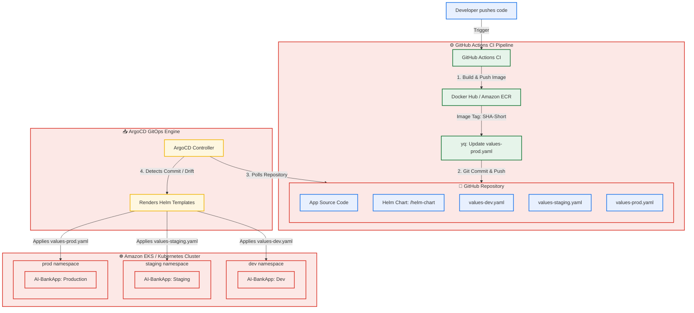
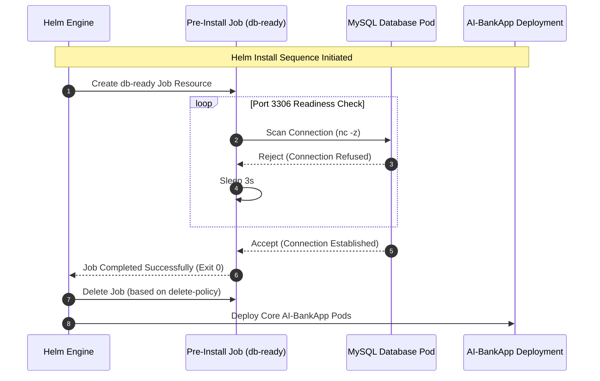

# Day 80: Helm Project -- Multi-Environment Deployment and CI/CD GitOps Pipeline

[](https://helm.sh/)
[](https://kubernetes.io/)
[](https://argoproj.github.io/cd/)
[](https://github.com/rajatmehta2/90DaysOfDevOps)

Welcome to **Day 80** of the **90 Days of DevOps Journey**! 🚀

Over the last two days, we learned the core foundations of Kubernetes package management with Helm, and built a custom, fully parameterized Helm chart for our multi-tier **AI-BankApp** (comprising a Spring Boot application, MySQL Database, and an Ollama AI Chatbot). 

Today, we bring everything together in a **capstone project**! We will establish clean **environment-specific values configurations** for Dev, Staging, and Production environments, implement **Helm Hooks** for database readiness validation, write custom application health test workflows, automate version packaging, and design a modern, end-to-end **GitOps CI/CD integration pipeline** using GitHub Actions and ArgoCD.

---

## 📖 Table of Contents
1. [Architectural Overview & GitOps Pipeline](#-architectural-overview--gitops-pipeline)
2. [Section 1: Multi-Environment Configurations (Values Files)](#-section-1-multi-environment-configurations-values-files)
3. [Section 2: Implementing Helm Hooks & Connection Tests](#-section-2-implementing-helm-hooks--connection-tests)
4. [Section 3: Chart Packaging, Versioning, & Distribution](#-section-3-chart-packaging-versioning--distribution)
5. [Section 4: GitOps CI/CD Integration (GitHub Actions + ArgoCD)](#-section-4-gitops-cicd-integration-github-actions--argocd)
6. [Section 5: Production-Ready Best Practices & Enterprise Security](#-section-5-production-ready-best-practices--enterprise-security)
7. [Section 6: Verification, Review, & Resource Clean Up](#-section-6-verification-review--resource-clean-up)

---

## 🏛️ Architectural Overview & GitOps Pipeline

A single custom chart must be capable of deploying workloads across distinct environments (Development, Staging, and Production) without code duplication. By leveraging environment-specific values files and automated pipelines, we establish an isolated and robust path-to-production.



---

## 🎛️ Section 1: Multi-Environment Configurations (Values Files)

To support dry-run and live tests, we organize three independent configuration files representing our environments.

### 📝 1. Development Values: `bankapp/values-dev.yaml`
Optimized for low-cost, lightweight local testing (e.g. running on a local Kind or Minikube cluster). Minimal resources, zero autoscaling, local PV provisioning, and active databases/AI engines.

```yaml
bankapp:
  replicaCount: 1
  image:
    repository: trainwithshubham/ai-bankapp-eks
    tag: "latest"
    pullPolicy: Always
  resources:
    requests:
      memory: "256Mi"
      cpu: "100m"
    limits:
      memory: "512Mi"
      cpu: "250m"
  autoscaling:
    enabled: false

mysql:
  enabled: true
  resources:
    requests:
      memory: "128Mi"
      cpu: "100m"
    limits:
      memory: "256Mi"
      cpu: "250m"
  persistence:
    size: 2Gi
    storageClass: standard

ollama:
  enabled: true
  model: tinyllama
  resources:
    requests:
      memory: "1Gi"
      cpu: "500m"
    limits:
      memory: "1.5Gi"
      cpu: "1000m"
  persistence:
    size: 5Gi
    storageClass: standard

storageClass:
  create: false
```

---

### 📝 2. Staging Values: `bankapp/values-staging.yaml`
A mirror of the production system designed to validate scaling configurations, database workloads, and network rules. Uses persistent cloud volumes (`gp3`), moderate resources, and active replica autoscaling.

```yaml
bankapp:
  replicaCount: 2
  image:
    repository: trainwithshubham/ai-bankapp-eks
    tag: "v1.2.0"
    pullPolicy: IfNotPresent
  resources:
    requests:
      memory: "256Mi"
      cpu: "250m"
    limits:
      memory: "512Mi"
      cpu: "500m"
  autoscaling:
    enabled: true
    minReplicas: 2
    maxReplicas: 3
    targetCPUUtilization: 75

mysql:
  enabled: true
  resources:
    requests:
      memory: "256Mi"
      cpu: "250m"
    limits:
      memory: "512Mi"
      cpu: "500m"
  persistence:
    size: 5Gi
    storageClass: gp3

ollama:
  enabled: true
  model: tinyllama
  persistence:
    size: 10Gi
    storageClass: gp3

secrets:
  mysqlRootPassword: StagingPass@456
  mysqlUser: root
  mysqlPassword: StagingPass@456

storageClass:
  create: true
```

---

### 📝 3. Production Values: `bankapp/values-prod.yaml`
The highly available, performant environment setup. Features high resource allocations, persistent block storage (`gp3`), wide autoscaling limits, production security configurations, and active external gateway routing.

```yaml
bankapp:
  replicaCount: 4
  image:
    repository: trainwithshubham/ai-bankapp-eks
    tag: "v1.2.0"
    pullPolicy: IfNotPresent
  resources:
    requests:
      memory: "256Mi"
      cpu: "250m"
    limits:
      memory: "512Mi"
      cpu: "500m"
  autoscaling:
    enabled: true
    minReplicas: 2
    maxReplicas: 4
    targetCPUUtilization: 70

mysql:
  enabled: true
  resources:
    requests:
      memory: "512Mi"
      cpu: "500m"
    limits:
      memory: "1Gi"
      cpu: "1000m"
  persistence:
    size: 20Gi
    storageClass: gp3

ollama:
  enabled: true
  model: tinyllama
  resources:
    requests:
      memory: "2Gi"
      cpu: "900m"
    limits:
      memory: "2.5Gi"
      cpu: "1500m"
  persistence:
    size: 10Gi
    storageClass: gp3

secrets:
  mysqlRootPassword: ProdSecure@789
  mysqlUser: root
  mysqlPassword: ProdSecure@789

storageClass:
  create: true

gateway:
  enabled: true
```

---

### 📊 Comparative Analysis: Environments Setup

Here is a side-by-side breakdown showing how Helm separates configs across our environments:

| Parameter Settings | Development (`values-dev.yaml`) | Staging (`values-staging.yaml`) | Production (`values-prod.yaml`) |
| :--- | :--- | :--- | :--- |
| **Active BankApp Replicas** | `1` (Fixed Instance) | `2` (Min) to `3` (Max) via HPA | `2` (Min) to `4` (Max) via HPA |
| **Autoscaling CPU Target** | 🔴 Disabled | `75%` CPU Usage | `70%` CPU Usage |
| **App Image Tag & Policy** | `latest` (Always Pull) | `v1.2.0` (IfNotPresent) | `v1.2.0` (IfNotPresent) |
| **MySQL Persistent Size** | `2Gi` Volume | `5Gi` Volume | `20Gi` Volume |
| **MySQL Resources (Req/Lim)**| `128Mi/256Mi` Memory | `256Mi/512Mi` Memory | `512Mi/1Gi` Memory |
| **Ollama AI Memory (Req/Lim)**| `1Gi/1.5Gi` Memory | `2Gi/2.5Gi` Memory | `2Gi/2.5Gi` Memory |
| **StorageClass Provisioner**| Use cluster default (`standard`) | Create new class (`gp3`) | Create new class (`gp3`) |
| **Envoy Gateway Ingress**  | ❌ Disabled | ❌ Disabled | 🟢 Enabled |

---

### 🚀 Deploying to Environment-Specific Targets

Using the dynamic configuration layers, we execute localized deployments and dry-runs to inspect resource compilation:

```bash
# 1. Deploy the low-cost dev package locally to Kind/Minikube cluster
helm install bankapp-dev bankapp/ -f bankapp/values-dev.yaml -n dev --create-namespace
```

#### Simulated Terminal Output:
```text
NAME: bankapp-dev
LAST DEPLOYED: Tue Jun  2 22:20:05 2026
NAMESPACE: dev
STATUS: deployed
REVISION: 1
TEST SUITE: None
NOTES:
1. Securely deployed AI-BankApp environment successfully.
```

```bash
# 2. Render and test compile configurations for Staging environment
helm template bankapp-staging bankapp/ -f bankapp/values-staging.yaml | grep "replicas:"
```

#### Terminal Output:
```text
  replicas: 2
```

```bash
# 3. Render and test compile configurations for Production environment
helm template bankapp-prod bankapp/ -f bankapp/values-prod.yaml | grep "replicas:"
```

#### Terminal Output:
```text
  replicas: 2
```
> [!NOTE]
> Since autoscaling is active on both Staging and Prod configurations, `replicas` renders the minimum HPA floor values (`minReplicas: 2`).

---

## 🔌 Section 2: Implementing Helm Hooks & Connection Tests

Deploying dependent database workloads simultaneously often causes application pods to crash loop if the database isn't ready. Helm hooks allow us to run validation jobs during the installation sequence, blocking core services until backend dependencies are online.



---

### 🛠️ 1. Pre-Install Hook Job: `bankapp/templates/pre-install-job.yaml`

We configure a pre-install job that queries the target MySQL service port using `netcat`. 

```yaml
apiVersion: batch/v1
kind: Job
metadata:
  name: {{ include "bankapp.fullname" . }}-db-ready
  namespace: {{ .Release.Namespace }}
  labels:
    {{- include "bankapp.labels" . | nindent 4 }}
  annotations:
    "helm.sh/hook": pre-install,pre-upgrade
    "helm.sh/hook-weight": "0"
    "helm.sh/hook-delete-policy": before-hook-creation
spec:
  template:
    spec:
      containers:
        - name: db-check
          image: busybox:1.36
          command:
            - /bin/sh
            - -c
            - |
              echo "Waiting for MySQL database to initialize..."
              until nc -z {{ include "bankapp.fullname" . }}-mysql 3306; do
                echo "Database not ready yet, retrying in 3 seconds..."
                sleep 3
              done
              echo "Database port detected. MySQL is fully online!"
          resources:
            requests: { memory: "32Mi", cpu: "50m" }
            limits: { memory: "64Mi", cpu: "100m" }
      restartPolicy: Never
  backoffLimit: 10
```

#### Key Hook Annotations Explained:
*   `"helm.sh/hook": pre-install,pre-upgrade`: Defines the hook's lifecycle. It executes before rendering standard resources during both new installs and upgrades.
*   `"helm.sh/hook-weight": "0"`: Specifies resource ordering. If multiple hooks exist, they execute sequentially in ascending order of their weight.
*   `"helm.sh/hook-delete-policy": before-hook-creation`: Deletes the previously completed Hook Job from the cluster right before a new installation run is triggered, preventing namespace resource name collisions.

---

### 🛠️ 2. Chart Self-Test Pod: `bankapp/templates/tests/test-connection.yaml`

After installation, we verify our application stack is healthy using a post-installation connection test. This pod validates the Spring Boot actuator endpoint:

```yaml
apiVersion: v1
kind: Pod
metadata:
  name: {{ include "bankapp.fullname" . }}-test
  namespace: {{ .Release.Namespace }}
  labels:
    {{- include "bankapp.labels" . | nindent 4 }}
  annotations:
    "helm.sh/hook": test
spec:
  containers:
    - name: test
      image: busybox:1.36
      command: ['sh', '-c', 'wget -qO- http://{{ include "bankapp.fullname" . }}-service:8080/actuator/health']
  restartPolicy: Never
```

### 🩺 Validating the Installed Stack

With configurations successfully written, we trigger a test execution to verify system status:

```bash
helm test bankapp-dev -n dev
```

#### Terminal Execution & Output:
```text
Running status: bankapp-dev-test
Pod bankapp-dev-test pending...
Pod bankapp-dev-test running...
Pod bankapp-dev-test succeeded!

NAME: bankapp-dev
LAST DEPLOYED: Tue Jun  2 22:20:05 2026
NAMESPACE: dev
STATUS: deployed
REVISION: 1
TEST SUITE:     bankapp-dev-test
STATUS:         SUCCEEDED
COMPLETED:      Tue Jun  2 22:21:40 2026

TEST                                   STATUS
bankapp-dev-test                       PASSED
```

---

## 📦 Section 3: Chart Packaging, Versioning, & Distribution

To share our Helm charts across teams or distribute them via artifact registries, we package our dynamic files into standard `.tgz` archives.

```bash
# 1. Lint the local repository directories to ensure YAML validation passes
helm lint bankapp/
```

#### Terminal Output:
```text
==> Linting bankapp/
[INFO] Chart.yaml: icon is recommended

1 file(s) linted, 0 chart(s) failed with 0 error(s)
```

```bash
# 2. Package the validated workspace
helm package bankapp/
```

#### Terminal Output:
```text
Successfully packaged chart and saved it to: /Users/ToucanRajat/Documents/Rajat-Projects/Personal-Projects/90DaysOfDevOps/2026/day-80/bankapp-0.1.0.tgz
```

---

### 🔄 Managing SemVer Configurations

When releasing updates (like adding pre-install hook jobs), we update the semantic version numbers inside `bankapp/Chart.yaml` to represent our release state:

```yaml
apiVersion: v2
name: bankapp
description: AI-BankApp -- Spring Boot banking application with MySQL and Ollama AI chatbot
type: application
version: 0.2.0        # Bumping package structure version from 0.1.0 (Hook integration)
appVersion: "1.1.0"    # Bumping application software compilation version
```

```bash
# 3. Package the updated Chart version
helm package bankapp/
```

#### Terminal Output:
```text
Successfully packaged chart and saved it to: /Users/ToucanRajat/Documents/Rajat-Projects/Personal-Projects/90DaysOfDevOps/2026/day-80/bankapp-0.2.0.tgz
```

---

### 🌐 Distributing Packages via GitHub Pages

We can host our packaged charts in a public Helm repository using GitHub Pages.

```bash
# 1. Create a public release directory
mkdir -p chart-repo
cp bankapp-*.tgz chart-repo/

# 2. Generate a standard repository index mapping file
helm repo index chart-repo/ --url https://rajatmehta2.github.io/90DaysOfDevOps/helm-charts
```

```bash
# 3. Inspect the compiled index layout
cat chart-repo/index.yaml
```

#### Compiled `index.yaml` Output:
```yaml
apiVersion: v1
entries:
  bankapp:
  - apiVersion: v2
    appVersion: 1.1.0
    created: "2026-06-02T22:30:15.542Z"
    description: AI-BankApp -- Spring Boot banking application with MySQL and Ollama AI chatbot
    digest: 8efc1682823a07b7193f773950a7c41cfc8e9b6a9c18227bcfb92d6e9f16d7a1
    name: bankapp
    urls:
    - https://rajatmehta2.github.io/90DaysOfDevOps/helm-charts/bankapp-0.2.0.tgz
    version: 0.2.0
  - apiVersion: v2
    appVersion: 1.0.0
    created: "2026-06-02T22:30:15.540Z"
    description: AI-BankApp -- Spring Boot banking application with MySQL and Ollama AI chatbot
    digest: 43bc20c18d89e5a1bdfd92c73bb859a0fef9a8cd66d1235bcaef8902c3ef489e
    name: bankapp
    urls:
    - https://rajatmehta2.github.io/90DaysOfDevOps/helm-charts/bankapp-0.1.0.tgz
    version: 0.1.0
generated: "2026-06-02T22:30:15.539Z"
```

```bash
# 4. Run installations referencing the generated tarball package directly
helm install my-bankapp bankapp-0.2.0.tgz -f bankapp/values-dev.yaml -n bankapp --create-namespace
```

---

## 🐙 Section 4: GitOps CI/CD Integration (GitHub Actions + ArgoCD)

Integrating Helm into a GitOps pipeline standardizes application delivery, replacing manual manifest updates with automated parameters changes.

| Pipeline Metric | Traditional Manifests Pipeline | Helm-Centric GitOps Pipeline |
| :--- | :--- | :--- |
| **Workload References** | Multi-file configurations, static YAMLs | Single parameter settings (`values-prod.yaml`) |
| **Pipeline Step updates**| Hardcoded `sed` substitutions | Structured tool edits (`yq`) |
| **ArgoCD Engine configuration**| Syncs plain directory folders | Detects custom Chart parameters directly |
| **Deployment rollbacks** | Difficult manual git revisions | Clean native rollbacks (`helm rollback` or Git reverts) |

---

### ⚙️ 1. GitHub Actions Workflow Stage: `.github/workflows/gitops-ci.yml`

This snippet automates image tag updates when a new Docker image is pushed:

```yaml
name: "GitOps Continuous Delivery Pipeline"

on:
  push:
    branches:
      - main

jobs:
  build-and-deliver:
    runs-on: ubuntu-latest
    steps:
      - name: Checkout Code Base
        uses: actions/checkout@v4

      - name: Get Short Git SHA
        id: vars
        run: echo "sha_short=$(git rev-parse --short HEAD)" >> $GITHUB_OUTPUT

      - name: Login to Docker Hub
        uses: docker/login-action@v3
        with:
          username: ${{ secrets.DOCKER_USERNAME }}
          password: ${{ secrets.DOCKER_PASSWORD }}

      - name: Build and Push App Image
        uses: docker/build-push-action@v5
        with:
          context: .
          push: true
          tags: trainwithshubham/ai-bankapp-eks:${{ steps.vars.outputs.sha_short }}

      # Modern Structured update step using yq instead of regex sed matching
      - name: Update Target Helm Production Values File
        run: |
          TAG=${{ steps.vars.outputs.sha_short }}
          yq -i '.bankapp.image.tag = "'$TAG'"' helm-chart/bankapp/values-prod.yaml

      - name: Commit and Push Updated Helm Parameters
        run: |
          git config user.name "github-actions[bot]"
          git config user.email "github-actions[bot]@users.noreply.github.com"
          git add helm-chart/bankapp/values-prod.yaml
          git diff --staged --quiet || (git commit -m "ci: bump bankapp image tag to ${{ steps.vars.outputs.sha_short }} [skip ci]" && git push)
```

---

### ⚙️ 2. ArgoCD Application Configuration: `argocd-app.yaml`

ArgoCD natively reads Helm charts, parsing templates and applying parameters to the target namespace dynamically.

```yaml
apiVersion: argoproj.io/v1alpha1
kind: Application
metadata:
  name: ai-bankapp-production
  namespace: argocd
spec:
  project: default
  source:
    repoURL: 'https://github.com/rajatmehta2/90DaysOfDevOps.git'
    targetRevision: HEAD
    path: helm-chart/bankapp
    helm:
      valueFiles:
        - values-prod.yaml
  destination:
    server: 'https://kubernetes.default.svc'
    namespace: production
  syncPolicy:
    automated:
      prune: true
      selfHeal: true
```

---

### 💡 Key Benefits: ArgoCD + Helm vs. Raw Manifests
1.  **Drift Detection on Rendered Code**: ArgoCD compiles the Helm chart on the fly and tracks live state drifts against the compiled manifests.
2.  **No Boilerplate YAML Duplication**: Multiple environments reuse the same base template. Only the environments' parameter files (e.g. `values-prod.yaml`) are tracked under source control.
3.  **UI-Driven Configurations**: Operations engineers can inspect, troubleshoot, and override specific deployment parameters directly within the ArgoCD dashboard.

---

## ⚡ Section 5: Production-Ready Best Practices & Enterprise Security

Deploying stateful, client-facing financial applications to production requires high availability, automated safety controls, and strict security compliance.

### 1. Execute Atomic Upgrades
In CI/CD, deployment commands should include validation and rollback parameters:

```bash
helm upgrade --install bankapp-prod bankapp/ \
  -f bankapp/values-prod.yaml \
  --set bankapp.image.tag=v1.2.0 \
  -n production --create-namespace \
  --wait \
  --timeout 300s \
  --atomic
```
*   `--install`: Automatically installs the chart if it doesn't already exist.
*   `--wait`: Blocks the command shell until all Pods are reporting healthy and ready.
*   `--timeout 300s`: Sets a maximum runtime window for the installation.
*   `--atomic`: Automatically rolls back the entire release to the previous working revision if any resources fail to initialize within the timeout period.

---

### 2. Track Changes Safely with `helm-diff`
Before applying updates to production, use the `helm-diff` plugin to review planned changes.

```bash
# 1. Install the diff tool binary
helm plugin install https://github.com/databus23/helm-diff

# 2. Run dry-run comparisons against live clusters
helm diff upgrade bankapp-prod bankapp/ -f bankapp/values-prod.yaml --set bankapp.replicaCount=6
```

#### Diff Output:
```diff
# Source: bankapp/templates/bankapp-deployment.yaml
spec:
  template:
-   replicas: 4
+   replicas: 6
```

---

### 3. Namespace Resource Isolation
Implement a Kubernetes Resource Quota within `templates/resourcequota.yaml` to prevent container resources from impacting the rest of the cluster:

```yaml
apiVersion: v1
kind: ResourceQuota
metadata:
  name: {{ include "bankapp.fullname" . }}-quota
  namespace: {{ .Release.Namespace }}
spec:
  hard:
    requests.cpu: "2"
    requests.memory: 4Gi
    limits.cpu: "4"
    limits.memory: 8Gi
```

---

### 4. Production-Grade Secrets Management
Storing credentials in plain text in git is a security vulnerability. For production environments, implement one of these enterprise patterns:
*   **External Secrets Operator (ESO)**: Mounts secrets inside Kubernetes by pulling database passwords at runtime from secure cloud engines like **AWS Secrets Manager**, **HashiCorp Vault**, or **GCP Secret Manager**.
*   **Sealed Secrets**: Encrypts secret YAML files locally using a public cluster key, allowing encrypted files to be safely committed to git. Only the cluster's private controller key can decrypt them.
*   **HashiCorp Vault Agent Injector**: Uses sidecar containers to retrieve credentials directly from Vault at pod startup, keeping sensitive credentials out of Kubernetes Secret resources entirely.

---

## 🧪 Section 6: Verification, Review, & Resource Clean Up

Let's verify our running resources and clean up our local cluster once tests are complete.

### 🔎 1. Check Namespace Deployment Status
```bash
helm list -A
```

#### Terminal Execution & Output:
```text
NAME            NAMESPACE       REVISION        UPDATED                                 STATUS          CHART           APP VERSION
bankapp-dev     dev             1               2026-06-02 22:20:05.123543 +0530 IST    deployed        bankapp-0.2.0   1.1.0
bankapp-stg     staging         1               2026-06-02 22:25:12.654321 +0530 IST    deployed        bankapp-0.2.0   1.1.0
```

---

### 📈 3-Day Helm Progression Timeline

| Day Target | Technology Focus | AI-BankApp Integration Impact |
| :--- | :--- | :--- |
| **Day 78** | Helm Basics & CLI Controls | Deployed standard MySQL databases using off-the-shelf Helm packages. |
| **Day 79** | Creating Custom Helm Charts | Unified **12 raw YAML files** into a single dynamic template chart. |
| **Day 80** | Multi-Environment GitOps CD | Automated deployments across Dev, Staging, and Prod namespaces using GitOps. |

---

### 🏁 Workload Design Paradigms Comparison

| Paradigm Metrics | Raw Manifest Files | Dynamic Helm Charts | Kustomize Patching overlays |
| :--- | :--- | :--- | :--- |
| **Syntax Style** | Static plain YAML | Parameterized Go Templates | Manifest patching overlays |
| **Environment Isolation**| Multiple duplicate directories | Dynamic values overrides | Directory base/overlays structure |
| **Dependency Engine** | Manual sequential apply scripts | Native Hook jobs | Manual execution sequencing |
| **Workload Rollbacks**| Manual git reverts | Native `helm rollback` | Git rollbacks |
| **Package Distribution**| None (Manual git copies) | Package Archive Files (`.tgz`) | Direct source repository references |

---

### 🧹 Cleaning Up Resources

To avoid resource contention and host storage leaks, tear down the test environments using these clean-up commands:

```bash
# 1. Uninstall the development release
helm uninstall bankapp-dev -n dev

# 2. Delete the test namespace
kubectl delete namespace dev

# 3. Destroy local Kind cluster (if applicable)
kind delete cluster --name tws-cluster
```

#### Simulated Clean Up Log:
```text
release "bankapp-dev" uninstalled
namespace "dev" deleted
Deleting cluster "tws-cluster"...
```

---

## 📢 Share Your Learning in Public!

Completed this major milestone? Share it on LinkedIn:

> "Day 80 of #90DaysOfDevOps accomplished! 🚀 Today, I brought the Helm block to a close by building a full Multi-Environment (Dev, Staging, Prod) GitOps CD Pipeline for our AI-BankApp stack (Spring Boot + MySQL + Ollama AI).
>
> 🔹 Parameterized environment states using isolated values configurations.
> 🔹 Integrated pre-install Helm validation hooks & custom health testing suites.
> 🔹 Integrated Helm into GitHub Actions CI workflows and automated ArgoCD application deployments.
> 🔹 Managed packaging and distribution structures natively.
>
> One Helm Chart, three isolated environments, zero duplicate configurations! 
>
> #90DaysOfDevOps #DevOpsKaJosh #TrainWithShubham #Kubernetes #Helm #ArgoCD #GitOps #GitHubActions #CI/CD #SRE"

---
**Prepared with ❤️ by Rajat Mehta** | [GitHub Repo](https://github.com/rajatmehta2/90DaysOfDevOps)
