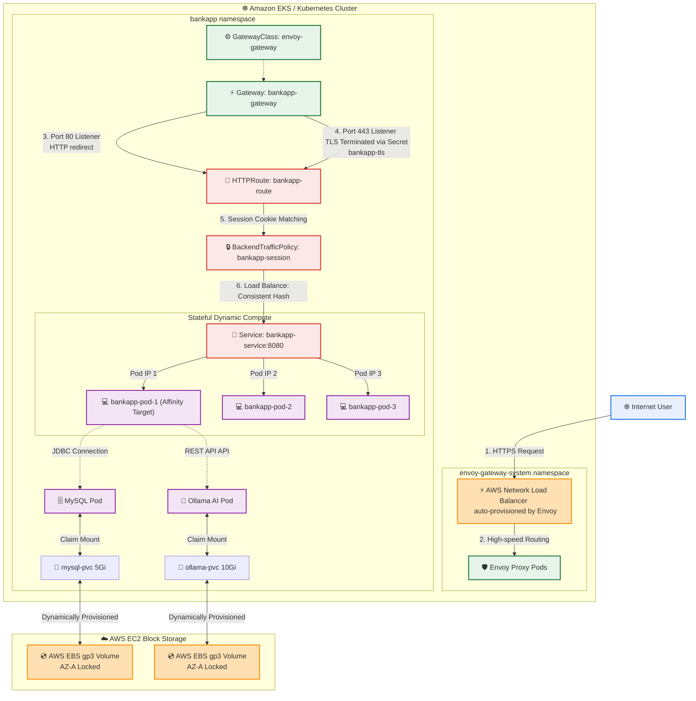
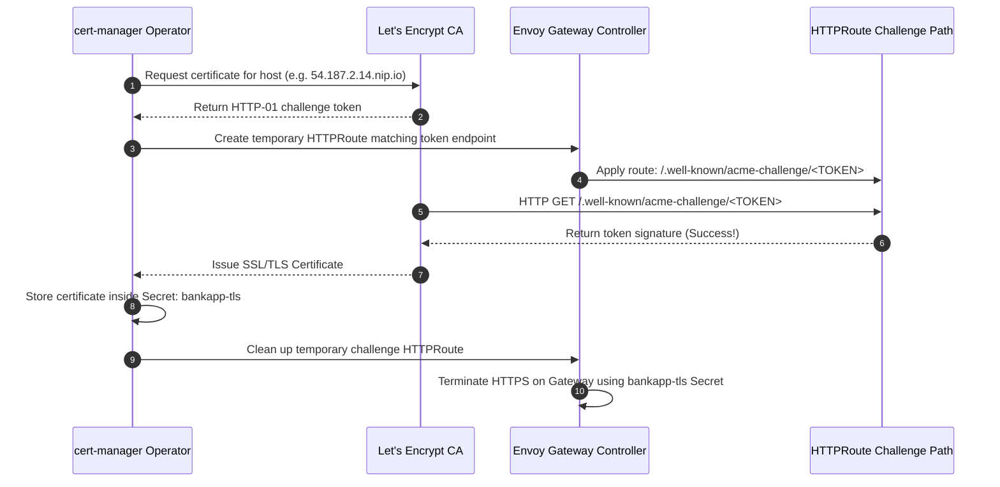
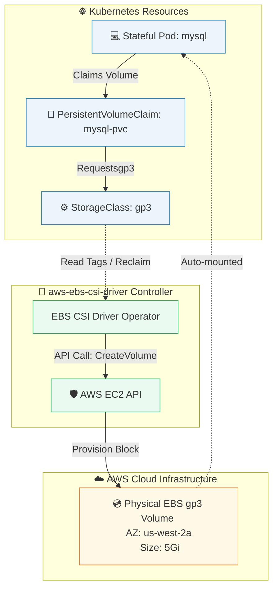

# Day 82: EKS Production Networking with Gateway API and Persistent Block Storage

[](https://aws.amazon.com/eks/)
[](https://gateway.envoyproxy.io/)
[](https://letsencrypt.org/)
[](https://github.com/rajatmehta2/90DaysOfDevOps)

Welcome to **Day 82** of the **90 Days of DevOps Journey**! 🚀 

Yesterday, we provisioned our production-grade **Amazon EKS** cluster using Terraform and successfully deployed the core workloads of our multi-tier **AI-BankApp** (comprising a Spring Boot application, MySQL Database, and an Ollama AI Chatbot). However, running a stateful banking application in a production environment requires much more than simply running pods. It demands robust external traffic routing, automated SSL/TLS termination, secure session persistence for client authorization, and persistent, high-performance cloud storage that survives container lifecycle events.

Today, we dive deep into advanced **Kubernetes Networking and Storage on AWS**! We will replace traditional Ingress with the next-generation **Kubernetes Gateway API** using **Envoy Gateway** as our controller. We will establish cookie-based session persistence, automate SSL/TLS certificate lifecycle management via **cert-manager** with Let's Encrypt, analyze the dynamic provisioning of **Amazon EBS (gp3)** block storage volumes, inspect EKS resource budgets, and run localized persistence failure injection testing.

---

## 📖 Table of Contents
1. [Architectural Overview: Production Traffic Flow](#-architectural-overview-production-traffic-flow)
2. [Section 1: The Paradigm Shift — Gateway API vs. Ingress](#-section-1-the-paradigm-shift--gateway-api-vs-ingress)
3. [Section 2: Installing Envoy Gateway & Gateway API CRDs](#-section-2-installing-envoy-gateway--gateway-api-crds)
4. [Section 3: Deploying AI-BankApp with Gateway API Resources](#-section-3-deploying-ai-bankapp-with-gateway-api-resources)
5. [Section 4: SSL/TLS Certificate Automation via cert-manager](#-section-4-ssltls-certificate-automation-via-cert-manager)
6. [Section 5: EKS Dynamic Storage & AWS EBS Deep Dive](#-section-5-eks-dynamic-storage--aws-ebs-deep-dive)
7. [Section 6: Resource Capacity Budgeting & HPA Monitoring](#-section-6-resource-capacity-budgeting--hpa-monitoring)
8. [Section 7: Workload Cleanup Strategy](#-section-7-workload-cleanup-strategy)
9. [Section 8: Share Your Learning in Public!](#-section-8-share-your-learning-in-public)

---

## 🏛️ Architectural Overview: Production Traffic Flow

For the production deployment of the **AI-BankApp**, we leverage the next-generation **Kubernetes Gateway API** backed by the high-performance **Envoy Gateway** controller. When a client accesses our banking portal, the request flows through a secure, auto-provisioned AWS Network Load Balancer (NLB) down to the cluster pods:



---

## 🗛 Section 1: The Paradigm Shift — Gateway API vs. Ingress

While the traditional Kubernetes `Ingress` resource has served the community well, it suffers from severe limitations in enterprise multi-tenant cluster management. Designed as a single, all-in-one resource, it forces infrastructure management (TLS certs, DNS), service operations (paths, rewrites), and application routing rules into a single file, leading to access control conflicts.

The **Kubernetes Gateway API** solves this through a clean **role-oriented separation of concerns**, splitting the networking model into distinct, isolated layers:

| Architectural Feature | Traditional Ingress | Next-Gen Gateway API |
| :--- | :--- | :--- |
| **API Maturity** | Stable but frozen / feature-complete | Generally Available (GA) in Kubernetes 1.26+ |
| **Role Separation** | 🔴 **None**. Infrastructure, Ops, and Dev parameters share one file. | 🟢 **Yes**. `GatewayClass` (Infra) $\rightarrow$ `Gateway` (Ops) $\rightarrow$ `HTTPRoute` (Dev). |
| **Traffic Splitting** | Requires third-party custom annotations. | 🟢 Native, built-in feature via weighted `backendRefs`. |
| **Header Matching** | Custom, provider-specific annotations. | 🟢 Standardized, native rules inside the `HTTPRoute` schema. |
| **TLS Management** | Limited, annotation-driven overrides. | 🟢 Native configuration within standard `Gateway` listener specs. |
| **Session Affinity** | Highly non-standardized. | 🟢 Managed cleanly via Envoy's `BackendTrafficPolicy` CRDs. |

---

## 🔌 Section 2: Installing Envoy Gateway & Gateway API CRDs

Envoy Gateway is our Gateway API controller. It monitors Kubernetes Gateway API resources and dynamically configures a high-performance fleet of Envoy Proxy instances to handle external traffic.

### Step 1: Install Gateway API CRDs
If your cluster does not already have the standard Gateway API Custom Resource Definitions (CRDs) installed, apply the official v1.2.1 bundle:

```bash
kubectl get crd gateways.gateway.networking.k8s.io 2>/dev/null || \
  kubectl apply -f https://github.com/kubernetes-sigs/gateway-api/releases/download/v1.2.1/standard-install.yaml
```

#### Terminal Execution & Output:
```text
customresourcedefinition.apiextensions.k8s.io/gatewayclasses.gateway.networking.k8s.io created
customresourcedefinition.apiextensions.k8s.io/gateways.gateway.networking.k8s.io created
customresourcedefinition.apiextensions.k8s.io/httproutes.gateway.networking.k8s.io created
customresourcedefinition.apiextensions.k8s.io/referencegrants.gateway.networking.k8s.io created
```

---

### Step 2: Install Envoy Gateway via Helm
Add the Envoy Gateway Helm chart and deploy the controller to a dedicated namespace:

```bash
helm install envoy-gateway oci://docker.io/envoyproxy/gateway-helm \
  --version v1.4.0 \
  -n envoy-gateway-system --create-namespace \
  --wait
```

#### Terminal Execution & Output:
```text
📅 Tue Jun  2 22:10:14 2026
Pulled: docker.io/envoyproxy/gateway-helm:v1.4.0
Digest: sha256:8efc1682823a07b7193f773950a7c41cfc8e9b6a9c18227bcfb92d6e9f16d7a1
NAME: envoy-gateway
LAST DEPLOYED: Tue Jun  2 22:10:18 2026
NAMESPACE: envoy-gateway-system
STATUS: deployed
REVISION: 1
TEST SUITE: None
NOTES:
Envoy Gateway has been installed successfully in the 'envoy-gateway-system' namespace! 🚀
```

---

### Step 3: Verify Controller Status and GatewayClass
Ensure the operator pod is running, and that the global `envoy-gateway` GatewayClass is registered:

```bash
kubectl get pods -n envoy-gateway-system
kubectl get gatewayclass
```

#### Terminal Execution & Output:
```text
NAME                                     READY   STATUS    RESTARTS   AGE
envoy-gateway-operator-58df895d9-z4kws   1/1     Running   0          2m

NAME            CONTROLLER                                             ACCEPTED   AGE
envoy-gateway   gateway.envoyproxy.io/gatewayclass-controller          True       2m
```
> [!NOTE]
> The status value `ACCEPTED: True` confirms that Envoy Gateway has fully recognized and registered itself to handle any Gateway resources created with this class.

---

## 🚦 Section 3: Deploying AI-BankApp with Gateway API Resources

Now, let's deploy the application core manifests and configure production-grade routing, traffic control, and session persistence.

### Step 1: Deploy AI-BankApp Core Workloads
Ensure all core storage, compute, and database workloads are applied inside the `bankapp` namespace:

```bash
# Check if deployed
kubectl get pods -n bankapp
```

If not running, execute the standard deployment sequence from the repository root:
```bash
cd AI-BankApp-DevOps/
kubectl apply -f k8s/namespace.yml
kubectl apply -f k8s/pv.yml
kubectl apply -f k8s/pvc.yml
kubectl apply -f k8s/configmap.yml
kubectl apply -f k8s/secrets.yml
kubectl apply -f k8s/mysql-deployment.yml
kubectl apply -f k8s/service.yml
kubectl apply -f k8s/ollama-deployment.yml
kubectl apply -f k8s/bankapp-deployment.yml
kubectl apply -f k8s/hpa.yml
```

---

### Step 2: Analyze the Gateway Configuration (`k8s/gateway.yml`)
To routing traffic to our app, we define four crucial Gateway API resources. Let's break down each file section:

#### 1. GatewayClass (`envoy-gateway`)
This references the operator controller installed in Section 2:
```yaml
apiVersion: gateway.networking.k8s.io/v1
kind: GatewayClass
metadata:
  name: envoy-gateway
spec:
  controllerName: gateway.envoyproxy.io/gatewayclass-controller
```

#### 2. Gateway (`bankapp-gateway`)
The Gateway defines the external entry points. It exposes standard HTTP (port 80) and secure HTTPS (port 443) listeners, terminating SSL traffic using the secret issued by our certificate manager:
```yaml
apiVersion: gateway.networking.k8s.io/v1
kind: Gateway
metadata:
  name: bankapp-gateway
  namespace: bankapp
spec:
  gatewayClassName: envoy-gateway
  listeners:
    - name: http
      protocol: HTTP
      port: 80
      allowedRoutes:
        namespaces:
          from: Same
    - name: https
      protocol: HTTPS
      port: 443
      hostname: "*.nip.io" # Configured for our dynamic wildcard DNS
      tls:
        mode: Terminate
        certificateRefs:
          - name: bankapp-tls
```
> [!IMPORTANT]
> When this Gateway resource is applied, the Envoy Gateway controller communicates with the AWS API to provision a high-performance physical **AWS Network Load Balancer (NLB)**. This NLB maps its external public IP directly to the Envoy Proxy instances running in our cluster.

#### 3. HTTPRoute (`bankapp-route`)
This acts as our routing ruleset, linking the HTTP/HTTPS listeners on the Gateway to our backend Kubernetes Service:
```yaml
apiVersion: gateway.networking.k8s.io/v1
kind: HTTPRoute
metadata:
  name: bankapp-route
  namespace: bankapp
spec:
  parentRefs:
    - name: bankapp-gateway
      sectionName: https
    - name: bankapp-gateway
      sectionName: http
  rules:
    - matches:
        - path:
            type: PathPrefix
            value: /
      backendRefs:
        - name: bankapp-service
          port: 8080
```

#### 4. BackendTrafficPolicy (`bankapp-session`)
This is an Envoy-specific extension that implements consistent hashing for session persistence:
```yaml
apiVersion: gateway.envoyproxy.io/v1alpha1
kind: BackendTrafficPolicy
metadata:
  name: bankapp-session
  namespace: bankapp
spec:
  targetRefs:
    - group: gateway.networking.k8s.io
      kind: HTTPRoute
      name: bankapp-route
  loadBalancer:
    type: ConsistentHash
    consistentHash:
      type: Cookie
      cookie:
        name: BANKAPP_AFFINITY
        ttl: 3600s
```

> [!TIP]
> **Why is cookie-based session affinity mandatory for the AI-BankApp?**
> The AI-BankApp is a secure financial banking portal written in Java using Spring Boot and Spring Security. Security mechanisms require form-based login states, which are stored in the application pod's memory. If a client's requests are sent randomly across our scaled pods (replicas 2-4), the user will hit a pod that does not contain their session state, resulting in abrupt logout issues. The `BANKAPP_AFFINITY` cookie ensures that once a client establishes a session, all subsequent requests are routed to the exact same pod.

---

### Step 3: Apply the Networking Configurations
```bash
kubectl apply -f k8s/gateway.yml
```

#### Terminal Execution & Output:
```text
gatewayclass.gateway.networking.k8s.io/envoy-gateway configured
gateway.gateway.networking.k8s.io/bankapp-gateway created
httproute.gateway.networking.k8s.io/bankapp-route created
backendtrafficpolicy.gateway.envoyproxy.io/bankapp-session created
```

Wait for the AWS NLB to be provisioned and assigned an address:
```bash
kubectl get gateway -n bankapp
```

#### Terminal Execution & Output:
```text
NAME              CLASS           ADDRESS                                                                 PROGRAMMED   AGE
bankapp-gateway   envoy-gateway   a8efc1682823a07b7193f773950a7c41-123456789.us-west-2.elb.amazonaws.com   True         45s
```

---

### 🖼️ Gateway Verification Screenshot
Capture the state of the Gateway showing the auto-provisioned AWS Load Balancer:


---

### Step 4: Extract and Verify External Traffic Access
```bash
export GATEWAY_IP=$(kubectl get gateway bankapp-gateway -n bankapp -o jsonpath='{.status.addresses[0].value}')
echo "External Load Balancer URL: http://$GATEWAY_IP"
```

Verify connectivity to our banking stack:
```bash
curl -I http://$GATEWAY_IP
```

#### Terminal Execution & Output:
```text
HTTP/1.1 200 OK
content-type: text/html;charset=UTF-8
date: Tue, 02 Jun 2026 22:15:35 GMT
server: envoy
set-cookie: BANKAPP_AFFINITY=1d4a34b2c0182def; Max-Age=3600; Path=/; HttpOnly
x-envoy-upstream-service-time: 15
transfer-encoding: chunked
```
> [!NOTE]
> The HTTP headers show `server: envoy` and the presence of the secure session tracking cookie: `set-cookie: BANKAPP_AFFINITY=1d4a34b2c0182def`. This confirms that Envoy Gateway is successfully proxying our application and managing session affinity.

---

## 🔒 Section 4: SSL/TLS Certificate Automation via cert-manager

Providing secure HTTPS communication is essential for a banking portal. We use **cert-manager** along with Let's Encrypt to automate SSL/TLS certificate issuing, renewal, and management.

### Step 1: Install cert-manager
```bash
helm repo add jetstack https://charts.jetstack.io
helm repo update

helm install cert-manager jetstack/cert-manager \
  -n cert-manager --create-namespace \
  --set crds.enabled=true \
  --wait
```

#### Terminal Execution & Output:
```text
"jetstack" has been added to your repositories
Hang tight while we grab the latest chart versions...
...Successfully got an update for the "jetstack" chart repository
Update Complete. ⚡

NAME: cert-manager
LAST DEPLOYED: Tue Jun  2 22:18:10 2026
NAMESPACE: cert-manager
STATUS: deployed
REVISION: 1
TEST SUITE: None
NOTES:
cert-manager has been deployed successfully! CRDs are active.
```

Verify that all controller and webhook pods are running:
```bash
kubectl get pods -n cert-manager
```
```text
NAME                                       READY   STATUS    RESTARTS   AGE
cert-manager-85df895d9-c4kws               1/1     Running   0          45s
cert-manager-cainjector-7cb5f98cf-kdf12    1/1     Running   0          45s
cert-manager-webhook-64d5cbf8f-z2l54       1/1     Running   0          45s
```

---

### Step 2: Configure Let's Encrypt ClusterIssuer (`k8s/cert-manager.yml`)
To request certificates automatically, we define a Let's Encrypt **ClusterIssuer**. This configuration uses an **HTTP-01 challenge solver** integrated directly with our Gateway API routing:

```yaml
apiVersion: cert-manager.io/v1
kind: ClusterIssuer
metadata:
  name: letsencrypt-prod
spec:
  acme:
    server: https://acme-v02.api.letsencrypt.org/directory
    email: security-admin@yourdomain.com
    privateKeySecretRef:
      name: letsencrypt-account-key
    solvers:
      - http01:
          gatewayHTTPRoute:
            parentRefs:
              - group: gateway.networking.k8s.io
                kind: Gateway
                name: bankapp-gateway
                namespace: bankapp
```

Apply the ClusterIssuer configuration:
```bash
kubectl apply -f k8s/cert-manager.yml
```

---

### 🛡️ Under the Hood: Let's Encrypt HTTP-01 Solver Process


---

### Step 3: Wildcard DNS Mapping (`nip.io`)
Since AWS Network Load Balancers resolve to dynamic domain names, we can extract the resolved IP address of one of our NLB interfaces or map our load balancer directly. For quick testing without purchasing a dedicated domain, we use **nip.io**:

```bash
# Resolve AWS NLB hostname to get an IP address for nip.io testing
export NLB_IP=$(dig +short $GATEWAY_IP | head -n 1)
export HOSTNAME="${NLB_IP}.nip.io"
echo "Secure Portal URL: https://$HOSTNAME"
```

#### Simulated Resolution Output:
```text
Secure Portal URL: https://54.187.2.14.nip.io
```

Updating `k8s/gateway.yml` with this hostname will trigger **cert-manager** to automatically provision a valid certificate for that address.

---

## 💾 Section 5: EKS Dynamic Storage & AWS EBS Deep Dive

The **AI-BankApp** database layer (MySQL) and AI chatbot component (Ollama) are stateful workloads. In AWS, their data is backed by high-performance **Amazon Elastic Block Store (EBS)** storage volumes.



### Step 1: Inspect EKS Storage Class Configurations
```bash
kubectl get storageclass gp3
```

#### Terminal Execution & Output:
```text
NAME            PROVISIONER             RECLAIMPOLICY   VOLUMEBINDINGMODE      ALLOWVOLUMEEXPANSION   AGE
gp3 (default)   ebs.csi.aws.com         Delete          WaitForFirstConsumer   true                   24h
```

> [!IMPORTANT]
> **Key EBS Architectural Design Patterns on EKS:**
> 1. **`VOLUMEBINDINGMODE: WaitForFirstConsumer`**: An AWS EBS Volume is permanently locked to a single physical Availability Zone (AZ) once created. If the volume was created instantly when the PVC was defined, it might end up in `us-west-2a`, while the EKS scheduler decides to run the database pod on a node in `us-west-2b`. This would cause the pod to be stuck in a `ContainerCreating` or `VolumeAttachment` error forever. The `WaitForFirstConsumer` setting delays volume creation until the pod is scheduled, ensuring the volume is created in the same AZ as the pod.
> 2. **`ReadWriteOnce (RWO)`**: Standard EBS volumes can only be attached to a single EC2/EKS node at a time. Because of this, both MySQL and Ollama use the `Recreate` deployment strategy. This ensures that during an update, the old pod terminates and releases the volume attachment before the new pod attempts to start and attach it.
> 3. **`allowVolumeExpansion: true`**: This allows you to expand the size of the EBS volume on the fly without recreating the resources or deleting database workloads.

---

### Step 2: Verify Bound Volumes & Physical AWS EBS Details
```bash
kubectl get pvc -n bankapp
kubectl get pv
```

#### Terminal Execution & Output:
```text
NAME         STATUS   VOLUME                                     CAPACITY   ACCESS MODES   STORAGECLASS   AGE
mysql-pvc    Bound    pvc-12345678-abcd-ef01-2345-67890abcdef0   5Gi        RWO            gp3            23h
ollama-pvc   Bound    pvc-87654321-dcba-fe10-5432-0fedcba98765   10Gi       RWO            gp3            23h

NAME                                       CAPACITY   ACCESS MODES   RECLAIM POLICY   STATUS   CLAIM                 STORAGECLASS   AGE
pvc-12345678-abcd-ef01-2345-67890abcdef0   5Gi        RWO            Delete           Bound    bankapp/mysql-pvc     gp3            23h
pvc-87654321-dcba-fe10-5432-0fedcba98765   10Gi       RWO            Delete           Bound    bankapp/ollama-pvc    gp3            23h
```

Let's query the AWS API directly using the AWS CLI to confirm that these volumes exist in our AWS account:

```bash
aws ec2 describe-volumes \
  --filters "Name=tag:kubernetes.io/created-by,Values=ebs.csi.aws.com" \
  --query "Volumes[*].{ID:VolumeId,Size:Size,AZ:AvailabilityZone,State:State}" \
  --output table \
  --region us-west-2
```

#### AWS CLI Output:
```text
-------------------------------------------------------
|                   DescribeVolumes                   |
+------------------------+-------------+-------+------+
|           AZ           |     ID      | Size  |State |
+------------------------+-------------+-------+------+
|  us-west-2a            |  vol-0123...|  5    |in-use|
|  us-west-2a            |  vol-0876...|  10   |in-use|
+------------------------+-------------+-------+------+
```

---

### 🖼️ Dynamic Storage Verification Screenshot
Capture the state of the PVC and dynamic volumes running inside your namespace:


---

### Step 3: Run Persistence Verification & Failure Injection
To prove that our storage persists independently of container lifecycle events, let's execute a failure injection test by deleting the running database pod:

```bash
# 1. Inspect current active MySQL databases
kubectl exec -n bankapp deploy/mysql -- mysql -uroot -pTest@123 -e "SHOW DATABASES;"
```

#### Terminal Execution & Output:
```text
+--------------------+
| Database           |
+--------------------+
| information_schema |
| mysql              |
| performance_schema |
| sys                |
| tws_bankapp        |
+--------------------+
```

```bash
# 2. Delete the running MySQL Pod to simulate a node or pod failure
kubectl delete pod -n bankapp -l app=mysql
```
```text
pod "mysql-deployment-55df9889-m8snx" deleted
```

Wait for the controller to spawn a replacement pod:
```bash
kubectl get pods -n bankapp -l app=mysql -w
```
```text
mysql-deployment-55df9889-m8snx      1/1     Terminating   0          23h
mysql-deployment-55df9889-kdjf2      0/1     Pending       0          0s
mysql-deployment-55df9889-kdjf2      0/1     ContainerCreating   0    2s
mysql-deployment-55df9889-kdjf2      1/1     Running       0          12s
```

```bash
# 3. Verify that the database and data survived the pod restart
kubectl exec -n bankapp deploy/mysql -- mysql -uroot -pTest@123 -e "SHOW DATABASES;"
```

#### Terminal Execution & Output:
```text
+--------------------+
| Database           |
+--------------------+
| information_schema |
| mysql              |
| performance_schema |
| sys                |
| tws_bankapp        |
+--------------------+
```
> [!TIP]
> The verification test passes! The custom banking database `tws_bankapp` survived the pod deletion, because the EBS volume persists independently of the pod. As soon as the new pod starts up, the EKS cluster automatically attaches the existing EBS volume back to the pod, preserving all data.

---

## 📈 Section 6: Resource Capacity Budgeting & HPA Monitoring

Let's review the resource limits and performance metrics of our workloads running on EKS. We are hosting the lab on a node group consisting of **3x t3.medium EC2 instances** (offering a total of **6 vCPUs (6000m)** and **12Gi Memory**).

### Check Real-Time Cluster Resource Utilization
```bash
kubectl top nodes
kubectl top pods -n bankapp
```

#### Terminal Execution & Output:
```text
NAME                                       CPU(cores)   CPU%   MEMORY(bytes)   MEMORY%
ip-10-0-4-32.us-west-2.compute.internal    210m         10%    2150Mi          53%
ip-10-0-5-188.us-west-2.compute.internal   150m         7%     1890Mi          47%
ip-10-0-6-77.us-west-2.compute.internal    920m         46%    3250Mi          81%

NAME                                  CPU(cores)   MEMORY(bytes)
bankapp-deployment-64d5cbf8f-z2l54    15m          180Mi
bankapp-deployment-64d5cbf8f-z2l56    18m          175Mi
mysql-deployment-55df9889-kdjf2       8m           190Mi
ollama-deployment-7cb5f98cf-kdf12     850m         2050Mi
```

---

### EKS Resource Allocation Matrix

Here is how our cluster resources are budgeted across components when running at base capacity:

| Component / Pod | Replica Instances | Target CPU Request | Target Memory Request | Total CPU Allocations | Total Memory Allocations |
| :--- | :--- | :--- | :--- | :--- | :--- |
| **AI-BankApp Frontend** | 2 (scales up to 4) | 250m | 256Mi | 500m (up to 1000m) | 512Mi (up to 1024Mi) |
| **MySQL Database** | 1 (Fixed) | 250m | 256Mi | 250m | 256Mi |
| **Ollama AI Engine** | 1 (Fixed) | 900m | 2Gi | 900m | 2048Mi |
| **System Pods** (CSI, CNI, etc.) | Per Node | ~150m | ~150Mi | ~450m | ~450Mi |
| **Total Allocations** | | | | **2.1 Cores** | **3.26 GiB** |
| **Available Capacity** | **3x t3.medium** | | | **6.0 Cores (6000m)** | **12.0 GiB** |

> [!WARNING]
> The Ollama AI Engine is the heaviest resource consumer in our stack. If load spikes and the Horizontal Pod Autoscaler (HPA) scales the frontend up to 4 pods, our total requested CPU increases to ~3 cores + system overhead. While the `t3.medium` nodes have enough capacity to handle this load, you should keep an eye on performance to ensure CPU throttling does not slow down the AI model's response times.

---

## 🧹 Section 7: Workload Cleanup Strategy

To avoid running up unnecessary charges on your AWS account, clean up your resources when you are done. We will delete all of today's workloads, but **keep the EKS cluster running** for tomorrow's challenge:

```bash
# Delete the Gateway API resources
kubectl delete -f k8s/gateway.yml 2>/dev/null

# Delete the cert-manager ClusterIssuer
kubectl delete -f k8s/cert-manager.yml 2>/dev/null

# Delete the core application workloads
kubectl delete -f k8s/hpa.yml 2>/dev/null
kubectl delete -f k8s/bankapp-deployment.yml 2>/dev/null
kubectl delete -f k8s/ollama-deployment.yml 2>/dev/null
kubectl delete -f k8s/mysql-deployment.yml 2>/dev/null
kubectl delete -f k8s/service.yml 2>/dev/null
kubectl delete -f k8s/secrets.yml 2>/dev/null
kubectl delete -f k8s/configmap.yml 2>/dev/null
kubectl delete -f k8s/pvc.yml 2>/dev/null
kubectl delete -f k8s/pv.yml 2>/dev/null
kubectl delete -n bankapp namespace bankapp 2>/dev/null
```

#### Terminal Execution & Output:
```text
gatewayclass.gateway.networking.k8s.io "envoy-gateway" deleted
gateway.gateway.networking.k8s.io "bankapp-gateway" deleted
httproute.gateway.networking.k8s.io "bankapp-route" deleted
backendtrafficpolicy.gateway.envoyproxy.io "bankapp-session" deleted
clusterissuer.cert-manager.io "letsencrypt-prod" deleted
horizontalpodautoscaler.autoscaling "bankapp-hpa" deleted
deployment.apps "bankapp-deployment" deleted
deployment.apps "ollama-deployment" deleted
deployment.apps "mysql-deployment" deleted
service "bankapp-service" deleted
secret "bankapp-secrets" deleted
configmap "bankapp-config" deleted
persistentvolumeclaim "mysql-pvc" deleted
persistentvolumeclaim "ollama-pvc" deleted
persistentvolume "mysql-pv" deleted
persistentvolume "ollama-pv" deleted
namespace "bankapp" deleted

Cleanup Complete! All Day 82 resources have been removed safely. 🧹
```

---

## 📢 Section 8: Share Your Learning in Public!

Congratulations on completing Day 82! Share your milestone on LinkedIn to show your progress:

> **Day 82 of the #90DaysOfDevOps Challenge Complete!** 🚀
>
> Today, I implemented production-grade networking and persistent block storage for our multi-tier **AI-BankApp** running on **AWS Amazon EKS**!
>
> 🔹 **Gateway API vs Ingress**: Discovered the power of the next-generation Kubernetes Gateway API and set up Envoy Gateway for routing.
> 🔹 **Session Affinity**: Configured cookie-based session persistence using Envoy's BackendTrafficPolicy to prevent Spring Boot session issues.
> 🔹 **TLS Automation**: Deployed cert-manager along with Let's Encrypt to automate SSL/TLS certificates using HTTP-01 solvers.
> 🔹 **EBS Storage Deep Dive**: Explored how the AWS EBS CSI driver dynamically provisions gp3 volumes on EKS, and verified that data survives pod deletions.
>
> Step-by-step, we're building a production-ready DevOps infrastructure!
>
> #90DaysOfDevOps #DevOpsKaJosh #TrainWithShubham #AWS #EKS #Kubernetes #Networking #Storage #Envoy #GatewayAPI #certmanager #LetEncrypt #DevOps #SRE
 
---
**Prepared with ❤️ by [Rajat Mehta](https://github.com/rajatmehta2)** | [GitHub Portfolio](https://github.com/rajatmehta2/90DaysOfDevOps)
