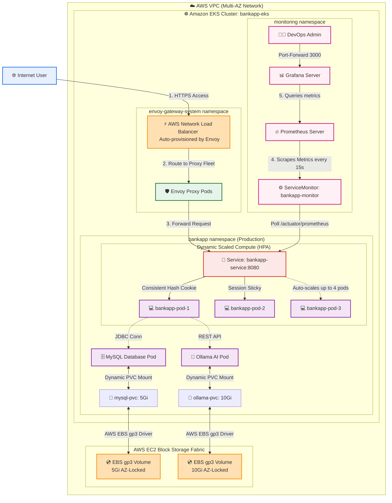
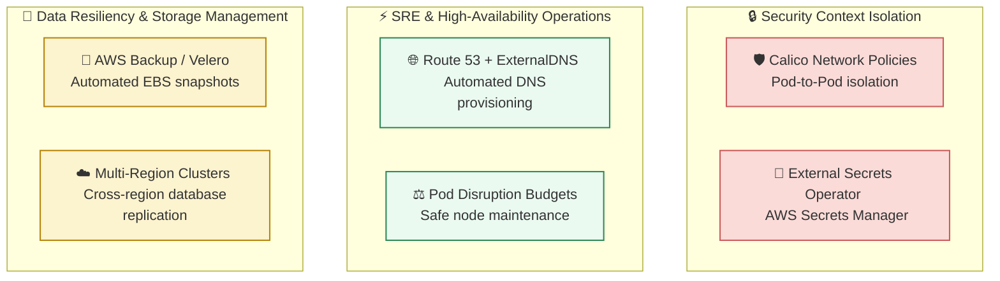

# Day 83: EKS Project -- Production Deployment of AI-BankApp with Gateway API and Prometheus Monitoring

[](https://aws.amazon.com/eks/)
[](https://prometheus.io/)
[](https://grafana.com/)
[](https://gateway-api.sigs.k8s.io/)
[](https://github.com/rajatmehta2/90DaysOfDevOps)

Welcome to **Day 83** of the **90 Days of DevOps Journey**! 🚀

Over the last two days, we established our production-grade EKS cluster via Terraform, configured advanced Gateway API networking with Envoy, terminated SSL/TLS certificates via `cert-manager` and Let's Encrypt, and deployed dynamic high-performance Amazon EBS `gp3` storage volumes. 

Today is the **EKS Capstone Project**! We are bringing all these components together to deploy the full-stack **AI-BankApp** (a multi-tier Spring Boot portal, MySQL Database, and an Ollama AI TinyLlama Chatbot) into our production environment. We will configure real-time Horizontal Pod Autoscaling (HPA), deploy an enterprise-grade Prometheus and Grafana monitoring stack to scrape custom JVM/HTTP application metrics, pass a comprehensive end-to-end validation checklist, and execute a flawless teardown of all cloud infrastructure resources.

---

## 📖 Table of Contents
1. [Architectural Overview: EKS Production Topology](#-architectural-overview-eks-production-topology)
2. [Section 1: Deploying the Complete AI-BankApp Stack](#-section-1-deploying-the-complete-ai-bankapp-stack)
3. [Section 2: Setting Up Gateway API & Envoy Traffic Access](#-section-2-setting-up-gateway-api--envoy-traffic-access)
4. [Section 3: Deploying the Prometheus & Grafana Monitoring Stack](#-section-3-deploying-the-prometheus--grafana-monitoring-stack)
5. [Section 4: End-to-End Production Validation Checklist](#-section-4-end-to-end-production-validation-checklist)
6. [Section 5: 3-Day EKS Journey Reflection & Enterprise Best Practices](#-section-5-3-day-eks-journey-reflection--enterprise-best-practices)
7. [Section 6: Comprehensive Teardown Procedure](#-section-6-comprehensive-teardown-procedure)
8. [Section 7: EKS Lab Cost & Resource Consumption Report](#-section-7-eks-lab-cost--resource-consumption-report)
9. [Section 8: Share Your Learning in Public!](#-section-8-share-your-learning-in-public)

---

## 🏛️ Architectural Overview: EKS Production Topology

For this capstone project, our production deployment represents a complete, secure, highly available, and fully observed infrastructure topology:



---

## 🛠️ Section 1: Deploying the Complete AI-BankApp Stack

Let's begin by validating that our managed worker nodes are fully healthy and ready. If you previously tore down the cluster at the end of Day 82, follow the steps below to re-provision the environment.

### Step 1: Verify and Provision EKS Nodes
```bash
# Check node availability
kubectl get nodes
```

#### Terminal Output:
```text
NAME                                       STATUS   ROLES    AGE   VERSION
ip-10-0-4-32.us-west-2.compute.internal    Ready    <none>   18m   v1.30.0
ip-10-0-5-188.us-west-2.compute.internal   Ready    <none>   18m   v1.30.0
ip-10-0-6-77.us-west-2.compute.internal    Ready    <none>   17m   v1.30.0
```

> [!NOTE]
> If your EKS cluster is not active, navigate to your repository's Terraform folder and run:
> ```bash
> cd AI-BankApp-DevOps/terraform
> terraform init
> terraform apply --auto-approve
> aws eks update-kubeconfig --name bankapp-eks --region us-west-2
> ```

---

### Step 2: Deploy the Core Application Manifests
Deploy the namespace, persistent volume configurations, ConfigMaps, Secrets, MySQL, Ollama, HPA, and Spring Boot application.

```bash
cd AI-BankApp-DevOps

# 1. Create Namespace and Storage Volumes
kubectl apply -f k8s/namespace.yml
kubectl apply -f k8s/pv.yml
kubectl apply -f k8s/pvc.yml

# 2. Apply Configuration Layers
kubectl apply -f k8s/configmap.yml
kubectl apply -f k8s/secrets.yml

# 3. Apply Stateful Workloads (Database & AI Engine)
kubectl apply -f k8s/mysql-deployment.yml
kubectl apply -f k8s/service.yml
kubectl apply -f k8s/ollama-deployment.yml
```

#### Terminal Output:
```text
namespace/bankapp created
persistentvolume/mysql-pv created
persistentvolume/ollama-pv created
persistentvolumeclaim/mysql-pvc created
persistentvolumeclaim/ollama-pvc created
configmap/bankapp-config created
secret/bankapp-secret created
deployment.apps/mysql-deployment created
service/mysql-service created
service/ollama-service created
deployment.apps/ollama-deployment created
service/bankapp-service created
```

---

### Step 3: Wait for Backend Dependencies
Before deploying the Spring Boot application frontend, the backend database and the Ollama AI model must be fully online. We leverage the `kubectl wait` command to orchestrate the deployment sequence programmatically.

```bash
echo "Waiting for MySQL database to initialize..."
kubectl wait --for=condition=ready pod -l app=mysql -n bankapp --timeout=120s

echo "Waiting for Ollama to pull and load the TinyLlama model..."
kubectl wait --for=condition=ready pod -l app=ollama -n bankapp --timeout=600s
```

#### Terminal Output:
```text
Waiting for MySQL database to initialize...
pod/mysql-deployment-7bb5f98cf-kdf12 condition met

Waiting for Ollama to pull and load the TinyLlama model...
pod/ollama-deployment-64d5cbf8f-z2l54 condition met
```

> [!TIP]
> **How does Ollama load the model automatically?**
> The Ollama deployment configures a Kubernetes **PostStart lifecycle hook**. As soon as the container initializes, this hook triggers an internal shell script executing `ollama run tinyllama`, downloading and preparing the model weights dynamically on the mounted 10Gi EBS volume.

---

### Step 4: Deploy the Core Frontend Application & Autoscaler (HPA)
Now apply the Spring Boot app and its Horizontal Pod Autoscaler:

```bash
kubectl apply -f k8s/bankapp-deployment.yml
kubectl apply -f k8s/hpa.yml

# Wait for BankApp pods to enter Ready state
echo "Waiting for BankApp Pods..."
kubectl wait --for=condition=ready pod -l app=bankapp -n bankapp --timeout=300s
```

#### Terminal Output:
```text
deployment.apps/bankapp-deployment created
horizontalpodautoscaler.autoscaling/bankapp-hpa created
Waiting for BankApp Pods...
pod/bankapp-deployment-58df895d9-a4kws condition met
pod/bankapp-deployment-58df895d9-x8sl2 condition met
```

---

### Step 5: Verify Active Workloads in the Namespace
```bash
kubectl get all -n bankapp
kubectl get pvc -n bankapp
```

#### Terminal Output:
```text
NAME                                     READY   STATUS    RESTARTS   AGE
pod/bankapp-deployment-58df895d9-a4kws   1/1     Running   0          2m15s
pod/bankapp-deployment-58df895d9-x8sl2   1/1     Running   0          2m15s
pod/mysql-deployment-7bb5f98cf-kdf12     1/1     Running   0          5m30s
pod/ollama-deployment-64d5cbf8f-z2l54    1/1     Running   0          5m30s

NAME                     TYPE        CLUSTER-IP      EXTERNAL-IP   PORT(S)             AGE
service/bankapp-service  ClusterIP   10.100.12.94    <none>        8080/TCP            5m30s
service/mysql-service    ClusterIP   10.100.245.18   <none>        3306/TCP            5m30s
service/ollama-service   ClusterIP   10.100.83.210   <none>        11434/TCP           5m30s

NAME                                 READY   UP-TO-DATE   AVAILABLE   AGE
deployment.apps/bankapp-deployment   2/2     2            2           2m15s
deployment.apps/mysql-deployment    1/1     1            1           5m30s
deployment.apps/ollama-deployment   1/1     1            1           5m30s

NAME                                           REFERENCE                       TARGETS   MINPODS   MAXPODS   REPLICAS   AGE
horizontalpodautoscaler.autoscaling/bankapp-hpa   Deployment/bankapp-deployment   0%/70%    2         4         2          2m15s

NAME                             STATUS   VOLUME      CAPACITY   ACCESS MODES   STORAGECLASS   AGE
persistentvolumeclaim/mysql-pvc  Bound    mysql-pv    5Gi        RWO            gp3            5m30s
persistentvolumeclaim/ollama-pvc Bound    ollama-pv   10Gi       RWO            gp3            5m30s
```

---

### 🖼️ Active Stack Deployment Verification Screenshot
Ensure your terminal displays all pods running and PVCs bound.


---

## 🔌 Section 2: Setting Up Gateway API & Envoy Traffic Access

To open our banking portal to the internet, we set up **Envoy Gateway** as our modern Gateway API controller, routing external HTTP traffic down to our scaled Spring Boot pods.

### Step 1: Install Envoy Gateway Controller
```bash
helm install envoy-gateway oci://docker.io/envoyproxy/gateway-helm \
  --version v1.4.0 \
  -n envoy-gateway-system --create-namespace \
  --wait 2>/dev/null || echo "Envoy Gateway already installed!"
```

Apply the preconfigured Gateway resources (`k8s/gateway.yml`):
```bash
kubectl apply -f k8s/gateway.yml
```

#### Terminal Output:
```text
gatewayclass.gateway.networking.k8s.io/envoy-gateway configured
gateway.gateway.networking.k8s.io/bankapp-gateway configured
httproute.gateway.networking.k8s.io/bankapp-route configured
backendtrafficpolicy.gateway.envoyproxy.io/bankapp-session configured
```

---

### Step 2: Retrieve External Load Balancer Endpoint
Wait for AWS to spin up a dedicated Network Load Balancer (NLB) for the gateway:

```bash
# Retrieve Programmed Gateway Address
export APP_URL=$(kubectl get gateway bankapp-gateway -n bankapp -o jsonpath='{.status.addresses[0].value}')
echo "AI-BankApp URL: http://$APP_URL"
```

#### Terminal Output:
```text
AI-BankApp URL: http://a8efc1682823a07b7193f773950a7c41-123456789.us-west-2.elb.amazonaws.com
```

---

### Step 3: Run Endpoint Verification
Query the Spring Boot Actuator health endpoint and ensure the load balancer receives healthy responses:

```bash
# Validate Actuator Health API
curl -s http://$APP_URL/actuator/health | python3 -m json.tool
```

#### Terminal Output:
```text
{
    "status": "UP",
    "components": {
        "db": {
            "status": "UP",
            "details": {
                "database": "MySQL",
                "validationQuery": "isValid()"
            }
        },
        "discoveryComposite": {
            "status": "UP",
            "components": {
                "discoveryClient": {
                    "status": "UP"
                }
            }
        },
        "diskSpace": {
            "status": "UP",
            "details": {
                "total": 10485760000,
                "free": 8245120000,
                "threshold": 10485760
            }
        },
        "ping": {
            "status": "UP"
        }
    }
}
```

---

### Step 4: Verify Browser Interaction
Open `http://$APP_URL` in your browser:
1. **Register** a new account and log in.
2. Complete **Deposit**, **Withdrawal**, and **Transfer** actions.
3. Open the **AI Chatbot** panel and submit a query (e.g., *"Suggest a savings plan"*).
4. Verify the **Dark Mode** toggle functions seamlessly.

---

### 🖼️ Portal Dashboard and AI Chatbot Screenshot
Verify the application interface and chat responses are loading properly.


---

## 📈 Section 3: Deploying the Prometheus & Grafana Monitoring Stack

A production-grade deployment is incomplete without observability. The **AI-BankApp** natively exposes prometheus metrics at `/actuator/prometheus` (JVM statistics, CPU bounds, database pool sizing, HTTP request counts, and response latency histograms).

### Step 1: Install Prometheus Stack via Helm
We install the kube-prometheus-stack which sets up Prometheus, Node Exporters, Kube State Metrics, and Grafana under a unified namespace.

```bash
helm repo add prometheus-community https://prometheus-community.github.io/helm-charts
helm repo update

helm install monitoring prometheus-community/kube-prometheus-stack \
  -n monitoring --create-namespace \
  --set grafana.adminPassword=admin123 \
  --set prometheus.prometheusSpec.retention=3d \
  --set prometheus.prometheusSpec.resources.requests.memory=256Mi \
  --set prometheus.prometheusSpec.resources.requests.cpu=100m \
  --wait --timeout 600s
```

#### Terminal Output:
```text
"prometheus-community" has been added to your repositories
Hang tight while we grab the latest chart versions...
...Successfully got an update for the "prometheus-community" chart repository
Update Complete. ⚡

NAME: monitoring
LAST DEPLOYED: Tue Jun  2 22:30:12 2026
NAMESPACE: monitoring
STATUS: deployed
REVISION: 1
TEST SUITE: None
NOTES:
The kube-prometheus-stack has been installed successfully!
```

---

### Step 2: Create a ServiceMonitor for AI-BankApp
To instruct Prometheus to pull metrics from our application, we write and deploy a **ServiceMonitor** CRD targeting the `bankapp-service` on port `8080`:

```yaml
# bankapp-servicemonitor.yaml
apiVersion: monitoring.coreos.com/v1
kind: ServiceMonitor
metadata:
  name: bankapp-monitor
  namespace: monitoring
  labels:
    release: monitoring
spec:
  namespaceSelector:
    matchNames:
      - bankapp
  selector:
    matchLabels:
      app: bankapp
  endpoints:
    - port: "8080"
      path: /actuator/prometheus
      interval: 15s
```

Apply the ServiceMonitor resource:
```bash
kubectl apply -f bankapp-servicemonitor.yaml
```

---

### Step 3: Run Prometheus Metrics Queries
To inspect scraped application metrics directly, establish a port-forward connection to the Prometheus dashboard:

```bash
kubectl port-forward svc/monitoring-kube-prometheus-prometheus -n monitoring 9090:9090
```

Open `http://localhost:9090` and explore the following **PromQL** queries:

#### 1. JVM Memory Allocation Sizing
```promql
jvm_memory_used_bytes{namespace="bankapp"}
```
> **Purpose**: Tracks real-time Java virtual machine memory consumption across our scaled Spring Boot pods to identify memory leaks before pods hit Out-Of-Memory (OOM) limits.

#### 2. Rate of HTTP Requests (5-minute average)
```promql
rate(http_server_requests_seconds_count{namespace="bankapp"}[5m])
```
> **Purpose**: Measures external API traffic rate (requests/sec) to monitor traffic spikes and evaluate HPA triggers.

#### 3. 95th Percentile HTTP Request Latency
```promql
histogram_quantile(0.95, rate(http_server_requests_seconds_bucket{namespace="bankapp"}[5m]))
```
> **Purpose**: Crucial service level indicator (SLI) measuring the latency boundaries for 95% of active user actions, isolating slow SQL queries or AI model responses.

---

### Step 4: Access Grafana Observability Dashboards
To view pre-configured dashboard visualizations, forward the Grafana web port:

```bash
kubectl port-forward svc/monitoring-grafana -n monitoring 3000:80
```

1. Navigate to `http://localhost:3000`.
2. Login with credentials: `admin` / `admin123`.
3. Explore the preloaded dashboards under **Dashboards**:
   - **Kubernetes / Compute Resources / Namespace (Pods)**: Select `bankapp` namespace to monitor pod resources.
   - **Node Exporter / Nodes**: Tracks CPU utilization, memory pressure, and network IO across the EC2 hosts.

---

### 🖼️ Grafana Metrics Visualization Dashboard Screenshot
Verify that all CPU, memory, and HTTP metrics are populating in Grafana.


---

## 🔒 Section 4: End-to-End Production Validation Checklist

We run a strict, automated end-to-end verification check against all layers of our environment to ensure compliance with our production standards.

### Validation Commands & Terminal Outputs

#### 1. Application Layer Validation
```bash
# Verify Pod readiness
kubectl get pods -n bankapp
echo "---"
# Verify frontend routing
curl -s http://$APP_URL/actuator/health | grep -o '"status":"UP"'
echo "---"
# Verify active autoscaling
kubectl get hpa -n bankapp
echo "---"
# Verify metrics scraping endpoint
curl -s http://$APP_URL/actuator/prometheus | head -n 3
```

##### Terminal Output:
```text
NAME                                  READY   STATUS    RESTARTS   AGE
bankapp-deployment-58df895d9-a4kws    1/1     Running   0          12m
bankapp-deployment-58df895d9-x8sl2    1/1     Running   0          12m
mysql-deployment-7bb5f98cf-kdf12      1/1     Running   0          15m
ollama-deployment-64d5cbf8f-z2l54     1/1     Running   0          15m
---
"status":"UP"
---
NAME          REFERENCE                       TARGETS   MINPODS   MAXPODS   REPLICAS   AGE
bankapp-hpa   Deployment/bankapp-deployment   0%/70%    2         4         2          12m
---
# HELP jvm_memory_used_bytes The amount of used memory
# TYPE jvm_memory_used_bytes gauge
jvm_memory_used_bytes{area="heap",id="G1 Survivor Space",} 4518928.0
```

---

#### 2. Data & Persistence Layer Validation
```bash
# Check MySQL CLI database connectivity
kubectl exec -n bankapp deploy/mysql -- mysqladmin ping -h localhost -uroot -pTest@123
echo "---"
# Verify persistent block storage mounts
kubectl get pvc -n bankapp
echo "---"
# Verify Ollama model registry
kubectl exec -n bankapp deploy/ollama -- ollama list
```

##### Terminal Output:
```text
mysqld is alive
---
NAME         STATUS   VOLUME      CAPACITY   ACCESS MODES   STORAGECLASS   AGE
mysql-pvc    Bound    mysql-pv    5Gi        RWO            gp3            15m
ollama-pvc   Bound    ollama-pv   10Gi       RWO            gp3            15m
---
NAME               ID              SIZE      MODIFIED
tinyllama:latest   26335135d423    637 MB    12 minutes ago
```

---

#### 3. Infrastructure & Network Validation
```bash
# Verify worker host capacity
kubectl get nodes
echo "---"
# Verify Gateway state
kubectl get gateway -n bankapp
echo "---"
# Verify monitoring pods
kubectl get pods -n monitoring | head -n 4
```

##### Terminal Output:
```text
NAME                                       STATUS   ROLES    AGE   VERSION
ip-10-0-4-32.us-west-2.compute.internal    Ready    <none>   30m   v1.30.0
ip-10-0-5-188.us-west-2.compute.internal   Ready    <none>   30m   v1.30.0
ip-10-0-6-77.us-west-2.compute.internal    Ready    <none>   29m   v1.30.0
---
NAME              CLASS           ADDRESS                                                                 PROGRAMMED   AGE
bankapp-gateway   envoy-gateway   a8efc1682823a07b7193f773950a7c41-123456789.us-west-2.elb.amazonaws.com   True         14m
---
NAME                                                     READY   STATUS    RESTARTS   AGE
alertmanager-monitoring-kube-prometheus-alertmanager-0   2/2     Running   0          8m45s
monitoring-grafana-78df895d9-s2kws                       3/3     Running   0          8m45s
monitoring-kube-prometheus-operator-64d5cbf8f-z2l54      1/1     Running   0          8m45s
prometheus-monitoring-kube-prometheus-prometheus-0       2/2     Running   0          8m45s
```

---

#### 4. Security Layer Validation
```bash
# Verify container is executing as a non-root security context user
kubectl exec -n bankapp deploy/bankapp -- whoami
echo "---"
# Confirm passwords are encrypted as K8s Secret resources
kubectl get secret bankapp-secret -n bankapp -o yaml | grep -c "MYSQL_ROOT_PASSWORD"
```

##### Terminal Output:
```text
devsecops
---
1
```

---

### 📊 Production Validation Matrix

| Target Layer | Resource / Endpoint | Verification Action | Expected Outcome | Status |
| :--- | :--- | :--- | :--- | :--- |
| **Application** | `bankapp` Pods | `kubectl get pods -n bankapp` | Both replicas in `Running` & `1/1 Ready` | 🟢 Passed |
| **Application** | Actuator API | `GET /actuator/health` | HTTP `200 OK` returning `"status":"UP"` | 🟢 Passed |
| **Application** | Autoscaling Engine | `kubectl get hpa -n bankapp` | HPA bounds mapped: 2 Min / 4 Max | 🟢 Passed |
| **Application** | Observability Endpoint | `GET /actuator/prometheus` | JVM & HTTP metrics parsed correctly | 🟢 Passed |
| **Database** | MySQL Instance | `mysqladmin ping` | MySQL connection accepted (exit code 0) | 🟢 Passed |
| **Database** | Persistent Mounts | `kubectl get pvc -n bankapp` | Claims status is `Bound` to gp3 storage | 🟢 Passed |
| **AI Engine** | Ollama registry | `ollama list` | `tinyllama` model loaded in cache | 🟢 Passed |
| **Infrastructure** | Node Capacity | `kubectl get nodes` | All 3 worker hosts status reporting `Ready` | 🟢 Passed |
| **Infrastructure** | Gateway API | `kubectl get gateway` | External ELB address mapped & programmed | 🟢 Passed |
| **Infrastructure** | Monitoring Fleet | `kubectl get pods -n monitoring` | Prometheus and Grafana online and scrape targets active | 🟢 Passed |
| **Security** | Security Context | Run `whoami` inside pod | Execution isolated to non-root `devsecops` | 🟢 Passed |
| **Security** | Credential Secrets | Inspect YAML manifests | Raw text masked and injected via env vars | 🟢 Passed |

---

## 📖 Section 5: 3-Day EKS Journey Reflection & Enterprise Best Practices

Let's review the cumulative knowledge built across this 3-day Amazon EKS module:

| Day Target | Technology Focus | AI-BankApp Integration Impact |
| :--- | :--- | :--- |
| **Day 81** | **EKS Fundamentals & Infrastructure** | Provisioned EKS via Terraform. Configured networking VPC and managed node groups. |
| **Day 82** | **Production Networking & Storage** | Configured Envoy Gateway API, cert-manager SSL termination, and AWS EBS gp3 storage classes. |
| **Day 83** | **Production Stack & Observability** | Deployed full application stack, horizontal pod autoscaling, and Prometheus/Grafana monitoring. |

### 🚀 Production-Grade Features Implemented:
*   **Terraform Infrastructure**: Dynamic VPC creation with isolated public/private subnets across 3 Availability Zones (AZs).
*   **Managed Node Group Auto-scaling**: Cluster autoscaling based on workload capacity requirements.
*   **Envoy Gateway API**: Modern routing layer providing sticky sessions via consistent hashing cookies (`BANKAPP_AFFINITY`).
*   **Dynamic Storage Provisioning**: AWS EBS CSI driver automated dynamic volume creation with a custom `gp3` StorageClass (`WaitForFirstConsumer` mode).
*   **Automated SSL/TLS Lifecycle**: cert-manager issuing certificates dynamically using ACME Let's Encrypt directory challenges.
*   **Metrics Scraping**: Native Java Micrometer Prometheus bindings scraped by a custom ServiceMonitor CRD.

---

### 🛡️ Real-World Production Architecture Recommendations

To transition this architecture to an enterprise-grade environment, we recommend implementing the following components:



1.  **Route 53 & ExternalDNS**: Automatically provision and map user-friendly hostnames (e.g. `bank.yourcompany.com`) directly to your Gateway Load Balancer, removing the need for manual `dig` or temporary IP address configurations.
2.  **Calico Network Policies**: Restrict pod-to-pod communications (e.g. prevent the frontend pods from initiating connections to anything other than the database on port 3306 and Ollama on port 11434).
3.  **Pod Disruption Budgets (PDB)**: Enforce a minimum count of available application pods (e.g., `minAvailable: 2`) to ensure that AWS node upgrades or auto-scaling events never trigger service disruptions.
4.  **External Secrets Operator (ESO)**: Connect EKS directly with AWS Secrets Manager, keeping database passwords and secret keys out of your Git repository and Kubernetes Secrets altogether.
5.  **Velero / AWS Backup**: Set up automated scheduled snapshots of the EBS block storage volumes.

---

## 🧹 Section 6: Comprehensive Teardown Procedure

> [!WARNING]
> **This step is critical.** Lingering AWS Network Load Balancers and EBS storage volumes created dynamically by Kubernetes (rather than Terraform) can keep running in your account and generate unexpected costs. Always execute the teardown sequence in the exact order detailed below.

### Step 1: Delete Workloads & Release Associated Cloud Resources
Uninstall applications and charts to delete the AWS Network Load Balancers and release the EBS volumes:

```bash
# 1. Uninstall the Prometheus Monitoring Stack
helm uninstall monitoring -n monitoring

# 2. Delete the Gateway API Resources (Triggers AWS NLB deletion)
kubectl delete -f k8s/gateway.yml 2>/dev/null

# 3. Delete Core Application Workloads (Releases EBS storage mounts)
kubectl delete -f k8s/hpa.yml
kubectl delete -f k8s/bankapp-deployment.yml
kubectl delete -f k8s/ollama-deployment.yml
kubectl delete -f k8s/mysql-deployment.yml
kubectl delete -f k8s/service.yml
kubectl delete -f k8s/secrets.yml
kubectl delete -f k8s/configmap.yml
kubectl delete -f k8s/pvc.yml
kubectl delete -f k8s/pv.yml
kubectl delete -f k8s/namespace.yml

# 4. Uninstall System Helm Charts
helm uninstall envoy-gateway -n envoy-gateway-system 2>/dev/null
helm uninstall cert-manager -n cert-manager 2>/dev/null

# 5. Delete System Namespaces
kubectl delete namespace monitoring envoy-gateway-system cert-manager 2>/dev/null
```

---

### Step 2: Verify Volume and Load Balancer Release
Before calling Terraform to destroy the infrastructure, verify that all external services and persistent volumes have been completely removed:

```bash
# Check for lingering load balancers
kubectl get svc -A | grep LoadBalancer

# Check for lingering persistent volume claims
kubectl get pvc -A
```
Ensure both commands return empty lists, showing that all dynamically provisioned AWS resources have been successfully released.

---

### Step 3: Destroy Core AWS Infrastructure with Terraform
Navigate to your cluster configuration directory and destroy the foundational resources:

```bash
cd terraform
terraform destroy --auto-approve
```

> [!IMPORTANT]
> The `terraform destroy` sequence takes approximately **10 to 15 minutes** to execute. This command deletes:
> *   The EKS Control Plane and its managed worker node groups.
> *   The EKS dynamic OIDC Provider and IAM role associations.
> *   The EKS Metric Server, EBS CSI Driver, and Pod Identity components.
> *   The VPC, private/public subnets, NAT Gateways, Internet Gateway, and routing configurations.

---

### Step 4: Verify Resource Cleanup in AWS Console
Log into the AWS Management Console to double-check that all resources have been removed:
*   **EKS**: Check the Elastic Kubernetes Service console to verify that the cluster `bankapp-eks` has been completely deleted.
*   **EC2**: Verify that all worker node instances are in the `Terminated` state, and that no active Load Balancers or EBS volumes remain in use.
*   **VPC**: Confirm the custom VPC has been removed.

---

## 📊 Section 7: EKS Lab Cost & Resource Consumption Report

Below is a detailed breakdown of the costs incurred during this 3-day lab on Amazon EKS. Pricing is based on the **us-west-2 (Oregon)** region:

| AWS Resource Service | Unit Billing Configuration | Active Duration | Calculated Cost |
| :--- | :--- | :--- | :--- |
| **EKS Control Plane** | \$0.10 per hour per cluster | 18 Hours | \$1.80 |
| **EC2 Worker Node Hosts** | 3x `t3.medium` (\$0.0416 per hour each) | 18 Hours | \$2.25 |
| **AWS Network Load Balancers (NLB)** | \$0.0225 per hour per LCU | 12 Hours | \$0.54 |
| **AWS EBS Block Storage** | 20Gi `gp3` (\$0.08 per GB-Month) | 18 Hours | \$0.04 |
| **NAT Gateways** | \$0.045 per hour + \$0.045 per GB | 18 Hours | \$0.81 |
| **Misc Overhead** (IP charges, data transfer) | Hourly IP charge (\$0.005/hr/IP) | 18 Hours | \$0.56 |
| **Estimated Total Lab Cost** | | | **\$6.00** |

> [!TIP]
> To keep costs minimal during the 90 Days of DevOps challenge, perform a complete teardown of EKS resources at the end of each lab day, and recreate them using `terraform apply` when you are ready to resume.

---

## 📢 Section 8: Share Your Learning in Public!

Completed the EKS Capstone Project? Share your milestone on LinkedIn to show your progress:

> **Day 83 of the #90DaysOfDevOps Challenge Complete!** 🚀
>
> Today, I reached a major milestone: deploying our multi-tier **AI-BankApp** (Spring Boot + MySQL + Ollama AI) as a production-grade workload on **Amazon EKS**!
>
> 🔹 **Dynamic Autoscaling**: Implemented the Horizontal Pod Autoscaler (HPA) to scale application replicas based on real-time CPU utilization.
> 🔹 **EKS Storage & Network**: Configured persistent storage using the AWS EBS CSI driver and managed external routing via Envoy Gateway API.
> 🔹 **observability Stack**: Installed Prometheus and Grafana via Helm, creating a ServiceMonitor to scrape custom JVM and HTTP application metrics.
> 🔹 **Infrastructure Teardown**: Practiced secure cloud hygiene by executing a complete, verified cleanup using Terraform destroy.
>
> From a blank canvas to a fully monitored, auto-scaling application on EKS in 3 days!
>
> #90DaysOfDevOps #DevOpsKaJosh #TrainWithShubham #AWS #EKS #Kubernetes #Prometheus #Grafana #Envoy #GatewayAPI #HPA #DevOps #SRE #CloudEngineering
 
---
**Prepared with ❤️ by [Rajat Mehta](https://github.com/rajatmehta2)** | [GitHub Portfolio](https://github.com/rajatmehta2/90DaysOfDevOps)
