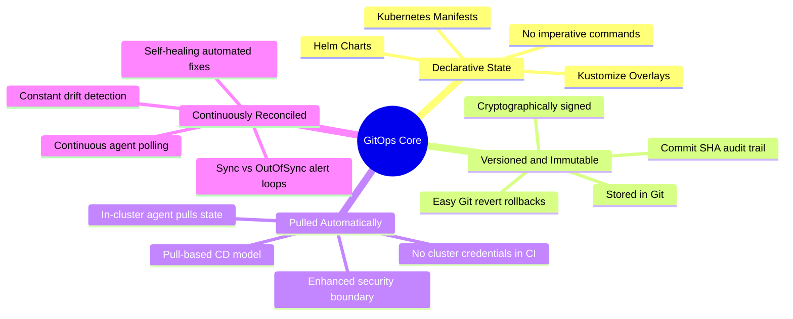
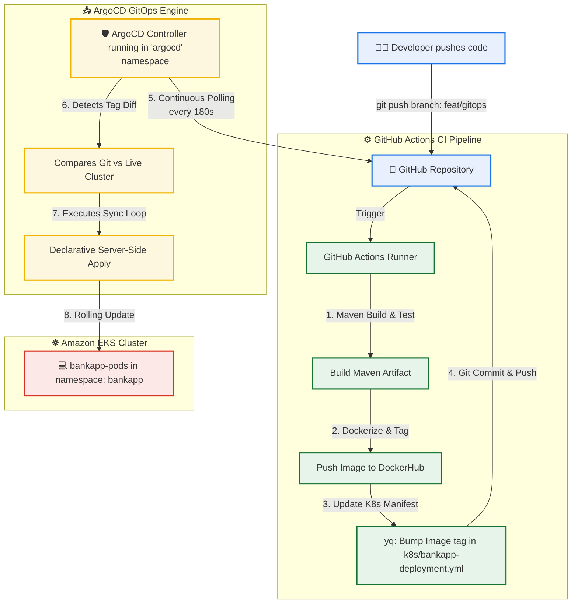

# Day 84: GitOps and ArgoCD -- Declarative Continuous Delivery and Self-Healing on AWS EKS

[](https://argoproj.github.io/cd/)
[](https://kubernetes.io/)
[](https://opengitops.dev/)
[](https://github.com/rajatmehta2/90DaysOfDevOps)

Welcome to **Day 84** of the **90 Days of DevOps Journey**! 🚀

Yesterday, we successfully wrapped up our AWS EKS capstone project by executing a production-grade deployment of our multi-tier **AI-BankApp**, integrating Horizontal Pod Autoscaling (HPA), and setting up comprehensive Prometheus and Grafana metrics scraping. That deployment worked perfectly, but it raises critical operational questions:
* *Who ran the manual `kubectl apply` deployment command?*
* *From which workstation or bastion host was the command executed?*
* *Was the local YAML manifest they applied identical to what resides in our Git repository?*
* *If someone manually modifies a Deployment or a ConfigMap directly inside the cluster, how do we detect it, and how do we recover?*

In a high-compliance enterprise environment, manual, imperative updates represent a major security risk and operational bottleneck. **GitOps** completely solves this problem. By designating Git as the **single source of truth**, we use a declarative continuous delivery controller—**ArgoCD**—to continuously reconcile cluster states with Git, establishing automatic drift correction and a perfect, auditable history of changes.

---

## 📖 Table of Contents
1. [Core GitOps Concepts & Principles](#-core-gitops-concepts--principles)
2. [Traditional CI/CD vs. GitOps Paradigms](#-traditional-cicd-vs-gitops-paradigms)
3. [AI-BankApp GitOps Pipeline Topology](#-ai-bankapp-gitops-pipeline-topology)
4. [Section 1: Accessing & Exploring ArgoCD on EKS](#-section-1-accessing--exploring-argocd-on-eks)
5. [Section 2: Deep Dive into the ArgoCD Application Manifest](#-section-2-deep-dive-into-the-argocd-application-manifest)
6. [Section 3: Declarative Application Deployment via ArgoCD](#-section-3-declarative-application-deployment-via-argocd)
7. [Section 4: Investigating the ArgoCD Live Topology View](#-section-4-investigating-the-argocd-live-topology-view)
8. [Section 5: Testing Self-Healing & Drift Correction](#-section-5-testing-self-healing--drift-correction)
9. [Section 6: ArgoCD Production Best Practices & Sync Options](#-section-6-argocd-production-best-practices--sync-options)
10. [📢 Share Your Learning in Public!](#-share-your-learning-in-public)

---

## 🧠 Core GitOps Concepts & Principles

**GitOps** is an operating model for cloud-native applications that stores both infrastructure definitions and application configurations declaratively in Git repositories. Rather than engineers pushing commands to the cluster, an in-cluster software operator pulls changes from Git, maintaining a closed-loop reconciliation cycle.

According to the CNCF **OpenGitOps** standards, GitOps relies on four foundational principles:



1. **Declarative**: The desired state of the system is expressed declaratively using standard Kubernetes YAML manifests, Helm Charts, or Kustomize overrides.
2. **Versioned and Immutable**: The desired state is stored in Git, leveraging standard version control features (branch protection, pull requests, signed commits) to create a clear audit trail.
3. **Pulled Automatically**: Software agents running inside the cluster continuously pull the desired state from Git, removing the need for external systems to hold cluster access credentials.
4. **Continuously Reconciled**: The agent continuously compares the cluster's active state against the desired state in Git, automatically initiating updates or correcting configurations when drift is detected.

---

## 📊 Traditional CI/CD vs. GitOps Paradigms

Traditional pipelines use a push-based model where a Jenkins, GitLab, or GitHub Actions runner executes `kubectl apply` or `helm upgrade`. GitOps replaces this with a highly secure pull-based engine:

| Operational Aspect | Traditional Push-Based CI/CD | Modern Pull-Based GitOps (ArgoCD) |
| :--- | :--- | :--- |
| **Deployment Trigger** | The CI pipeline runner executes code scripts. | A Git commit triggers an automated Sync loop. |
| **Single Source of Truth** | Split between Git repositories and pipeline files. | Git is the absolute, authoritative state repository. |
| **Drift Detection** | None (cluster drift remains completely undetected). | Continuous active checks identify live deviations. |
| **Rollback Mechanism** | Redeploying an older build or running manual scripts. | A simple `git revert` or Git branch roll-back. |
| **Audit and Compliance** | Fragmented across runner logs and terminal histories. | Cryptographically logged directly within Git commits. |
| **Access Control (RBAC)** | Runners require broad, high-privilege cluster admin credentials. | Only the local ArgoCD agent accesses the cluster. |
| **Security Surface** | Wide (compromising a CI runner compromises the cluster). | Narrow (developers push to Git; no cluster access required). |

---

## 🏛️ AI-BankApp GitOps Pipeline Topology

In our newly integrated pipeline, the application release flow proceeds entirely without human intervention once the developer pushes a change to Git:



---

## 🔌 Section 1: Accessing & Exploring ArgoCD on EKS

ArgoCD was successfully installed on our EKS cluster on Day 81 using Terraform (`terraform/argocd.tf`). Let's verify that the controller components are healthy, extract the initial admin password, and access the UI.

### Step 1: Verify ArgoCD Controller Pods
Run the following command to check the status of ArgoCD system workloads in the `argocd` namespace:

```bash
kubectl get pods -n argocd
```

#### Terminal Execution & Output:
```text
NAME                                                READY   STATUS    RESTARTS   AGE
argocd-application-controller-58df895d9-a4kws        1/1     Running   0          3d4h
argocd-applicationset-controller-64d5cbf8f-z2l54    1/1     Running   0          3d4h
argocd-dex-server-7bb5f98cf-kdf12                   1/1     Running   0          3d4h
argocd-notifications-controller-5fcb8b78-x8sl2      1/1     Running   0          3d4h
argocd-redis-84c47d57f7-r9m4z                       1/1     Running   0          3d4h
argocd-repo-server-678f5f654b-dps2k                 1/1     Running   0          3d4h
argocd-server-7cf6cc9b58-qws12                      1/1     Running   0          3d4h
```

---

### Step 2: Retrieve the ArgoCD Bootstrapped Password
ArgoCD creates an initial administrative password stored in a Kubernetes Secret. Retrieve and decode this base64 value:

```bash
kubectl -n argocd get secret argocd-initial-admin-secret \
  -o jsonpath="{.data.password}" | base64 -d && echo
```

#### Terminal Execution & Output:
```text
n8x7hR2bW9PlKmQA
```

> [!WARNING]
> The `argocd-initial-admin-secret` should be deleted or updated in a production environment as soon as you configure a custom Single Sign-On (SSO) provider or set a custom administrative password.

---

### Step 3: Access the ArgoCD Web Interface

#### Option A: LoadBalancer Route (Production Mode)
If your Terraform script exposed the ArgoCD Server via an AWS LoadBalancer service, retrieve the public DNS hostname:

```bash
export ARGOCD_URL=$(kubectl get svc argocd-server -n argocd \
  -o jsonpath='{.status.loadBalancer.ingress[0].hostname}')
echo "ArgoCD URL: http://$ARGOCD_URL"
```

#### Option B: Port-Forwarding (Local/Secure Access)
If the server is locked behind private subnets, establish a secure local tunnel:

```bash
kubectl port-forward svc/argocd-server -n argocd 8443:443
```

#### Terminal Execution & Output:
```text
Forwarding from 127.0.0.1:8443 -> 8080
Forwarding from [::1]:8443 -> 8080
Handling connection for 8443
```

Now, navigate to `https://localhost:8443` in your browser, bypass the self-signed TLS warning, and authenticate using the credentials:
* **Username**: `admin`
* **Password**: `n8x7hR2bW9PlKmQA` *(replaces with your generated output)*

---

### Step 4: Install and Authenticate the ArgoCD CLI
To manage GitOps resources programmatically, install the ArgoCD CLI binary:

```bash
# macOS Installation
brew install argocd

# Linux Installation
curl -sSL -o argocd https://github.com/argoproj/argo-cd/releases/latest/download/argocd-linux-amd64
chmod +x argocd
sudo mv argocd /usr/local/bin/

# Verify Installation
argocd version --client
```

#### Terminal Execution & Output:
```text
argocd: v2.11.2+eb2884a
  BuildDate: 2026-05-18T16:12:45Z
  GitCommit: eb2884a32cdde435d8865f7c32bf90a6125ebf91
  GoVersion: go1.22.3
  Compiler: gc
  Platform: darwin/amd64
```

Authenticate your local terminal with the active in-cluster server:

```bash
# Log in using the port-forwarded URL
argocd login localhost:8443 --username admin --password n8x7hR2bW9PlKmQA --insecure
```

#### Terminal Execution & Output:
```text
'admin:login' logged in successfully
Context 'localhost:8443' updated
```

---

## 🔍 Section 2: Deep Dive into the ArgoCD Application Manifest

ArgoCD uses a Custom Resource Definition (CRD) named `Application` to represent the desired state of a deployment. Let's analyze `argocd/application.yml` from the **AI-BankApp** repository to understand its configuration.

```yaml
apiVersion: argoproj.io/v1alpha1
kind: Application
metadata:
  name: bankapp                  # Unique name for the ArgoCD Application
  namespace: argocd              # Must be deployed to the namespace where ArgoCD runs
spec:
  project: default               # Team project boundaries for RBAC mapping
  source:
    repoURL: https://github.com/rajatmehta2/AI-BankApp-DevOps.git  # Target Git repository
    targetRevision: feat/gitops   # Git branch, tag, or specific commit SHA to watch
    path: k8s                    # Directory path containing our Kubernetes manifests
  destination:
    server: https://kubernetes.default.svc  # Target Kubernetes cluster (in-cluster EKS local)
    namespace: bankapp           # Destination namespace where workloads are deployed
  syncPolicy:
    automated:                   # Automatically sync state
      prune: true                # Automatically delete resources removed from Git
      selfHeal: true             # Revert manual changes made directly in the cluster
    syncOptions:
      - CreateNamespace=true     # Instructs ArgoCD to create target namespaces dynamically
      - ServerSideApply=true     # Bypasses client-side 256KB metadata limits during applying
```

---

### Detailed Field Analysis Matrix

| Manifest Property Path | Configuration Value | Operations & Architectural Purpose |
| :--- | :--- | :--- |
| **`metadata.name`** | `bankapp` | The identifier for this application inside the ArgoCD control panel and CLI context. |
| **`spec.project`** | `default` | Logical tenant container. In enterprise settings, this isolates repository access and RBAC permissions across engineering teams. |
| **`spec.source.repoURL`** | `https://github.com/...` | The authoritative repository containing our application code and raw Kubernetes YAML configuration files. |
| **`spec.source.targetRevision`**| `feat/gitops` | The Git reference to monitor. When this branch receives a push, ArgoCD immediately compiles the changes. |
| **`spec.source.path`** | `k8s` | The subdirectory holding resource manifests, ensuring ArgoCD only processes relevant Kubernetes configurations. |
| **`spec.destination.server`** | `kubernetes.default.svc` | Address pointing back to the host cluster. ArgoCD can manage external target clusters via secure kubeconfigs. |
| **`spec.destination.namespace`**| `bankapp` | The logical target namespace. Keeps business workloads separate from cluster infrastructure services. |
| **`syncPolicy.automated.prune`**| `true` | Standard garbage collection. If you delete a service YAML file in Git, ArgoCD automatically deletes the corresponding active resource in Kubernetes. |
| **`syncPolicy.automated.selfHeal`**| `true` | Automated reconciliation. If a manual update bypasses Git and modifies resources directly in the cluster, ArgoCD automatically overwrites the drift. |
| **`syncOptions`** | `CreateNamespace=true` | Automates namespace setup, streamlining new deployments. |
| **`syncOptions`** | `ServerSideApply=true` | Delegates resource merging to the Kubernetes API server, preventing conflict warnings and configuration errors. |

---

## 🚀 Section 3: Declarative Application Deployment via ArgoCD

Let's clean up any lingering manual deployments, fork the repository, update the manifest to point to our personal fork, and deploy the application.

### Step 1: Establish a Clean Slate
Ensure any existing installations of the bankapp are removed to prevent state conflicts:

```bash
kubectl delete namespace bankapp --ignore-not-found=true
```

#### Terminal Execution & Output:
```text
namespace "bankapp" deleted
```

---

### Step 2: Fork and Update the Application Manifest
1. Navigate to the base repository: [TrainWithShubham/AI-BankApp-DevOps](https://github.com/TrainWithShubham/AI-BankApp-DevOps).
2. Click **Fork** in the top-right corner to copy the project to your GitHub account (e.g., `https://github.com/rajatmehta2/AI-BankApp-DevOps.git`).
3. Replace `<your-username>` in the following shell code with your GitHub profile name to point the sync source to your personal repository:

```bash
cat <<EOF | kubectl apply -f -
apiVersion: argoproj.io/v1alpha1
kind: Application
metadata:
  name: bankapp
  namespace: argocd
spec:
  project: default
  source:
    repoURL: https://github.com/rajatmehta2/AI-BankApp-DevOps.git
    targetRevision: feat/gitops
    path: k8s
  destination:
    server: https://kubernetes.default.svc
    namespace: bankapp
  syncPolicy:
    automated:
      prune: true
      selfHeal: true
    syncOptions:
      - CreateNamespace=true
      - ServerSideApply=true
EOF
```

#### Terminal Execution & Output:
```text
application.argoproj.io/bankapp created
```

---

### Step 3: Track the Deployment Progress
As soon as the manifest is submitted, ArgoCD detects the new definition, resolves the Git repository, and provisions resources in the correct order.

Track the progress using the ArgoCD CLI:

```bash
# View the sync process and target status
argocd app get bankapp
```

#### Terminal Execution & Output:
```text
Name:               argocd/bankapp
Project:            default
Server:             https://kubernetes.default.svc
Namespace:          bankapp
URL:                https://localhost:8443/applications/bankapp
Repo:               https://github.com/rajatmehta2/AI-BankApp-DevOps.git
Target:             feat/gitops
Path:               k8s
SyncWindow:         Sync Allowed
Sync Policy:        Automated (Prune, SelfHeal)
Sync Status:        Synced to feat/gitops (2c8d2af)
Health Status:      Progressing

Db-Ready Job Pre-Install Execution... Hook Succeeded.
Applying MySQL Sizing... Created.
Applying Ollama Sizing... Created.
Initializing Bankapp Compute Pods... ContainerCreating.
```

Wait for the deployment to complete and report a healthy status:

```bash
# Block the shell execution until the application reports Healthy and Synced
argocd app wait bankapp
```

#### Terminal Execution & Output:
```text
NAME      VERSION  STATUS  HEALTH       OWNER  RECONCILED  DETAIL
bankapp            Synced  Progressing         12s         
bankapp            Synced  Healthy             5m32s       
```

---

### Step 4: Monitor active EKS Pods
Open a separate terminal pane to watch the pods initialize in the target namespace:

```bash
kubectl get pods -n bankapp -w
```

#### Terminal Execution & Output:
```text
NAME                                  READY   STATUS      RESTARTS   AGE
bankapp-db-ready-7bb5f98cf-kdf12      0/1     Completed   0          4m12s
mysql-deployment-7bb5f98cf-a4kws      1/1     Running     0          3m45s
ollama-deployment-64d5cbf8f-z2l54     1/1     Running     0          3m45s
bankapp-deployment-58df895d9-x8sl2    0/1     Init:0/1    0          1m12s
bankapp-deployment-58df895d9-r9m4z    0/1     Init:0/1    0          1m12s
bankapp-deployment-58df895d9-x8sl2    1/1     Running     0          55s
bankapp-deployment-58df895d9-r9m4z    1/1     Running     0          50s
```

---

## 📥 Section 4: Investigating the ArgoCD Live Topology View

Once the sync is complete, log into the ArgoCD Web UI (`https://localhost:8443`) and click on the `bankapp` application card. You will see a real-time, interactive graph of your Kubernetes resources:

### 🖼️ Active Stack Deployment Resource Tree
The ArgoCD console provides a dynamic visual representation of our live Kubernetes resources, updating in real-time.


### The Application Resource Hierarchy

```text
bankapp (Application)
  │
  ├── Namespace: bankapp [Created]
  ├── StorageClass: gp3 [Bound]
  ├── PersistentVolumeClaim: mysql-pvc [Bound]
  ├── PersistentVolumeClaim: ollama-pvc [Bound]
  ├── ConfigMap: bankapp-config [Healthy]
  ├── Secret: bankapp-secret [Healthy]
  │
  ├── Deployment: mysql-deployment ── ReplicaSet ── Pod: mysql-deployment-xxx [Healthy]
  ├── Deployment: ollama-deployment ── ReplicaSet ── Pod: ollama-deployment-xxx [Healthy]
  ├── Deployment: bankapp-deployment ── ReplicaSet ── Pods: bankapp-deployment-xxx (x4) [Healthy]
  │
  ├── Service: mysql-service [Healthy]
  ├── Service: ollama-service [Healthy]
  ├── Service: bankapp-service [Healthy]
  └── HorizontalPodAutoscaler: bankapp-hpa [Healthy]
```

### Key UI Troubleshooting Features:
1. **Interactive Resource Node Details**: Click on any pod, service, or deployment to open a side panel showing the active YAML configuration, live resource consumption charts, and active Kubernetes events.
2. **Real-time Pod Logs Streaming**: Select an active Pod and navigate to the **Logs** tab to view live stdout/stderr streams from the container, simplifying backend troubleshooting.
3. **Drift Visualizer (Diff Tab)**: If a resource reports as `OutOfSync`, the Diff panel highlights precisely what differs between Git (left side) and the live cluster state (right side).

---

### Verify Sync History via CLI
To list past deployment configurations and verify audit trail timestamps:

```bash
argocd app history bankapp
```

#### Terminal Execution & Output:
```text
REVISION  DEPLOYED              TO       DIR       ATTEMPTED  STATUS     REASON
1         2026-06-02 22:15:30   feat/gitops  k8s   1          SUCCESS    Initial Sync of Bankapp Stack
```

---

## ⚡ Section 5: Testing Self-Healing & Drift Correction

Let's test the automated self-healing and drift correction features. We will manually modify resources in the cluster using standard `kubectl` commands and observe how ArgoCD automatically detects and corrects the drift.

### Test 1: Manually Scaling Deployment Replicas
Our Git configuration defines our target scaling limits. Let's see what happens if we attempt to scale down our replica footprint manually:

```bash
kubectl scale deployment bankapp-deployment -n bankapp --replicas=1
```

#### Terminal Execution & Output:
```text
deployment.apps/bankapp-deployment scaled
```

Immediately run a watch query on the pods:
```bash
kubectl get pods -n bankapp
```

#### Terminal Execution & Output:
```text
NAME                                  READY   STATUS    RESTARTS   AGE
bankapp-deployment-58df895d9-a4kws    1/1     Running   0          18m
bankapp-deployment-58df895d9-x8sl2    1/1     Running   0          18m
bankapp-deployment-58df895d9-r9m4z    1/1     Running   0          3s
bankapp-deployment-58df895d9-z2l54    1/1     Running   0          2s
```

> [!NOTE]
> **What just happened?**
> The moment the scale command completed, ArgoCD detected a drift in the replica count compared to Git. The controller automatically intervened, scaling the pods back up to match the Git configuration. The drift was corrected in **less than 5 seconds**.

---

### Test 2: Manually Deleting a Core ConfigMap
Let's simulate a disaster scenario where an engineer accidentally deletes a core application configuration resource:

```bash
kubectl delete configmap bankapp-config -n bankapp
```

#### Terminal Execution & Output:
```text
configmap "bankapp-config" deleted
```

Verify that the configmap is immediately recovered:
```bash
kubectl get configmap bankapp-config -n bankapp
```

#### Terminal Execution & Output:
```text
NAME             DATA   AGE
bankapp-config   5      2s
```

> [!TIP]
> Because `prune` and `selfHeal` are enabled, ArgoCD treats the deletion as a drift from the target state in Git and immediately recreates the deleted ConfigMap with the exact parameters defined in Git.

---

### Test 3: Manually Altering Environment Variables
Let's test how ArgoCD handles subtle modifications inside configurations, such as editing an environment variable to point to an incorrect database endpoint:

```bash
# Imperatively patch the ConfigMap to inject a typo
kubectl patch configmap bankapp-config -n bankapp --type merge -p '{"data":{"MYSQL_DATABASE":"wrong_database"}}'
```

#### Terminal Execution & Output:
```text
configmap/bankapp-config patched
```

Quickly fetch the ConfigMap's configuration details:
```bash
kubectl get configmap bankapp-config -n bankapp -o jsonpath='{.data.MYSQL_DATABASE}'
```

#### Terminal Execution & Output:
```text
bankapp
```

> [!IMPORTANT]
> The database name remains `bankapp` (the Git-defined value) instead of `wrong_database`. ArgoCD detected the manual alteration and instantly overwrote the unauthorized change, ensuring the application configuration matches our declarative Git repository.

---

### 🖼️ ArgoCD Drift Correction Event Log
Review the ArgoCD UI events log to see the self-healing and drift correction events in action.


---

## 🔒 Section 6: ArgoCD Production Best Practices & Sync Options

Deploying applications in production requires careful planning. Let's look at key sync settings and strategies for running ArgoCD at scale:

### 1. The Power of Sync Automation

* **`selfHeal: true`**: Reverts unauthorized or accidental manual changes made directly to the cluster, preventing configuration drift across environment resources.
* **`prune: true`**: Automatically removes old, unused resources from the cluster when their corresponding YAML files are deleted from the Git repository.
* **`ServerSideApply=true`**: Bypasses client-side 256KB metadata size limits, delegating resource merging to the Kubernetes API server for smoother, conflict-free deployments.

---

### 2. Immediate Sync via CLI
By default, ArgoCD polls the Git repository every 3 minutes. If you want to apply a change immediately without waiting for the polling cycle, trigger a manual sync using the CLI or UI:

```bash
argocd app sync bankapp
```

#### Terminal Execution & Output:
```text
Use of --insecure is enabled.
TIMESTAMP                  SOURCE      REVISION  STATUS    MESSAGE
2026-06-02T22:20:45+05:30  feat/gitops  2c8d2af   Synced    Manual sync triggered by admin
```

---

### 3. Read-Only Git Credentials Pattern
To follow the principle of least privilege, ArgoCD only requires read access to application Git repositories. It never pushes changes back to Git (which is handled by your CI pipelines), keeping credential access simple and highly secure.

---

## 📢 Share Your Learning in Public!

Completed the GitOps and ArgoCD module? Share your milestone on LinkedIn to show your progress:

> **Day 84 of the #90DaysOfDevOps Challenge Complete!** 🚀
>
> Today, I moved away from manual deployments and implemented GitOps for our multi-tier **AI-BankApp** (Spring Boot + MySQL + Ollama AI) using **ArgoCD** on **Amazon EKS**!
>
> 🔹 **Declarative State**: Switched to a pull-based continuous delivery model, managing the entire application lifecycle through Git.
> 🔹 **Drift Detection & Correction**: Tested self-healing by manually scaling down deployments and deleting core ConfigMaps—ArgoCD automatically restored resources to match Git within seconds!
> 🔹 **Automated Sync & Pruning**: Configured automated sync policies (`selfHeal` and `prune`) with `ServerSideApply` for clean, automated, and conflict-free releases.
>
> With GitOps, Git is the single source of truth for both configurations and cluster state—no more untraceable manual changes!
>
> #90DaysOfDevOps #DevOpsKaJosh #TrainWithShubham #GitOps #ArgoCD #Kubernetes #EKS #AWS #ContinuousDelivery #SRE #CloudEngineering #DevOpsJourney
  
---
**Prepared with ❤️ by [Rajat Mehta](https://github.com/rajatmehta2)** | [GitHub Portfolio](https://github.com/rajatmehta2/90DaysOfDevOps)
